

# Как работать со справочником «Контрагенты и контакты»

<table><tr><td><b>Время чтения:</b> 13 мин.</td><td><b>Обновлено:</b> 29.01.2025</td></tr></table>

Источник: https://www.5systems.ru/help/kontragenty-i-kontakty

## Содержание

1. [Работа со справочником “Контрагенты и контакты”](#работа-со-справочником-контрагенты-и-контакты)
2. [Карточка контрагента](#карточка-контрагента)
   - [Вкладки карточки контрагента](#вкладки-карточки-контрагента)
      - [1. “Основные”](#1-основные)
      - [2. “Счета и договоры”](#2-счета-и-договоры)
      - [3. “Подтв. документы”](#3-подтв-документы)
      - [4. “Дисконтные карты”](#4-дисконтные-карты)
      - [5. “Документы”](#5-документы)
      - [6. “CRM”](#6-crm)
3. [Справочник “Виды взаимоотношений”](#справочник-виды-взаимоотношений)
4. [Справочник “Виды контактной информации”](#справочник-виды-контактной-информации)
5. [Адресная книга](#адресная-книга)
6. [Способы перехода в карточку клиента в программе](#способы-перехода-в-карточку-клиента-в-программе)
   - [1. Из Сделки](#1-из-сделки)
   - [2. Из АРМ Клиенты и автомобили](#2-из-арм-клиенты-и-автомобили)
   - [3. Из АРМ Корзина](#3-из-арм-корзина)
   - [4. Из АРМ Запись на ремонт](#4-из-арм-запись-на-ремонт)
   - [5. Из документов](#5-из-документов)

Справочник ***Контрагенты и контакты*** содержит перечень всех контрагентов компании (клиентов, поставщиков, подрядчиков и т.п.) и их контактных лиц.

Справочник расположен в меню программы *Автосервис → Справочники → Клиенты:*

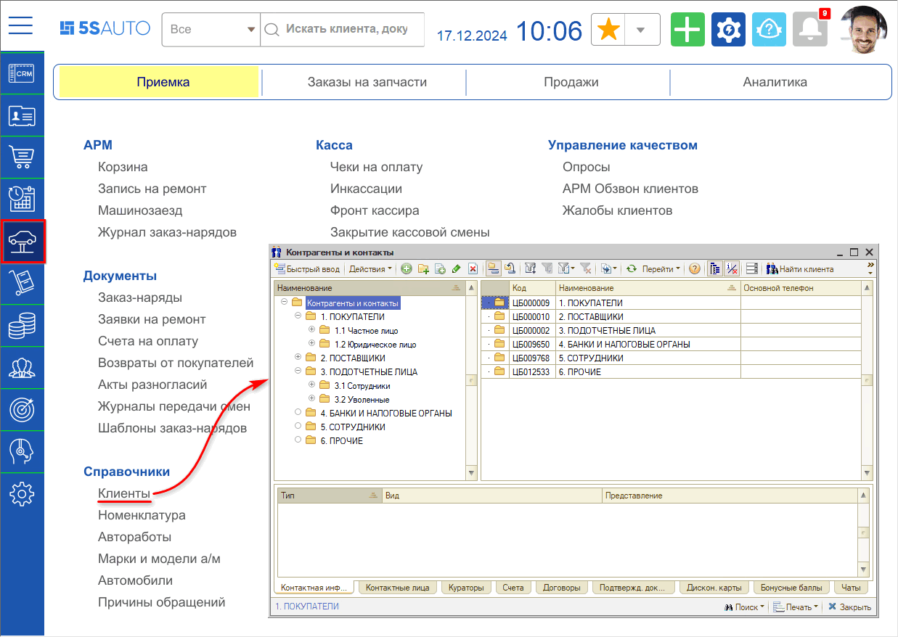

## Работа со справочником “Контрагенты и контакты”

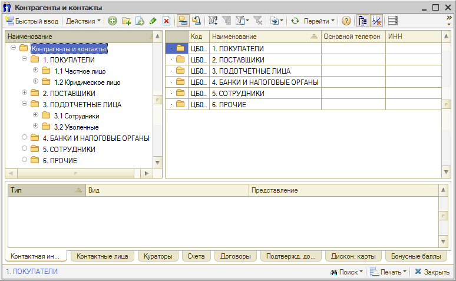

**Кнопки панели управления:**

<table><tr><td><b>Кнопка</b></td><td><b>Описание</b></td></tr><tr><td></td><td>Добавить: создать новую карточку контрагента.</td></tr><tr><td></td><td>Добавить группу: создать папку для группировки списка.</td></tr><tr><td></td><td>Добавить новый элемент копированием.</td></tr><tr><td></td><td>Изменить текущий элемент.</td></tr><tr><td></td><td>Установить пометку удаления.</td></tr><tr><td></td><td>Включить/отключить иерархический просмотр.</td></tr><tr><td></td><td>Переместить элемент в другую группу.</td></tr><tr><td></td><td>Фильтры и отборы.</td></tr><tr><td></td><td>Ввести на основании.</td></tr><tr><td></td><td>Обновить текущий список.</td></tr><tr><td></td><td>Перейти к связанной информации.</td></tr><tr><td></td><td>Отобразить/скрыть панель информации.</td></tr><tr><td>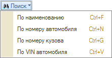</td><td>Поиск по справочнику.</td></tr><tr><td>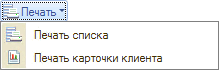</td><td>Вывод на печать.</td></tr></table>

## Карточка контрагента

Карточка элемента справочника “Контрагенты и контакты” содержит несколько вкладок.

### Вкладки карточки контрагента

#### 1. “Основные”

**Описание полей вкладки "Основные":**

<table><tr><td><b>Поле</b></td><td><b>Содержимое</b></td></tr><tr><td><b>Полное наименование</b></td><td>Полное наименование контрагента. Реквизит обязателен для заполнения.</td></tr><tr><td><b>Тип клиента</b></td><td>Форма собственности контрагента. Возможные значения: <ul><li>Юридическое лицо;</li><li>Частный предприниматель;</li><li>Частное лицо;</li><li>Обособленное подразделение;</li><li>Прочее.</li></ul></td></tr><tr><td><b>Основной вид отношений</b></td><td>Описывает основной вид взаимодействия компании с контрагентом. <ul><li></li></ul>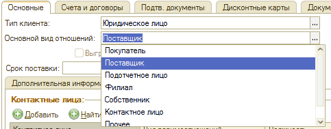 Контрагент может быть поставщиком, подотчетным лицом, клиентом и др. Они находятся в одном справочнике, но имеют разные <i>виды взаимоотношений</i>. Возможные значения: <ul><li>Покупатель;</li><li>Поставщик;</li><li>Подотчетное лицо;</li><li>Филиал;</li><li>Собственник;</li><li>Контактное лицо;</li><li>Прочее.</li></ul>Назначение вида не является строгим: например, поставщику можно производить отгрузку.</td></tr><tr><td><b>Срок поставки</b></td><td>Реквизит доступен при выбранном виде отношений "Поставщик". Количество дней, в течение которых обычно осуществляется поставка данным контрагентом. По умолчанию “0”.</td></tr></table>

***Вкладки:***

***1. Дополнительная информация.***

Поля вкладки:

- *ИНН* – Идентификационный номер налогоплательщика. Не активно при типе клиента "Частное лицо".
- *Код по ОКПО –* Код контрагента по "Общероссийскому Классификатору Предприятий и Организаций". Не доступно при типе клиента "Частное лицо".
- *КПП –* Код причины постановки на учет. Формируется из ИНН. Недоступно при типе клиента "Частное лицо".
- *Код ИМНС –* Код налоговой инспекции контрагента. Первые 4 цифры ИНН. Недоступно при типе клиента "Частное лицо".
- *Комментарий –* Дополнительная информация о контрагенте.

В таблице *Автомобили* отображается список *автомобилей* данного контрагента.

***2. Контактная информация***

На этой вкладке вводится информация о телефонах, адресах, адресах электронной почты и пр.

**3. *Чаты***

На вкладке *"Чаты"* отображается информация о чатах, с которыми связан клиент:

Подробнее см. статью "[Чаты клиента](../../../articles/5S%20AUTO/CRM/Чаты%20клиента/chaty-klienta.md)".

***4. Контакты***

*Контактные лица* – данные о контактных лицах данного контрагента (Ф.И.О., вид взаимоотношений, должность и др.). Подробнее *см. [статью](../../../articles/5S%20AUTO/Работа%20с%20клиентами/Контактные%20лица/kontaktnye-lica.md)*.

*Контактная информация контактного лица* – контактная информация (телефон, адрес, адрес электронной почты и т. п.) для каждого контактного лица данного контрагента.

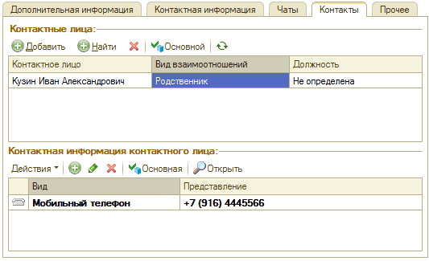

***4. Прочее***

Дополнительная информация о контрагенте.

- *Источник инф-ции* – внешние источники информации о контрагенте, ссылается на справочник "Источники информации";
- *График работы* – график работы контрагента, ссылается на справочник "Графики работы";
- *Гражданство* – гражданство контрагента;
- *Страна регистрации* – страна, где зарегистрирован контрагент;
- *Налоговый номер* – налоговый номер контрагента;
- *Согласие на обработку персональных данных* – отметка о согласии на обработку персональных данных;
- *Согласие на получение SMS* – отметка о согласии на получение SMS.

#### 2. “Счета и договоры”

*Вкладка Счета и договоры* содержит таблицу, в которую заносится информация из справочников “Банковские счета” и “Договоры взаиморасчетов”.

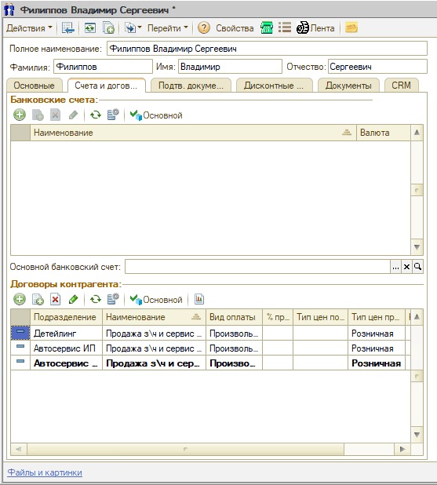

Можно задать основной банковский счет (его значение может быть выбрано из справочника “Банковские счета”) и основной договор: они выделяются полужирным шрифтом и будут использоваться по умолчанию – подставляться в документы при создании. Для этого нужно выделить нужную строку в таблице и нажать кнопку *“Основной”*.

#### 3. “Подтв. документы”

Вкладка *"Подтв. документы"* содержит список подтверждающих документов для контрагента (доверенность, лицензия и т. п.).

Реквизиты *"Текущий"* и *"Устаревший"* информируют, актуален ли этот документ в данный момент или устарел и не используется.

#### 4. “Дисконтные карты”

На вкладке "Дисконтные карты" находится таблица со списком дисконтных карт, зарегистрированных на контрагента, с накопленной суммой. Над таблицей справа отображается общая расчетная сумма, накопленная данным контрагентом.

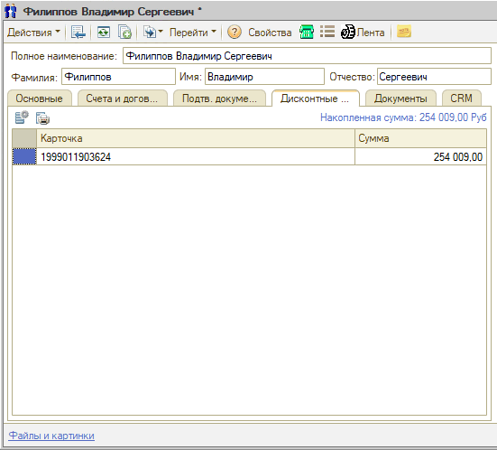

#### 5. “Документы”

На вкладке *“Документы”* собраны все документы, созданные в программе по данному контрагенту – Заказы, Поступление товаров, Приходные ордера, Банковские выписки, Заявки на ремонт, *Заказ-наряды* и т.д.:

#### 6. “CRM”

На вкладке *“CRM”* информация о клиенте представлена на вкладках "Бонусы", "Внешние пользователи" (отмечена регистрация клиента в Мобильном приложении, участие в программе лояльности и т.д.) и "Категории клиентов" (позволяет отметить особый статус клиента):

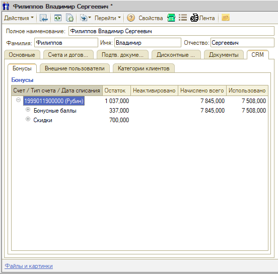

## Справочник “Виды взаимоотношений”

Справочник *“Виды взаимоотношений”* (Справочники → Идентификационные → Виды взаимоотношений) служит для классификации отношений между контрагентами и/или их *контактными лицами:*

## Справочник “Виды контактной информации”

Справочник "Виды контактной информации" (Справочники → Идентификационные → Виды контактной информации) служит для классификации контактной информации:

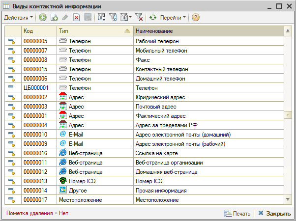

Типы и виды контактной информации различаются.

***Типы контактной информации*** жестко заданы в конфигурации и не могут быть изменены пользователем. К ним относятся:

- Телефон;
- Адрес;
- E-Mail;
- Веб-страница;
- Номер ICQ;
- Другое;
- Местоположение.

Пользователь может задать произвольное количество ***видов контактной информации***, принадлежащих данному типу. Так, типу контактной информации "Адрес" может соответствовать произвольное количество видов контактной информации, связанной с данным типом, а именно:

- Юридический адрес.
- Почтовый адрес.
- Фактический адрес.
- Адрес за пределами РФ.

Эти четыре значения являются предопределенными, т. е. они уже занесены в текущую конфигурацию и не могут быть изменены пользователем. Но пользователь имеет возможность расширить перечень видов контактной информации, воспользовавшись кнопкой “Добавить”, расположенной на командной панели справочника “Виды контактной информации”.

## Адресная книга

Обработка **“Адресная книга”** (Справочники → Идентификационные → Адресная книга) предназначена для просмотра, поиска и редактирования контактной информации.

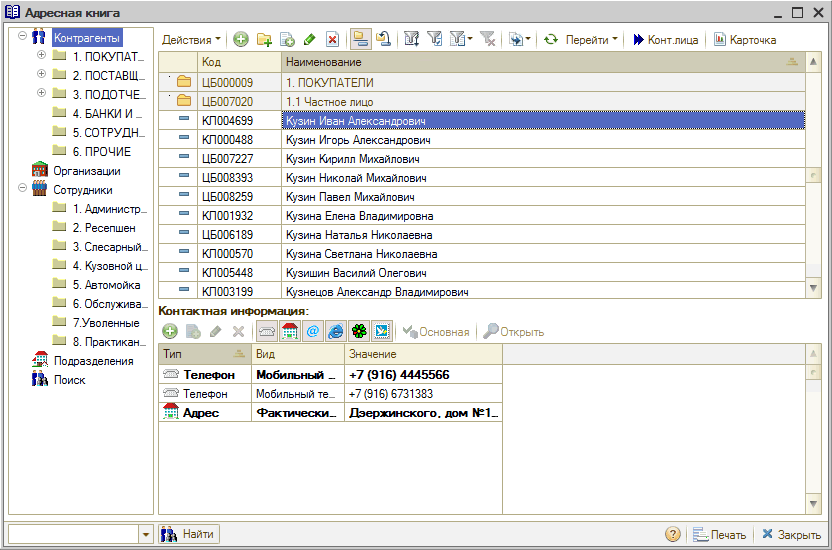

Диалоговое окно обработки разделено на три области:

1. В левой части располагается дерево объектов. Оно содержит следующие разделы: "Контрагенты", "Организации", "Сотрудники", "Подразделения", а также команду "Поиск", при помощи которой можно осуществить полнотекстовый поиск записей по нужному объекту.
2. В правой верхней части диалогового окна располагается панель списка объектов. При выборе нужного раздела дерева объектов происходит переключение панели списка объектов на соответствующие этому разделу строки. Выбор строки объекта открывает одноименный элемент справочника "Контрагенты и контакты".
3. Панель "Контактная информация" отображается в нижней правой части окна. Она предназначена для просмотра и редактирования контактной информации.

Кнопки *“Показывать телефоны”*, *“Показывать адреса”*, *“Показывать* *адреса электронной почты”*, *“Показывать веб-страницы”*, *“Показывать номера ICQ”*, *“Показывать другую информацию”* предназначены для фильтрации выводимой контактной информации.

В списке панели *“Контактная информация”* выводится контактная информация, связанная с выбранным объектом.

Кнопка *“Основная”* устанавливает выбранную контактную информацию в качестве основной для данного типа.

Кнопка *“Открыть”* открывает выделенный в списке Web-сайт или создает электронное письмо.

Контактная информация хранится по типам, которые жестко заданы в конфигурации и не могут быть изменены пользователем. В рамках типов контактной информации пользователь может ввести произвольное количество видов контактной информации, принадлежащих данному типу. Для этого служит справочник “Виды контактной информации”.

Кнопка “Карточка” командной панели диалогового окна позволяет вывести на печать карточку клиента.

## Способы перехода в карточку клиента в программе

### 1. Из Сделки

При нажатии на имя клиента в [*Сделке*](../../../articles/5S%20AUTO/CRM/Работа%20со%20сделкой/rabota-so-sdelkoy.md) появляются кнопки “Выбрать”, “Очистить” и “Показать”.

Кнопка “Показать”   открывает карточку клиента. Кнопка “Выбрать”   открывает справочник “Контрагенты и контакты”.

### 2. Из АРМ Клиенты и автомобили

В [*АРМ “Клиенты и автомобили”*](../../../articles/5S%20AUTO/Работа%20с%20клиентами/Работа%20в%20АРМ%20Клиенты%20и%20автомобили/rabota-v-arm-klienty-i-avtomobili.md) можно [найти имеющегося в базе клиента](../Как%20найти%20клиента%20в%20АРМ%20Клиенты%20и%20автомобили/kak-nayti-klienta-v-arm-klienty-i-avtomobili.md) по фамилии или номеру телефона и открыть карточку клиента двойным кликом по нужной строке в списке клиентов:

### 3. Из АРМ Корзина

Открыть карточку клиента или перейти в справочник для выбора другого клиента можно из [*АРМ “Корзина”*](../../../articles/5S%20AUTO/Проценка%20запчастей%20и%20работ/Работа%20в%20АРМ%20Корзина/rabota-v-arm-korzina.md) нажатием на кнопки “Выбрать” или “Открыть” в поле “Клиент”:

### 4. Из АРМ Запись на ремонт

Из [*АРМ “Запись на ремонт”*](../../../articles/5S%20AUTO/Запись%20на%20ремонт/Календарь%20для%20планирования%20работ/kalendar-dlya-planirovaniya-rabot.md) также можно перейти в карточку клиента или открыть справочник “Контрагенты и контакты” нажатием кнопок “Выбрать” или “Открыть” в поле “Клиент”:

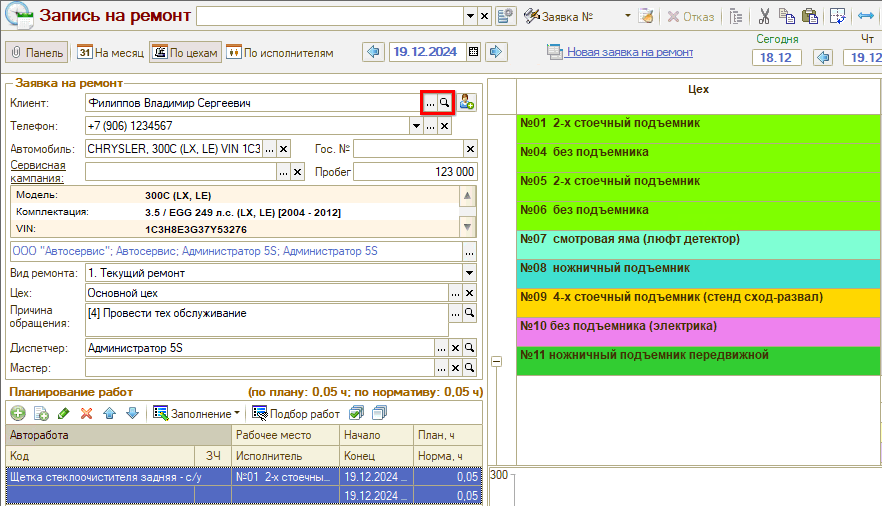

### 5. Из документов

Из документов “Заявка на ремонт”, *“[Заказ-наряд](../../../articles/5S%20AUTO/Автосервис/Работа%20с%20Заказ-нарядами/Заказ-наряды/zakaz-naryady.md)”*, "Заказ покупателя" карточка контрагента и справочник “Контрагенты и контакты” открываются кнопками “Выбрать” и “Открыть” в поле “Заказчик”:

---

**Теги:** клиенты и автомобили, контрагенты, контакты, карточка клиента, адресная книга, виды взаимоотношений

