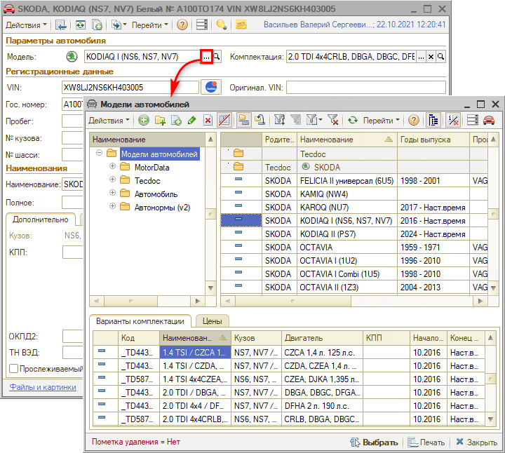
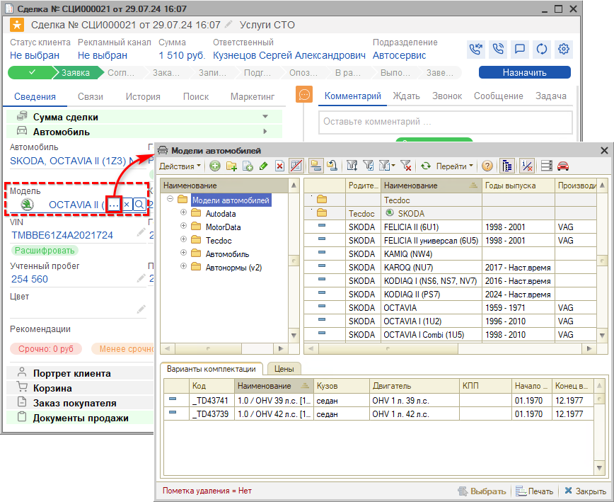
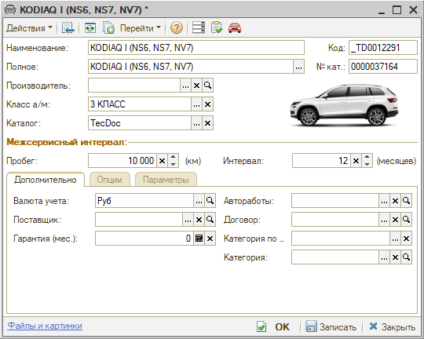
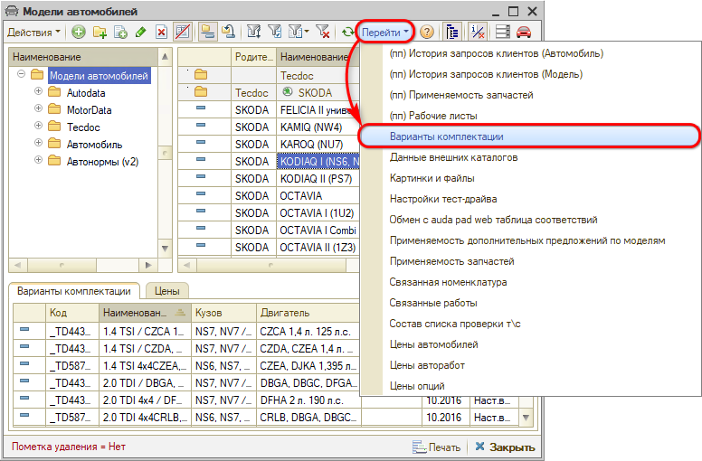
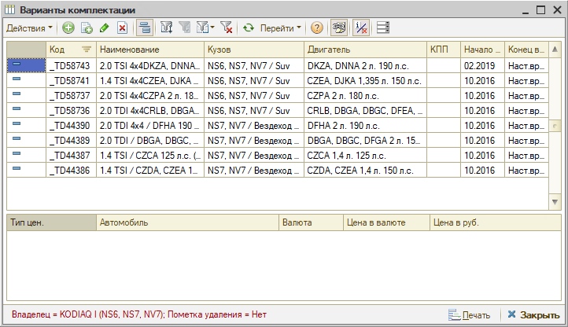
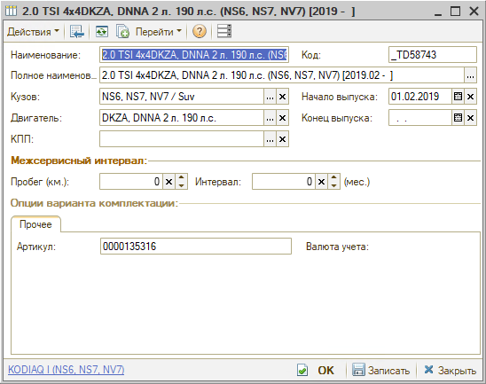
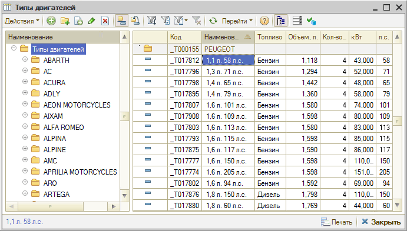
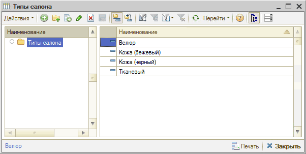

# Как работать со справочником «Модели автомобилей»

<table><tr><td><b>Время чтения:</b> 6 мин.</td><td><b>Обновлено:</b> 05.02.2025</td></tr></table>

Источник: https://www.5systems.ru/help/modeli-avtomobiley

## Содержание

1. [Способы перехода в справочник](#способы-перехода-в-справочник)
2. [Карточка модели автомобиля](#карточка-модели-автомобиля)
3. [Варианты комплектации](#варианты-комплектации)
4. [Цвета](#цвета)
5. [Типы кузовов](#типы-кузовов)
6. [Типы двигателей](#типы-двигателей)
7. [Типы КПП](#типы-кпп)
8. [Типы салона](#типы-салона)

В справочник ***"Модели автомобилей"*** заносится информация обо всех моделях [автомобилей](../Как%20работать%20со%20справочником%20«Автомобили»/avtomobili.md), обслуживаемых на предприятии или являющихся собственностью предприятия.

## Способы перехода в справочник

1. Из меню программы – *Автосервис → Приемка → Справочники → Марки и модели а/м:*  
   
2. Из карточки [автомобиля](../Как%20работать%20со%20справочником%20«Автомобили»/avtomobili.md) нажатием на кнопку “Выбрать” в поле “Модель”:  
   
3. Из *сделки* нажатием на кнопку “Выбрать” в поле “Модель”:  
   

## Карточка модели автомобиля

**Описание полей карточки модели автомобиля:**

- *Наименование* – наименование модели автомобиля.
- *Полное* – полное наименование модели автомобиля.
- *Код* – код модели автомобилей в справочнике.
- *№ кат.* – номер по каталогу (артикул) модели.
- *Производитель* – производитель модели автомобиля. Выбирается из справочника "Производители".
- *Класс а/м* – класс автомобиля.
- *Каталог* – каталог, к которому относится эта модель.

*Межсервисный интервал:*

- *Пробег (км)* – межсервисный пробег ТО.
- *Интервал (месяцев)* – межсервисный интервал ТО: период, через который необходимо производить следующее техобслуживание.

*Вкладка "Дополнительно":*

- *Валюта учета* – используется для ведения дополнительного учета валютной себестоимости и цен. Выбирается из справочника "Валюты".
- *Автоработы* – группа [авторабот](../../Урок%204.%20Запчасти%20и%20автоработы/Как%20работать%20со%20справочником%20«Автоработы»/avtoraboty.md) для данной модели по умолчанию. Выбирается из справочника "Автоработы".
- *Поставщик* – выбирается из справочника ["Контрагенты и контакты"](../Как%20работать%20со%20справочником%20«Контрагенты%20и%20контакты»/kontragenty-i-kontakty.md).
- *Договор* – договор поставки данной модели автомобиля (с поставщиком).
- *Гарантия* – гарантийный срок в месяцах.
- *Категория по...* – категория транспортного средства согласно "Конвенции о дорожном движении".
- *Категория* – категория транспортного средства, которая указана в паспорте ТС и в свидетельстве о регистрации ТС.

## Варианты комплектации

Из справочника “Модели автомобилей” при помощи меню кнопки командной панели “Перейти” можно открыть подчиненный справочник “Варианты комплектации”.

Справочник **“Варианты комплектации”** описывает варианты комплектации различных моделей автомобилей.

Карточка элемента справочника “Варианты комплектации”:

**Описание полей:**

- *Наименование* – наименование комплектации.
- *Полное наименование* – полное наименование комплектации.
- *Код* – код варианта комплектации модели автомобиля.
- *Кузов* – тип кузова данного варианта комплектации автомобиля. Ссылается на справочник *“Типы кузовов”*.
- *Двигатель* – тип двигателя данного варианта комплектации автомобиля. Ссылается на справочник *“Типы двигателей”*.
- *КПП* – тип КПП данного варианта комплектации автомобиля. Ссылается на справочник *“Типы КПП”*.
- *Начало выпуска / Конец выпуска* – начало и конец выпуска варианта комплектации.

*Межсервисный интервал:*

- *Пробег (км)* – межсервисный пробег техобслуживания.
- *Интервал (месяцев)* – межсервисный интервал техобслуживания.

*Вкладка "Прочее":*

- *Артикул* – номер по каталогу варианта комплектации.

## Цвета

Справочник **“Цвета”** (Справочники → Автомобили → Цвета) содержит информацию о возможных цветах автомобилей и соответствии этих цветов классификации ГИБДД.

## Типы кузовов

В справочник **“Типы кузовов”** (Справочники → Автомобили → Типы кузовов) заносятся сведения о возможных типах кузовов автомобилей, обслуживаемых предприятием.

## Типы двигателей

В справочник **“Типы двигателей”** (Справочники → Автомобили → Типы двигателей) заносятся сведения о возможных типах двигателей автомобилей, обслуживаемых предприятием.

## Типы КПП

В справочник **“Типы КПП”** (Справочники → Автомобили → Типы КПП) заносятся сведения о возможных типах коробок переключения передач автомобилей, обслуживаемых предприятием.

## Типы салона

В справочник **“Типы салона”** (Справочники → Автомобили → Типы салона) заносятся сведения о возможных типах интерьера салона автомобилей, обслуживаемых предприятием.

---

**Теги:** клиенты и автомобили, модели автомобилей, комплектации, типы кузовов, типы двигателей
