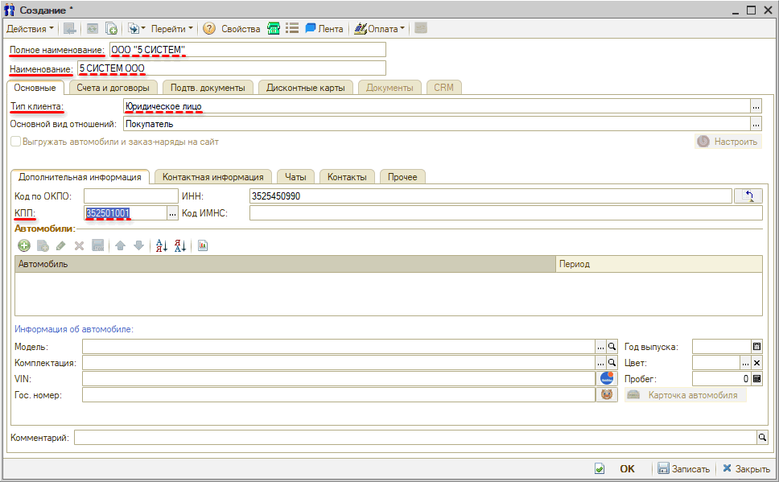

# Как создать контрагента по ИНН

<table><tr><td><b>Время чтения:</b> 4 мин.</td><td><b>Обновлено:</b> 25.06.2025</td></tr></table>

Источник: https://www.5systems.ru/help/kak-sozdat-kontragenta-po-inn

В 5S AUTO можно автоматически заполнять *реквизиты контрагентов или организаций по ИНН* (работа функционала строится на основе интеграции с сервисом [1С:Контрагент](https://portal.1c.ru/applications/1C-Counteragent)).

Для этого при создании карточки контрагента (см. урок [*Контрагенты и контакты*](../Как%20работать%20со%20справочником%20«Контрагенты%20и%20контакты»/kontragenty-i-kontakty.md)) в поле “ИНН” требуется ввести ИНН контрагента и нажать кнопку *“Автоматическое заполнение реквизитов по данным государственных реестров ЕГРЮЛ/ЕГРИП”.*

В открывшемся окне “Заполнение реквизитов контрагента” выводится найденная организация – требуется нажать кнопку *“Выбрать”:*

В создаваемую карточку контрагента подгружаются КПП и наименование, автоматически устанавливается *тип клиента,* например, “Юридическое лицо”:

На вкладку *“Контактная информация”* подтягивается юридический адрес контрагента:

Далее нужно выбрать *основной вид отношений,* *записать* карточку и продолжить заполнение остальных параметров.

Аналогично механизм расшифровки по ИНН действует при создании нового контрагента путем *быстрого ввода:*

*Примечание:* Для пользователей облачной версии 5S AUTO и для пользователей коробочной версии на подписке доступен базовый пакет расшифровок по ИНН в месяц. При необходимости есть возможность приобрести подписку для увеличения количества доступных расшифровок – через менеджера 5SYSTEMS, либо самостоятельно на [сайте сервиса 1С:Контрагент](https://portal.1c.ru/applications/1C-Counteragent).

Подробнее читайте в статье "[Расшифровка контрагентов по ИНН](../../../articles/5S%20AUTO/Работа%20с%20клиентами/Расшифровка%20контрагентов%20по%20ИНН/rasshifrovka-kontragentov-po-inn.md)".

---

**Теги:** клиенты и автомобили, контрагент, ИНН, расшифровка по ИНН

