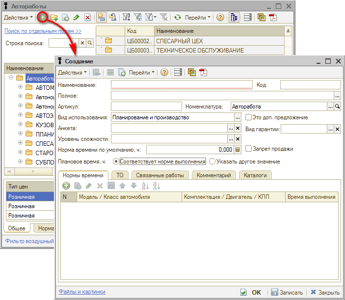

# Как добавить автоработу

<table><tr><td><b>Время чтения:</b> 2 мин.</td><td><b>Обновлено:</b> 25.12.2023</td></tr></table>

Источник: https://www.5systems.ru/help/kak-dobavit-avtorabotu

Для того, чтобы создать в программе новую автоработу, требуется перейти в справочник “Автоработы” (например, из заказ-наряда), выбрать группу и нажатием на кнопку добавить новый элемент.

В новой карточке автоработы требуется заполнить все необходимые параметры:

- *Наименование автоработы*: при задании наименований авторабот рекомендуется соблюдать единообразие в наименованиях;
- *Вид использования*: рекомендуемый – "Планирование и производство";
- *Анкета* – если авторабота создается для использования [*диагностической анкеты*](../../Урок%2020.%20Диагностические%20анкеты/), то в данном поле необходимо указать нужную анкету;
- *Уровень сложности работы* – выбрать из заранее заполненного [*справочника*](../../../articles/5S%20AUTO/Автосервис/Автоработы/avtoraboty.md#уровень-сложности-работы);
- *Вид гарантии*: если [*вид гарантии*](https://5systems.ru/help/kak-nastroit-vidy-garantiy) указан на группу работ, то в карточке каждой отдельной автоработы можно его не указывать;
- *Норма времени по умолчанию* – норма времени для данной автоработы; в случае если для разных марок и моделей автомобилей норма времени для этой работы отличается – требуется заполнить таблицу на *вкладке “Нормы времени”*.

---

**Теги:** запчасти и автоработы, автоработы, новая авторабота, виды гарантий

