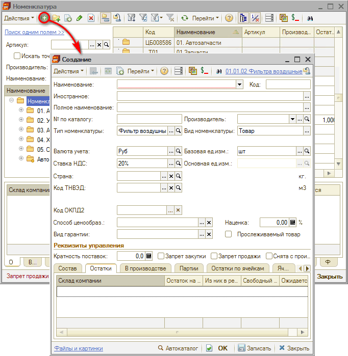
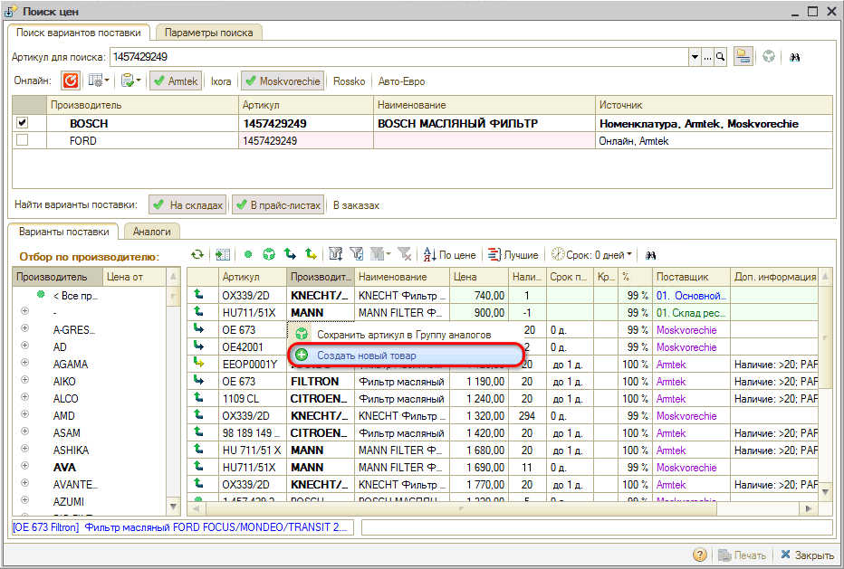

# Как добавить номенклатуру

<table><tr><td><b>Время чтения:</b> 1 мин.</td><td><b>Обновлено:</b> 08.07.2022</td></tr></table>

Источник: https://www.5systems.ru/help/kak-dobavit-nomenklaturu

- [1. Создать новый элемент справочника](#1-создать-новый-элемент-справочника)
- [2. Из Поиска цен](#2-из-поиска-цен)

Добавить номенклатуру можно одним из следующих способов:

## 1. Создать новый элемент справочника

Из справочника “Номенклатура” требуется создать добавлением новый элемент:

В создаваемой номенклатуре следует заполнить все необходимые параметры и сохранить.

## 2. Из Поиска цен

Из *Поиска цен* нажатием на кнопку “Создать новый товар” (подробнее см. [*статью*](../../../articles/5S%20AUTO/Проценка%20запчастей%20и%20работ/Поиск%20цен/poisk-cen.md) и [*видеокурс*](../../Урок%209.%20Работа%20с%20Поиском%20цен/)).

В данном случае автоматически создается и заполняется карточка номенклатуры. Можно затем открыть ее для редактирования.

---

**Теги:** запчасти и автоработы, номенклатура, новый элемент, поиск цен

