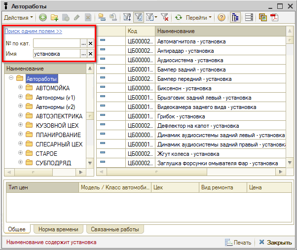
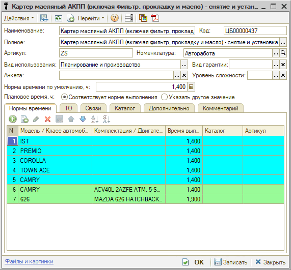
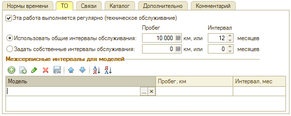
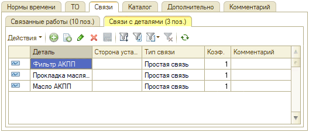
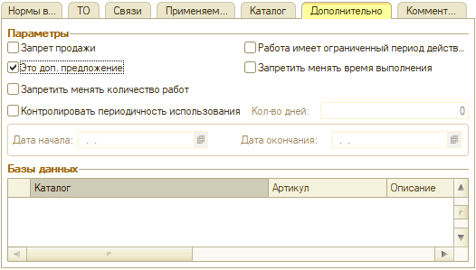

# Как работать со справочником «Автоработы»

<table><tr><td><b>Время чтения:</b> 7 мин.</td><td><b>Обновлено:</b> 18.07.2025</td></tr></table>

Источник: https://www.5systems.ru/help/avtoraboty

## Содержание

1. [Расположение справочника “Автоработы”](#расположение-справочника-автоработы)
2. [Работа со справочником](#работа-со-справочником)
   - [Кнопки панели управления](#кнопки-панели-управления)
   - [Поиск по справочнику](#поиск-по-справочнику)
      - [Вариант 1. Поиск одним полем](#вариант-1-поиск-одним-полем)
      - [Вариант 2. Поиск по отдельным полям](#вариант-2-поиск-по-отдельным-полям)
3. [Карточка автоработы](#карточка-автоработы)
   - [Описание полей карточки автоработы](#описание-полей-карточки-автоработы)
   - [Вкладки карточки автоработы](#вкладки-карточки-автоработы)
      - [1. Нормы времени](#1-нормы-времени)
      - [2. ТО](#2-то)
      - [3. Связи](#3-связи)
      - [4. Каталог](#4-каталог)
      - [5. Дополнительно](#5-дополнительно)
      - [6. Комментарий](#6-комментарий)

Справочник ***“Автоработы”*** содержит перечень всех авторемонтных работ, производимых компанией.

## Расположение справочника “Автоработы”

В меню интерфейса А*втосервис → Приемка → Справочники → Автоработы:*

## Работа со справочником

### Кнопки панели управления

<table><tr><td><b>Кнопка</b></td><td><b>Описание</b></td></tr><tr><td align="center"></td><td>Добавить: создать новую автоработу.</td></tr><tr><td align="center"></td><td>Добавить группу: создать папку для группировки списка.</td></tr><tr><td align="center"></td><td>Добавить новый элемент копированием.</td></tr><tr><td align="center"></td><td>Изменить текущий элемент.</td></tr><tr><td align="center"></td><td>Установить пометку удаления.</td></tr><tr><td align="center"></td><td>Включить/отключить иерархический просмотр.</td></tr><tr><td align="center"></td><td>Переместить элемент в другую группу.</td></tr><tr><td align="center"></td><td>Фильтры и отборы.</td></tr><tr><td align="center"></td><td>Ввести на основании.</td></tr><tr><td align="center"></td><td>Обновить текущий список.</td></tr><tr><td align="center"></td><td>Перейти к связанной информации.</td></tr><tr><td align="center"></td><td>Прикрепление файла с картинкой.</td></tr><tr><td align="center"></td><td>Прикрепление файла с описанием.</td></tr></table>

### Поиск по справочнику

Для поиска по справочнику авторабот можно переключиться на режим поиска по отдельным полям или искать по одному полю.

#### Вариант 1. Поиск одним полем

В строку поиска нужно ввести искомое значение, нажать [Enter] или кнопку с лупой: в списке останутся только позиции, содержащие в артикуле или наименовании введенные символы.

#### Вариант 2. Поиск по отдельным полям

Можно вести поиск отдельно по каталожным номерам или наименованию авторабот.

## Карточка автоработы

### Описание полей карточки автоработы

- **Наименование** – наименование автоработы.
- **Полное** – полное наименование автоработы.
- **Код** – код автоработы.
- **Артикул** – № автоработы по каталогу.
- **Номенклатура** – выбирается из справочника “[Номенклатура](../Как%20работать%20со%20справочником%20«Номенклатура»/nomenklatura.md)”. Базовая номенклатура автоработы с параметрами для задания ставок налогов.
- **Вид использования** – вид использования авторабот. Выбирается из списка:
  - *Планирование* — работы, которые будут использоваться исключительно для планирования при записи на ремонт, но не должны включаться на вкладку “Работы” заявки и [*заказ-наряда*](../../../articles/5S%20AUTO/Автосервис/Работа%20с%20Заказ-нарядами/Заказ-наряды/zakaz-naryady.md). Отображаются на вкладке “Планирование” заявки на ремонт.
  - *Производство* — работы, которые не используются для планирования, включаются на вкладку “Работы” заявки и *заказ-наряда*.
  - *Планирование и производство* — работы, которые могут использоваться как для планирования, так и быть включенными в *заказ-наряд*. Такие работы будут отображаться как на вкладке “Планирование”, так и на вкладке “Работы” документа “Заявка на ремонт”.
- **Анкета** – диагностическая анкета. Параметр заполняется при работе с функционалом “[*Диагностические анкеты*](../../Урок%2020.%20Диагностические%20анкеты/)”: для использования анкеты создается специальная авторабота и устанавливается ее связь с анкетой.
- **Вид гарантии** – выбор значения из справочника “[*Виды гарантии*](https://5systems.ru/help/kak-nastroit-vidy-garantiy) → Автоработы”.
- **Уровень сложности** – выбор [*уровня сложности*](../../../articles/5S%20AUTO/Автосервис/Автоработы/avtoraboty.md#уровень-сложности-работы) работ из соответствующего справочника, который предварительно нужно заполнить. Уровни сложности работ влияют на начисление заработной платы исполнителей. В отчетах возможно смотреть выработку по разным уровням сложности.
- **Норма времени по умолчанию** – общая норма времени выполнения работ. Это значение будет подставляться по умолчанию для всех моделей автомобилей. 
  В табличной части “Нормы времени” могут быть указаны исключения – другое время работ для особых случаев.

### Вкладки карточки автоработы

#### 1. Нормы времени

На вкладке *Нормы времени* отображается норма времени выполнения автоработы в часах для автомобилей выбранного класса.

Если класс автомобиля не задан, то значение общего параметра “Норма времени по умолчанию” действует для всех классов автомобилей.

#### 2. ТО

Вкладка *"ТО"* используется для авторабот, которые относятся к категории техобслуживания, т.е. выполняется регулярно, и может использоваться для настройки автоматической рассылки [*приглашений на ТО*](../../../articles/5S%20AUTO/CRM/Приглашения%20на%20ТО/priglasheniya-na-to.md).

Для использования функционала требуется поставить галочку “Эта работа выполняется регулярно (техническое обслуживание)” и задать пробег и интервал обслуживания. В таблице можно задать параметры для определенных [моделей](../../Урок%203.%20Клиенты%20и%20автомобили/Как%20работать%20со%20справочником%20«Модели%20автомобилей»/modeli-avtomobiley.md).

#### 3. Связи

Вкладка *"Связи"* включает два раздела: "Связанные работы" и "Связи с деталями".

*1) Связанные работы*

На вкладке *“Связанные работы”* отображается список работ, связанных с текущей автоработой:

Есть возможность добавить материалы по данной автоработе для последующей автоподстановки в Заказ-наряды – для этого необходимо в строке с добавленной номенклатурой установить признак **"Это материалы"** (подробнее см. в статье [Работа с расходными материалами](../../../articles/5S%20AUTO/Автосервис/Работа%20с%20расходными%20материалами/rabota-s-raskhodnymi-materialami.md#автоматическое-заполнение-расходных-материалов-включенных-в-работу)):

*2) Связи с деталями*

На вкладке *“Связи с деталями”* отображается перечень номенклатуры, связанной с текущей автоработой.

#### 4. Каталог

Данная вкладка используется для установки связи с каталогами, например с внешним каталогом услуг для настройки интеграции с веб-приложением 5S Link – подробнее см. в статье "[Настройка каталога услуг](../../../articles/5S%20AUTO/Приложение%205S%20LINK/Настройка%20каталога%20услуг/nastroyka-kataloga-uslug.md)":

#### 5. Дополнительно

На данной вкладке собраны различные дополнительные настройки:

#### 6. Комментарий

На вкладке "Комментарий" может быть введена произвольная текстовая информация.

*Подробнее см. [статью](../../../articles/5S%20AUTO/Автосервис/Автоработы/avtoraboty.md).*

---

**Теги:** запчасти и автоработы, автоработы, справочник авторабот, карточка автоработы

