# Как работать со справочником «Номенклатура»

<table><tr><td><b>Время чтения:</b> 20 мин.</td><td><b>Обновлено:</b> 23.12.2024</td></tr></table>

Источник: https://www.5systems.ru/help/nomenklatura

## Содержание

1. [Для чего нужен справочник "Номенклатура"](#для-чего-нужен-справочник-номенклатура)
2. [Как открыть справочник "Номенклатура"](#как-открыть-справочник-номенклатура)
   - [Как искать номенклатуру в справочнике](#как-искать-номенклатуру-в-справочнике)
   - [Как пользоваться кнопками панелей управления](#как-пользоваться-кнопками-панелей-управления)
3. [Как перейти в карточку номенклатуры](#как-перейти-в-карточку-номенклатуры)
4. [Как работать с Типами номенклатуры](#как-работать-с-типами-номенклатуры)
5. [Какие используются Виды номенклатуры](#какие-используются-виды-номенклатуры)
6. [Какая информация относится к характеристикам номенклатуры](#какая-информация-относится-к-характеристикам-номенклатуры)

## Для чего нужен справочник "Номенклатура"

Справочник **“Номенклатура”** – один из основных справочников программы. В него заносится информация обо всех товарах и услугах, включаемых в документы, которые оформляются в компании, в т.ч. о наборах и комплектах товаров.

## Как открыть справочник "Номенклатура"

В меню интерфейса программы *Автосервис → Приемка → Справочники → Номенклатура:*

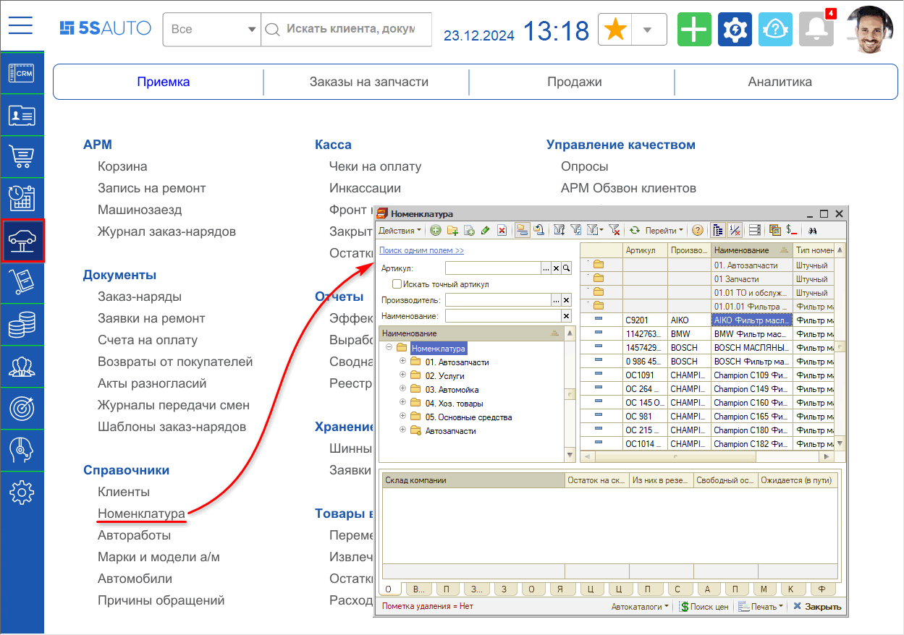

### Как искать номенклатуру в справочнике

В верхнем левом углу формы списка справочника находится область поиска. Можно вести поиск одним полем, либо переключиться на поиск по отдельным полям нажатием на соответствующую кнопку-ссылку.

#### Вариант 1. Как искать одним полем

Чтобы найти в справочнике нужный товар, в строку поиска необходимо ввести артикул или наименование детали и нажать [Enter] или кнопку с лупой. В списке останутся только позиции, содержащие введенное значение в наименовании или артикуле.

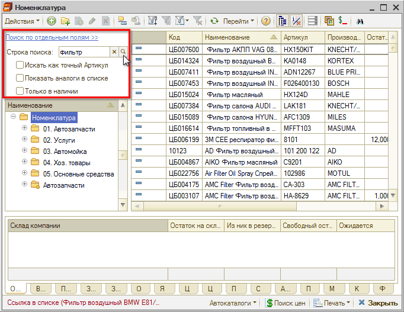

Для более детального поиска можно использовать отборы *“Искать как точный Артикул”*, *“Показать аналоги в списке”* и *“Только в наличии”*.

#### Вариант 2. Как искать по отдельным полям

Для быстрого отбора по артикулу, производителю или наименованию можно использовать отдельные поля поиска. При вводе в эти строки каких-либо значений в таблице справочника остаются только позиции, артикул или наименование которых включают указанные значения.

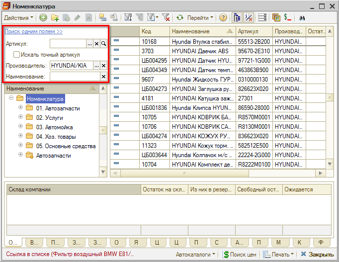

### Как пользоваться кнопками панелей управления

#### Включение панели вкладок

С помощью кнопки панели управления *“Отобразить/скрыть панель информации”  * можно вывести или убрать в нижней части справочника панель информации, которая содержит вкладки, соответствующие выделенной строке таблицы справочника:

- ***Остатки*** – информация об остатках товара на всех складах компании: о количестве товара, зарезервированного на каждом складе, и розничная сумма для розничных складов.
- ***В производстве*** – параметры незакрытых заказ-нарядов с указанием цеха, в котором производится ремонт, и количества перемещенного по заказ-наряду товара.
- ***Партии*** – перечень остатков партий текущего товара на всех складах по количеству и себестоимости в единицах управленческого учета.
- ***Заказы покупателей*** – отображается список невыполненных заказов покупателей и внутренних заказов на данную номенклатурную позицию с указанием заказчика, размера заказа и резерва по этому заказу.
- ***Заказы поставщикам*** – отображается список невыполненных заказов поставщикам на данную номенклатурную позицию с указанием поставщика и величины заказа.
- ***Остатки по ячейкам*** – информация об остатках данной номенклатурной позиции в ячейках на складах компании.
- ***Ячейки хранения по умолчанию*** – список ячеек, которые используются для автоподстановки в документы для данной номенклатурной позиции в качестве ячейки хранения по умолчанию.
- ***Цены*** – варианты цены товара для разных типов цен (в валюте цены этого типа и в валюте бухгалтерского учета) в разрезе подразделений, характеристик товара и способа учета (единицы измерения).
- ***Цены поставщиков*** – закупочные цены, по которым был куплен товар у разных поставщиков, в разрезе подразделений, характеристик товара и способа учета (единицы измерения). Цены показываются в валюте типа цены, указанного в документе закупки, и в валюте бухгалтерского учета. 
  *Информация о ценах поставщиков присутствует только в том случае,* *если для конкретных типов цен установлен флажок “Регистрировать* *цены поставщиков при поступлении”.*
- ***Прайс-листы*** – список номенклатуры в прайс-листах контрагентов с таким же артикулом, как и у данной номенклатурной позиции. Информация отображается как для загруженных в информационную базу прайс-листов, так и для находящихся во внешних источниках данных.
- ***Аналоги*** – отображается информация о взаимозаменяемости данной номенклатурной позиции с указанием для каждого аналога его наименования и номера по каталогу. Также отображается общий складской остаток по каждому аналогу и сведения о том, является ли этот аналог *главным по группе* (используется при автоматическом расчете заказа на пополнение склада) и *по производителю* (информационный признак).
- ***Применяемость*** – список моделей автомобилей, к которым может быть применена данная номенклатурная позиция.
- ***Мин. ост.*** – устанавливается минимальный остаток данного товара, который должен храниться на складах разных подразделений компании. Графа *“Период”* содержит дату, начиная с которой задан соответствующий минимальный остаток.
- ***Фильтр*** – вкладка позволяет найти элементы номенклатуры по указанным условиям.

  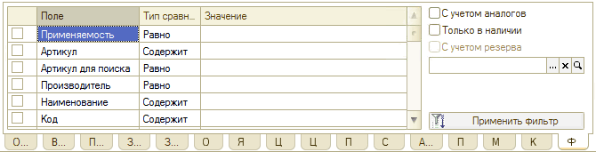

  Слева на вкладке представлена таблица отбора, а в правой части содержатся флажки:

  - ***С учетом аналогов*** – если установить, то результат отбора по данной позиции номенклатуры будет также содержать аналоги искомой номенклатуры.
  - ***Только в наличии*** – если установить, то результат отбора будет содержать информацию только о тех элементах номенклатуры, которые имеются на складах. Если выбран конкретный склад, то результаты отбора будут представлены только для этого склада. Если склад не выбран, то будут выведены данные со всех складов.
  - ***С учетом резерва*** – если установить, то отбор будет произведен с учетом информации о зарезервированных элементах данной номенклатуры.

   Кнопка *“Применить фильтр”*, расположенная в правой нижней части вкладки, показывает результаты отбора. После показа результатов отбора эта кнопка заменяется на кнопку *“Снять отбор”*. Кнопка *“Снять отбор”* восстанавливает информацию, которая отображалась до установки отбора.

#### Как использовать добавочные кнопки на нижней панели

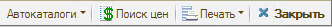

- *Автокаталоги*;
- *Поиск цен* – переход в обработку *“[Поиск цен](../../Урок%209.%20Работа%20с%20Поиском%20цен/)”* для поиска вариантов поставки;
- *Печать –* вызывает на выбор отчет *“Печать списка”* или обработку *“Печать этикеток и ценников”*;
- *Закрыть* – закрыть форму справочника.

#### Как просмотреть или прикрепить картинки и файлы

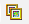 Кнопка *“Картинки и файлы”*, расположенная на панели инструментов, открывает окно, содержащее список файлов, прикрепленных к выбранному элементу номенклатуры.

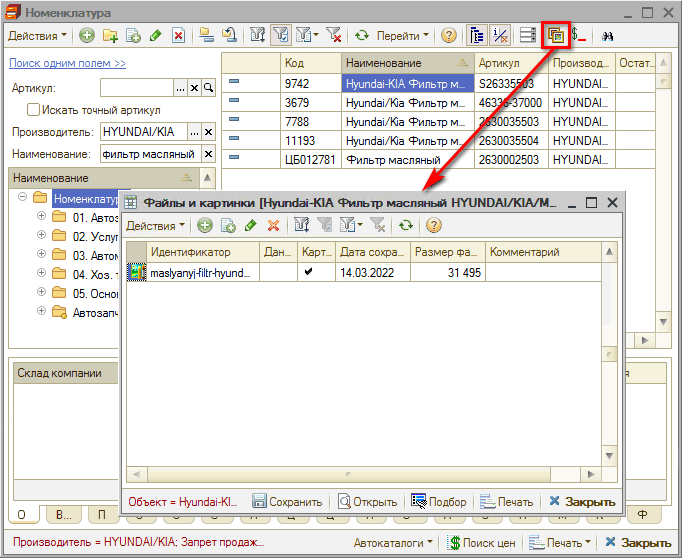

Регистр сведений *“Картинки и файлы”* является универсальным хранилищем дополнительных данных (внешних объектов – файлов, картинок и т. п.). Для каждой номенклатурной позиции можно задать несколько прикрепленных файлов.

Двойным кликом открывается карточка файла:

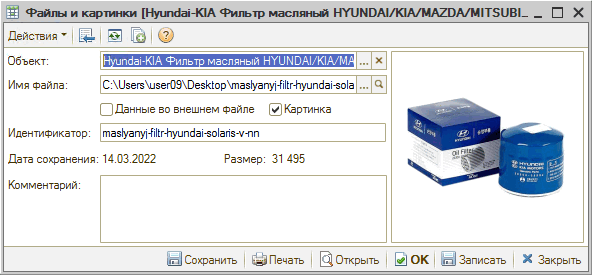

Карточка файла содержит следующие поля:

- *Объект* – номенклатурная позиция, которой соответствует данный файл.
- *Имя файла* – полный путь к графическому файлу, содержащему изображение.
- *Данные во внешнем файле* – признак того, что файл хранится в качестве внешнего файла на диске. Если флажок снят, то файл изображения будет помещен в базу данных.
- *Картинка* – признак того, что файл является картинкой.
- *Идентификатор* – текстовое поле, произвольное наименование изображения.
- *Дата сохранения* – дата сохранения данных объекта.
- *Размер* – размер выбранного графического файла в байтах.
- *Комментарий* – произвольный текстовый комментарий к файлу/картинке. При [*выгрузке прайс-листов*](../../../articles/5S%20AUTO/Склад%20и%20запчасти/Выгрузка%20прайс-листов/vygruzka-prays-listov.md) на сайт в данном поле пропишется адрес картинки.

#### Как использовать свойства номенклатуры

Из справочника или из карточки номенклатуры можно вызвать окно *“Свойства”*, которое содержит данные, связанные с выбранным элементом. Данные удобно просматривать и редактировать.

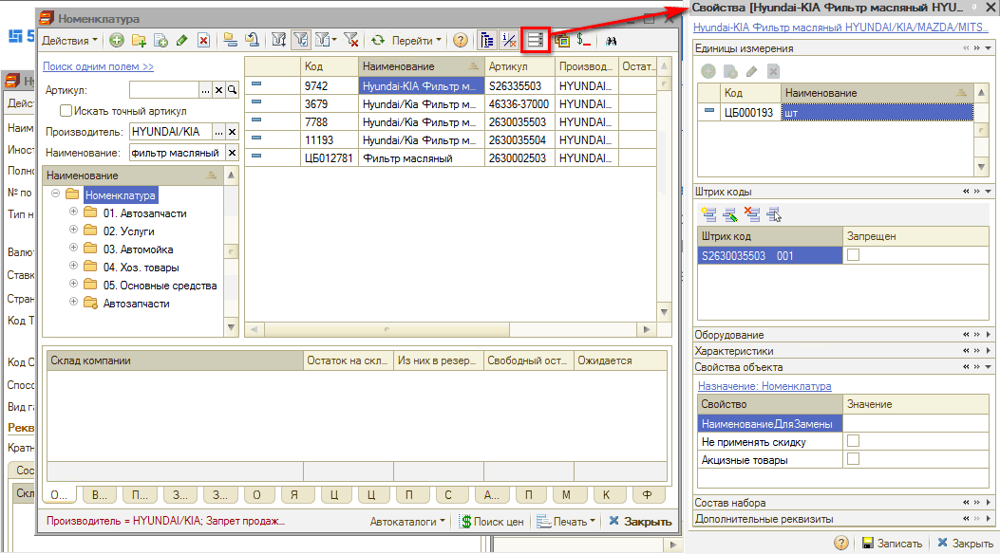

#### Как работать с группами элементов

Кнопка *“Добавить группу”* позволяет создать группу, которая может содержать элементы или другие подчиненные группы номенклатурных элементов. Значения полей этого диалогового окна задают значения по умолчанию для всех новых номенклатурных элементов, которые будут вводиться или создаваться в этой группе.

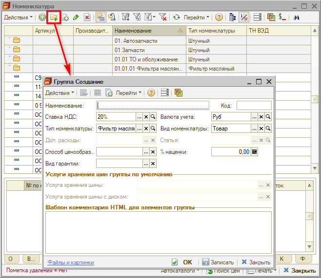

Поля карточки группы элементов номенклатуры:

- *Ставка НДС* – ставка НДС по умолчанию.
- *Тип номенклатуры* – [тип номенклатуры](#как-работать-с-типами-номенклатуры) по умолчанию.
- *Вид номенклатуры* – [вид номенклатуры](#какие-используются-виды-номенклатуры) по умолчанию.
- *Доп. расходы* – способ распределения дополнительных расходов (только для услуг).
- *Статья* – статья распределения дополнительных расходов (только для услуг).
- *Валюта учета* – валюта учета по умолчанию.
- *% наценки* – процент наценки по умолчанию для установки розничных цен.
- *Вид гарантии* – выбор вида гарантии из справочника.

## Как перейти в карточку номенклатуры

Открыть карточку номенклатуры из справочника можно двойным кликом, либо кнопкой на панели управления “Изменить текущий элемент”:

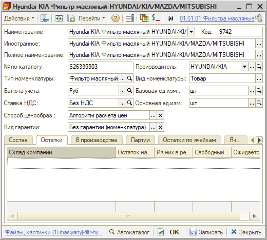

На командной панели карточки номенклатуры справа вверху расположена гиперссылка, указывающая на *группу* справочника, к которой относится данный элемент. При нажатии гиперссылки открывается окно справочника “Номенклатура”, в нем можно переносить элементы из группы в группу.

### Какие параметры содержит карточка Номенклатуры

- ***Наименование*** – наименование номенклатуры.
- ***Код*** – код элемента номенклатуры.
- ***Иностранное*** – наименование на иностранном языке, например, из зарубежных каталогов.
- ***Полное наименование*** – полное наименование элемента номенклатуры, например, для печати.
- ***№ по каталогу*** – каталожный номер запчасти.
- ***Производитель*** – производитель запчасти.
- ***Тип номенклатуры*** – задает поведение номенклатурной позиции в учете, ссылается на справочник *“[Тип номенклатуры](#как-работать-с-типами-номенклатуры)”*.
- ***Вид номенклатуры*** – выбирается из списка *“[Виды номенклатуры](#какие-используются-виды-номенклатуры)”*.
- ***Валюта учета*** – валюта, в которой учитывается номенклатурная единица.
- ***Ставка НДС*** – ставка НДС, используемая в документах по умолчанию.
- ***Базовая единица измерения*** – задает единицу измерения, в которой ведется складской учет товара.
- ***Основная единица измерения*** – единица измерения, используемая в документах по умолчанию (может совпадать с базовой единицей).
- ***Способ ценообраз.*** – текущий способ ценообразования.
- ***Вид гарантии*** – установленный на запчасть *вид гарантии* из справочника “Виды гарантии”.

### Какая информация собрана на вкладках карточки номенклатуры

В нижней части карточки номенклатуры располагаются вкладки, большинство из которых аналогичны вкладкам справочника “Номенклатура” и описаны *[выше](#vkladki).*

На ***вкладке "Признаки"*** расположены предопределенные и добавленные признаки, которые можно назначать для товаров для упрощения работы со справочником "Номенклатура" на этапах подбора запчастей, проценки и оформления документов. Подробнее см. статью *"[Признаки номенклатуры](../../../articles/5S%20AUTO/Склад%20и%20запчасти/Признаки%20номенклатуры/priznaki-nomenklatury.md)".*

На ***вкладку "Дополнительно"*** вынесены следующие параметры:

- ***Страна*** – определяет место производства товара, выбирается из справочника "Классификатор стран мира".
- ***Код ТНВЭД*** – коды товарной номенклатуры внешнеэкономической деятельности, используются при заполнении реквизитов номенклатуры. Данный справочник может быть заполнен с помощью подбора из классификатора кодов ТН ВЭД, а также вручную пользователем поэлементно. При использовании подбора из классификатора кодов существенно снижается трудоемкость ввода информации. Коды, которые уже были выбраны из классификатора подбора, в списке отмечаются синим цветом.
- ***Код ОКПД2*** – коды продукции по видам экономической деятельности, используются при заполнении реквизитов номенклатуры. Справочник может быть заполнен с помощью подбора из классификатора ОКПД2, а также вручную.
- ***Вес (брутто), кг*** – вес запчасти в кг. Обычно соответствует массе Брутто в основной единице измерения массы.
- ***Объем*** – объем запчасти в м³. Обычно соответствует объему в основной единице измерения объема.
- ***Наценка*** – процент наценки по умолчанию для установки цен.
- ***Кратность поставок*** – число, которому будет кратно количество в заказе поставщику.

Если *Вид номенклатуры* соответствует *услуге,* то в информационной панели отображается дополнительная ***вкладка “Услуга”***:

- ***Способ распределения*** – устанавливается способ распределения доходов при проведении документа: сумма услуг распределяется либо на доходы и расходы, либо на себестоимость перечисленных в документе товаров.
- ***Статья расходов*** – задается статья доходов и расходов (выбирается из справочника “Статьи доходов и расходов”).
- ***Вид платежа*** – заполняется из справочника “Виды платежей”.

***Вкладка “Комментарий”*** может содержать произвольное примечание к описываемой номенклатурной позиции.

***Вкладка "Авито"*** – дополнительная вкладка, появляется при подключении интеграции с платформой объявлений Авито. На данной вкладке расположены параметры для настройки выгрузки объявлений по продаже данного товара – см. в [статье](../../../articles/5S%20AUTO/Склад%20и%20запчасти/Автоматическая%20публикация%20объявлений%20на%20Авито/avtomaticheskaya-publikaciya-obyavleniy-na-avito.md#шаг-3-заполнение-свойств-номенклатуры).

## Как работать с Типами номенклатуры

Справочник ***“Типы номенклатуры”** (Справочники → Номенклатурные → Типы номенклатуры)* содержит список типов номенклатуры. Этот справочник позволяет вести учет по категориям товаров, а также осуществлять настройку учета товаров и услуг отдельно для каждого типа номенклатуры:

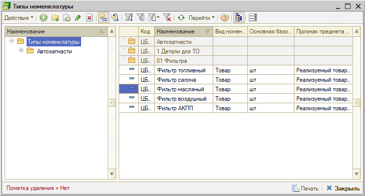

### Какие параметры содержит карточка Типа номенклатуры

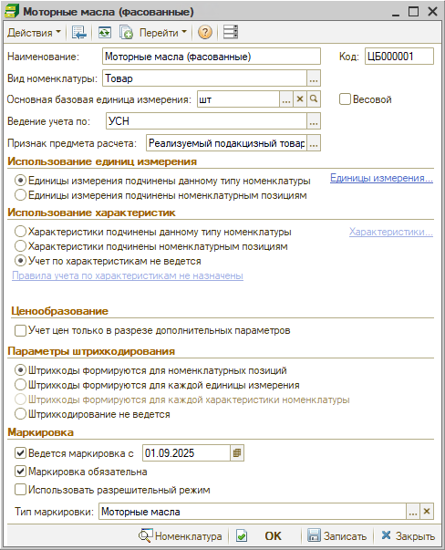

***Описание полей карточки Тип номенклатуры:***

<table><tr><td><b>Поле</b></td><td><b>Содержимое</b></td></tr><tr><td><b><i>Наименование</i></b></td><td>Наименование типа номенклатуры.</td></tr><tr><td><b><i>Вид номенклатуры</i></b></td><td>Задает поведение номенклатурного типа в учете. Выбирается из выпадающего списка (см. <a href="#какие-используются-виды-номенклатуры"><i>ниже</i></a><i>).</i></td></tr><tr><td><b><i>Основная базовая единица измерения</i></b></td><td>Используется по умолчанию при вводе новых номенклатурных позиций. Выбирается из классификатора единиц измерения.</td></tr><tr><td><b><i>Весовой</i></b></td><td>Флажок. Признак весового товара. Используется для определения вида штрих-кодирования.</td></tr><tr><td><b><i>Использование единиц измерения</i></b></td><td>Переключатель на две позиции: <ul><li><i>Единицы измерения подчинены данному типу номенклатуры</i> — означает, что есть общие единицы измерения для всех товаров с данным типом номенклатуры.</li></ul> При выборе данного варианта подчинения единиц измерения активируется гиперссылка <i>“Единицы измерения”</i>, при нажатии на которую открывается справочник для создания и редактирования единиц измерения, подчиненных данному типу номенклатуры. <ul><li><i>Единицы измерения подчинены номенклатурным позициям</i> — означает, что для каждого товара с данным типом номенклатуры можно задавать свои собственные единицы измерения.</li></ul></td></tr><tr><td><b><i>Использование характеристик</i></b></td><td>Переключатель на три позиции: <ul><li><i>Характеристики подчинены данному типу номенклатуры</i> — есть общие характеристики для всех номенклатурных элементов данного типа номенклатуры. При этой позиции переключателя справа доступна гиперссылка “<i>Характеристики”</i>, позволяющая вызвать подчиненный <a href="#какая-информация-относится-к-характеристикам-номенклатуры">справочник</a> для редактирования характеристик данного типа номенклатуры.</li><li><i>Характеристики подчинены номенклатурным позициям</i> — в каждом номенклатурном элементе можно будет задавать свои собственные характеристики. При этой позиции переключателя доступна гиперссылка, содержание которой зависит от типа номенклатуры. Например, <i>Порядок списания: ручной выбор; Ограничение данных; Серийные номера и свойства характеристики.</i></li></ul> Эта гиперссылка открывает диалоговое окно формы “Настройка учета по характеристикам”. Здесь можно задать способ ручного или автоматического списания номенклатуры по характеристикам, установить ограничение на использование характеристик для данной номенклатуры или ее типа, установить флажком значение уникальности серийного номера данной номенклатуры.<ul><li><i>Учет по характеристикам не ведется</i>.</li></ul></td></tr><tr><td><b><i>Ценообразование</i></b></td><td>Флажок позволяет установить учет цен для данного типа номенклатуры только в разрезе дополнительных параметров.</td></tr><tr><td><b><i>Параметры штрих-кодирования</i></b></td><td>Переключатель на четыре позиции: <ul><li>Штрих-коды формируются для номенклатурных позиций;</li><li>Штрих-коды формируются для каждой единицы измерения;</li><li>Штрих-коды формируются для каждой характеристики номенклатуры;</li><li>Штрих-кодирование не ведется.</li></ul></td></tr><tr><td><b><i>Маркировка</i></b></td><td><ul><li><i>Ведется маркировка</i> – для данного типа номенклатуры ведется учет по маркировкам;</li><li><i>Дата</i> – дата начала ведения ведения учета по маркировкам в базе для данного типа товара;</li><li><i>Маркировка обязательна</i> – признак требует обязательного наличия кодов маркировки для всего количества товара (активирует сверку количества кодов маркировки с количеством товара);</li><li><i>Использовать разрешительный режим</i> — для данного типа номенклатуры обязателен разрешительный режим онлайн проверки кодов маркировки перед пробитием чека (с ноября 2024 г. обязательно для шин – см. <i><a href="../../../articles/5S%20AUTO/Маркировка/Операции%20с%20кодами%20маркировки/operacii-s-kodami-markirovki.md#разрешительный-режим">статью</a>);</i></li></ul><i>Тип маркировки</i> – возможность выбора категории маркируемого товара активируется при установке признака "Ведется маркировка".</td></tr></table>

## Какие используются Виды номенклатуры

- ***Товар*** – основной номенклатурный вид.
- ***Услуга*** – сумма покупки услуги либо относится на доходы и расходы, либо распределяется на себестоимость товаров, покупаемых вместе с услугой.
- ***Комплект*** – категория для товара, составленного из комплектующих товаров. Для комплекта следует выполнять операции комплектации и разукомплектации.
- ***Тара*** – товарная категория, по которой можно вести добавочный («тарный») учет.
- ***Набор*** – набор состоит из нескольких товаров. При выборе набора в документе он автоматически заменяется на компоненты. Комплектация/разукомплектация для набора не проводится.
- ***Прочие активы*** – элемент является прочим активом. В этом случае появляется добавочный реквизит: основной тип эксплуатации.
- ***Шины*** – элемент является шиной. Предусматриваются добавочные особенности (свойства) шины: ширина, высота, радиус, профиль и т. п.
- ***Диски*** – элемент номенклатуры является диском. В этом случае имеются добавочные особенности (свойства) диска: размер и т. п.
- ***Номерные агрегаты*** – элемент номенклатуры является номерным агрегатом. В этом случае имеется добавочная особенность (вид) номерного агрегата.
- ***ЛКМ*** – элемент номенклатуры является лакокрасочным материалом.
- ***Опции автомобиля*** – само по себе это значение не создает особенностей. Однако номенклатурные позиции, которым присвоен этот тип, могут быть в дальнейшем задействованы в качестве опций для дополнительного оснащения автомобилей на предприятии по заказ-нарядам.
- ***Автомобили*** – элемент номенклатуры является автомобилем.

## Какая информация относится к характеристикам номенклатуры

Кнопка командной панели “Перейти” открывает доступ к справочнику *“Характеристики номенклатуры” — э*тот справочник содержит информацию, позволяющую вести количественный учет материальных ценностей, отличающихся индивидуальными особенностями.

Например, может оказаться, что на складе находятся две позиции номенклатуры “Масло”, причем часть масла разлита в пластиковые канистры, а другая часть — в жестяные.

В таких ситуациях справочник “Характеристики номенклатуры” позволяет расширить характеристики для позиций номенклатуры, включив в них серийные номера, параметры качества, даты изготовления, сроки годности, данные сертификата.

Понятие характеристики номенклатуры применимо только для тех типов номенклатуры, для которых в карточке типа номенклатуры отключен флажок “Учет по характеристикам не ведется”.

---

**Теги:** запчасти и автоработы, номенклатура, справочник номенклатуры, карточка номенклатуры, типы номенклатуры, виды номенклатуры, характеристики
