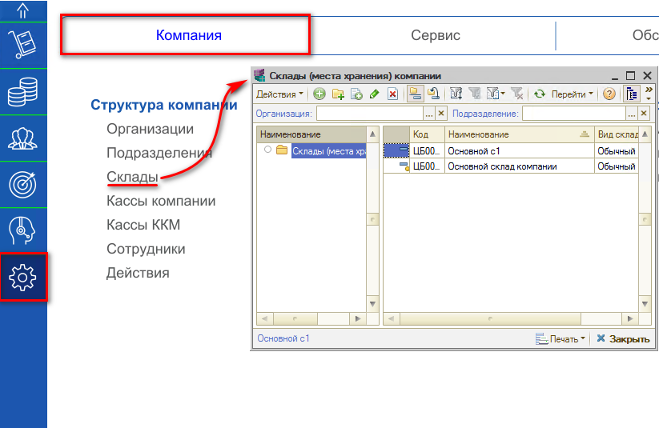
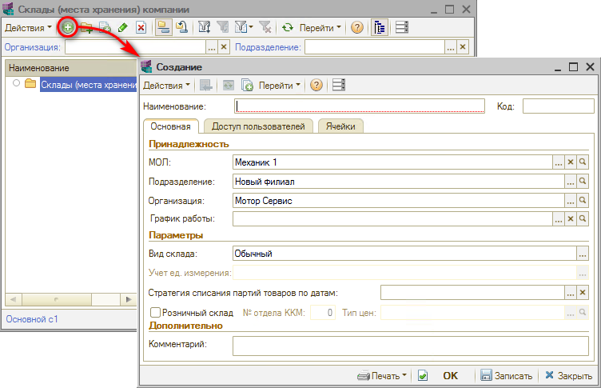
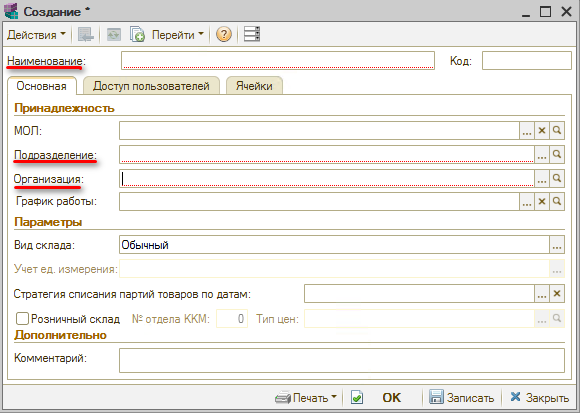

# Как добавить склад

<table><tr><td><b>Время чтения:</b> 2 мин.</td><td><b>Обновлено:</b> 14.08.2026</td></tr></table>

Справочник **"Склады (места хранения)"** предназначен для ведения списка мест хранения товаров. Каждый элемент справочника описывает некоторое физическое место хранения.

Для добавления склада необходимо перейти в пункт меню "Администрирование", на вкладке" "Компания", раздел "Структура компании", где находится справочник "Склады":

После открытия справочника "Склады (места хранения) компании", нажимаем на кнопку "Добавить":

В открывшемся окне заполняем обязательные поля: “Наименование”, “Подразделение”, “Организация”.

Если уже известно МОЛ (Материально ответственное лицо), заполняем соответствующее поле. Устанавливать пометку “Розничный склад” не рекомендуется.

Практически всегда используется вид склада "Обычный", другие же виды крайне редко.

Подробно ознакомиться с видами склада можно в статье: [*Виды склада*](../../../articles/5S%20AUTO/Склад%20и%20запчасти/Виды%20склада/vidy-sklada.md).

---

**Теги:** складской учет, склад, справочник складов, виды складов
