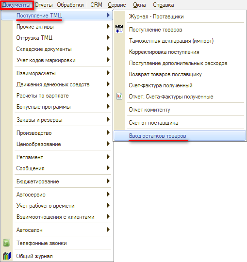
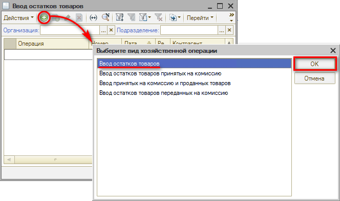
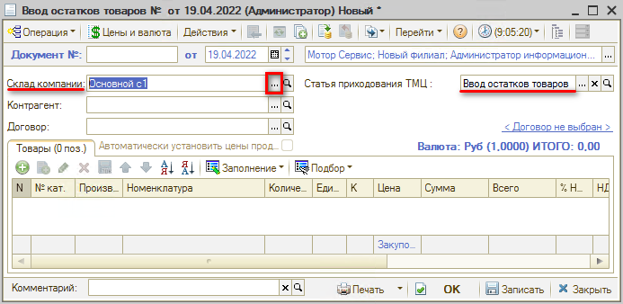
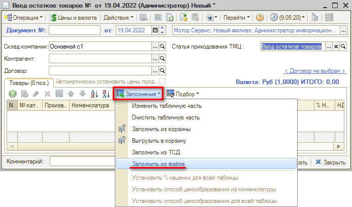
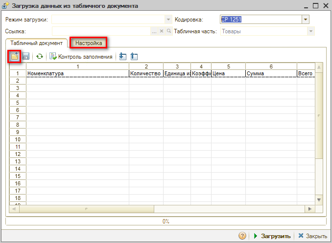
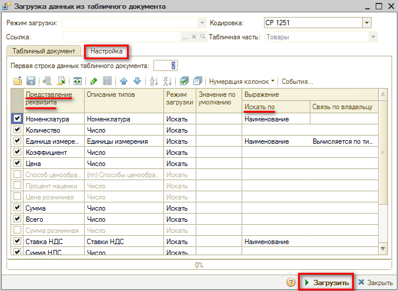
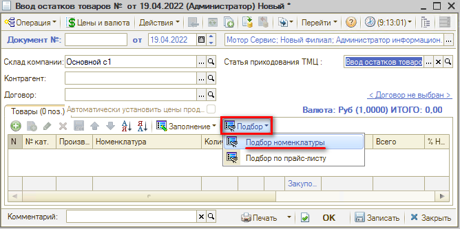
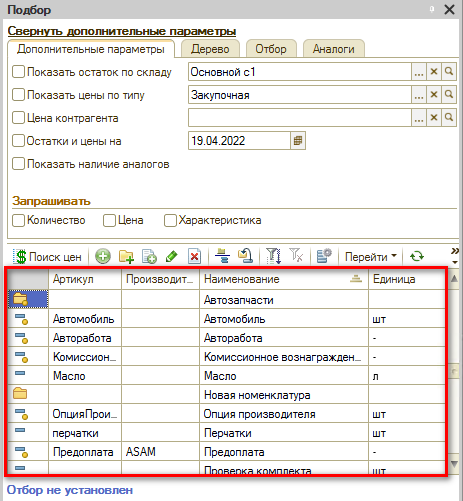
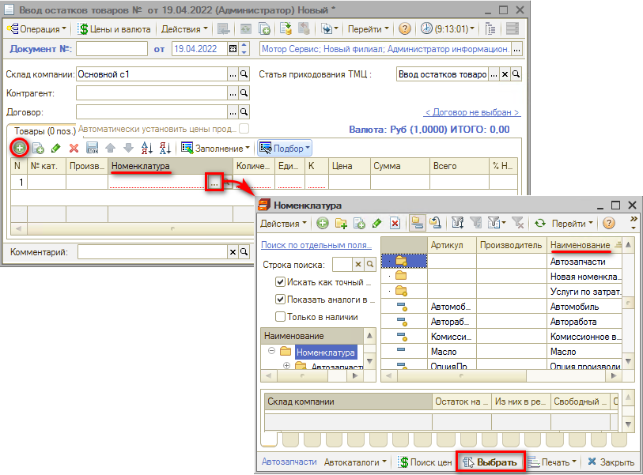
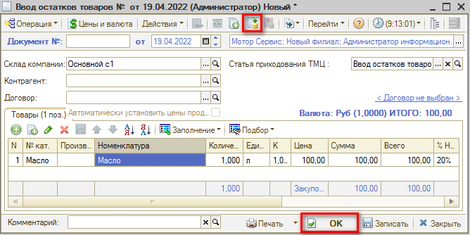

# Как задать начальные остатки товаров

<table><tr><td><b>Время чтения:</b> 4 мин.</td><td><b>Обновлено:</b> 21.11.2022</td></tr></table>

Источник: https://www.5systems.ru/help/kak-zadat-nachalnye-ostatki-tovarov

## Содержание

1. [Ввод остатков товаров через кнопку “Заполнить из файла”](#ввод-остатков-товаров-через-кнопку-заполнить-из-файла)
2. [Подбор из справочника “Номенклатура”](#подбор-из-справочника-номенклатура)
3. [Ввод остатков товаров через ручное заполнение](#ввод-остатков-товаров-через-ручное-заполнение)
4. [Проведение документа](#проведение-документа)

Документ **"Ввод остатков товаров"** предназначен для ввода начальных остатков товаров на складах.

Выбираем в верхнем меню “Документы”, на вкладке “Поступление ТМЦ”, реестр документов “Ввод остатков товаров”:

Откроется окно “Ввод остатков товаров”. Нажимаем на кнопку "Добавить", выбираем “Вид хозяйственной деятельности”, в основном используется “Ввод остатков товаров”:

В открывшемся окне “Ввод остатков товаров” заполняем поля “Склад компании" и “Статья приходования ТМЦ” (чаще всего используют “Ввод остатков товаров”):

Основные **способы заполнения** табличной части документа “Ввод остатков товаров”:

1. Заполнение из файла;
2. Подбор из справочника “Номенклатура”;
3. Заполнение вручную.

## Ввод остатков товаров через кнопку “Заполнить из файла”

В табличной части документа выбираем кнопку “Заполнение” → “Заполнить из файла”:

Во всплывающем окне нажимаем кнопку  “Открыть файл” и выбираем файл в формате: .mxl, .txt, .xls, .xlsx. Когда подгрузится файл, необходимо настроить соответствие колонок из файла колонкам таблицы. Для этого нажимаем на вкладку “Настройка”:

Настраиваем так, чтобы столбец “Представление реквизита” и “Выражение/Искать по” соотнеслись, например, как “Наименование” и “Наименование”. Настраиваем все необходимые нам столбцы.

После настроек нажимаем кнопку “Загрузить”.

## Подбор из справочника “Номенклатура”

В табличной части документа “Ввод остатков товаров” нажимаем кнопку “Подбор” и “Подбор номенклатуры”:

Во всплывающем окне “Подбор” выбираем необходимые товары.

## Ввод остатков товаров через ручное заполнение

Добавлять товары можно вручную, выбирая из справочника “Номенклатура” и указывая нужное количество.

## Проведение документа

После проверки заполнения документа нажимаем кнопку Провести либо кнопку ОК (запись с проведением и закрытием формы).

---

**Теги:** складской учет, начальные остатки, ввод остатков, оприходование

