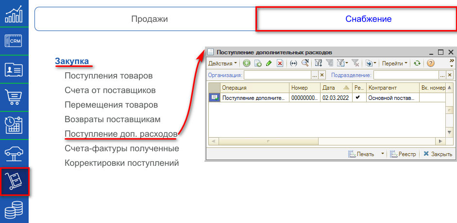
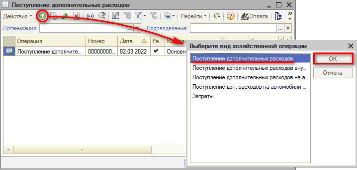
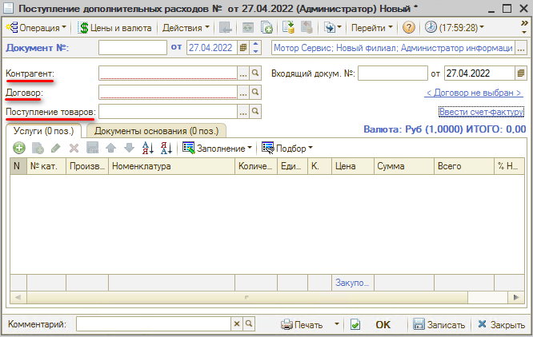
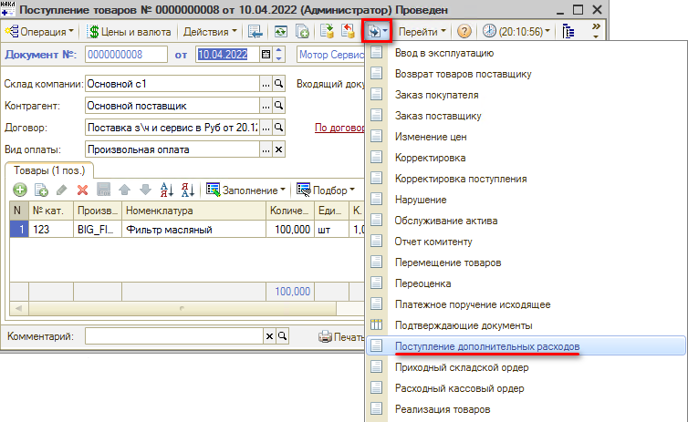
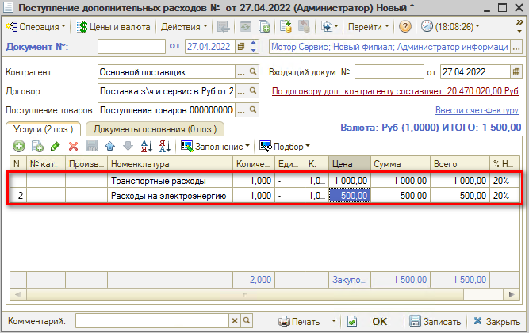
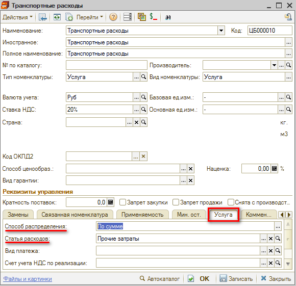
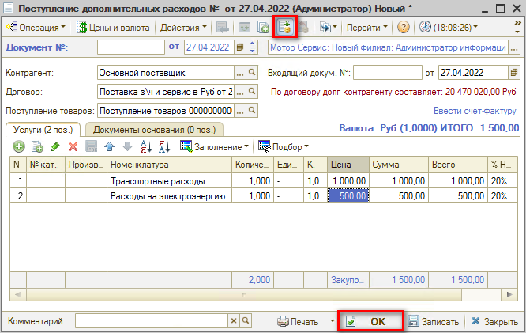

# Как отразить расходы на доставку

<table><tr><td><b>Время чтения:</b> 3 мин.</td><td><b>Обновлено:</b> 08.07.2022</td></tr></table>

Источник: https://www.5systems.ru/help/kak-otrazit-raskhody-na-dostavku

Документ **"Поступление дополнительных расходов"** предназначен для учета тех услуг сторонних организаций и собственной компании, которые оказывают влияние на себестоимость товаров. То есть введением данного документа можно увеличить себестоимость партий товаров на сумму расходов на логистику (разнести стоимость услуг на себестоимость товаров).

Для открытия реестра документов “Поступление дополнительных расходов” необходимо перейти в пункт меню "Запчасти и склад", на вкладке “Снабжение", в разделе "Закупка" выбрать пункт “Поступление доп. расходов”:

Из реестра “Поступление дополнительных расходов” можно ввести новый документ нажатием на кнопку “Добавить” и выбрать вид хозяйственной операции - Поступление дополнительных расходов:

В окне создания документа необходимо ввести или скорректировать обязательные поля: Контрагент, оказывающий услуги; Договор; Поступление товаров.

## Ввод поступления дополнительных расходов на основании документа “Поступление товаров”

Для автоматического заполнения обязательных реквизитов документа необходимо зайти в нужный документ “Поступление товаров” и по кнопке “Ввести на основании” выбрать “Поступление дополнительных расходов”.

После этого откроется окно создания документа, где необходимо будет указать список услуг, которые предоставил Контрагент, и их стоимость.

Услуги выбираются из справочника “Номенклатура”. Транспортные расходы являются часто используемыми и по умолчанию присутствуют в базе.

Указать способ распределения и статью расходов можно в самой карточке номенклатуры на вкладке “Услуга”.

Поле “Способ распределения” устанавливает способ распределения доходов при проведении документа: сумма услуг распределяется либо на доходы и расходы, либо на себестоимость перечисленных в документе товаров.

Поле “Статья расходов” задает статью доходов и расходов (выбирается из справочника “Статьи доходов и расходов”).

## Проведение документа

После проверки заполнения документа нажимаем кнопку “Провести” либо кнопку “ОК” (запись с проведением и закрытием формы).

---

**Теги:** складской учет, дополнительные расходы, доставка, себестоимость
