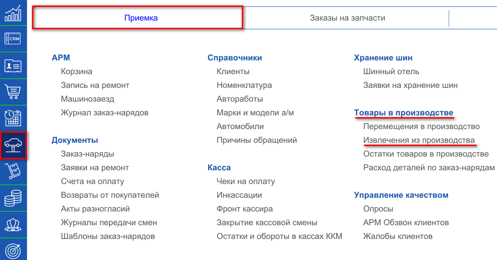
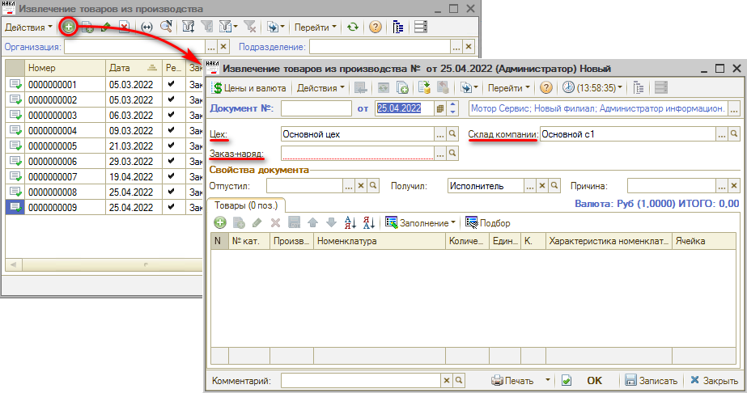
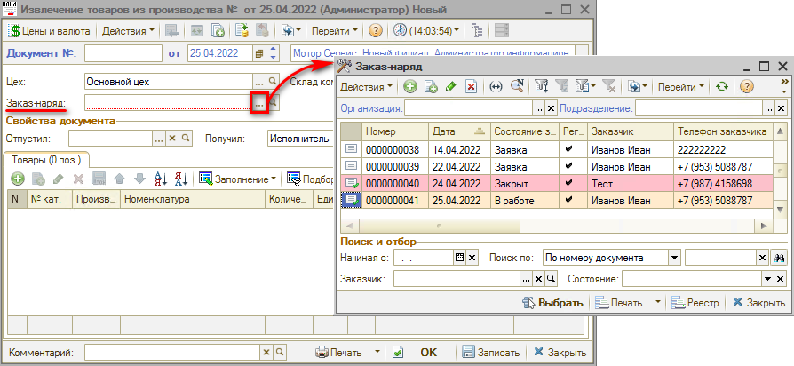
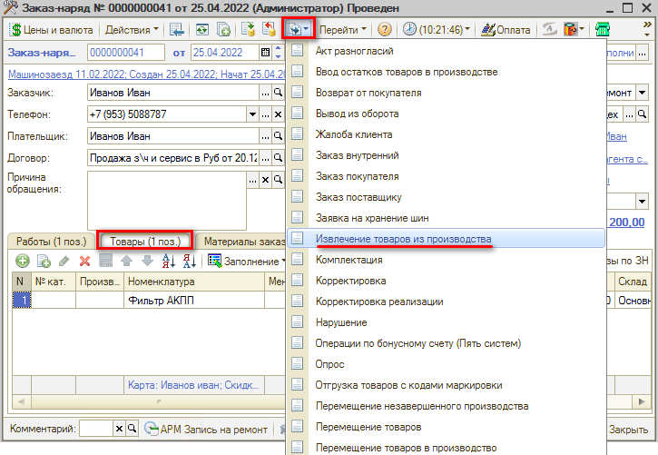
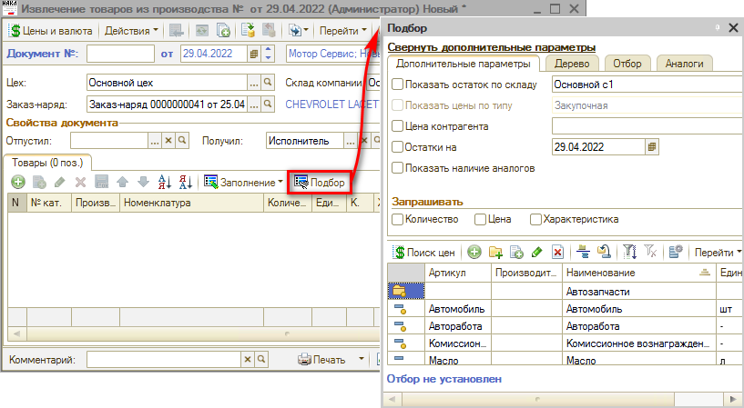
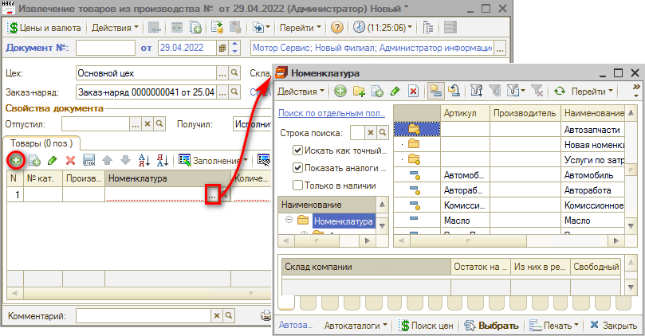
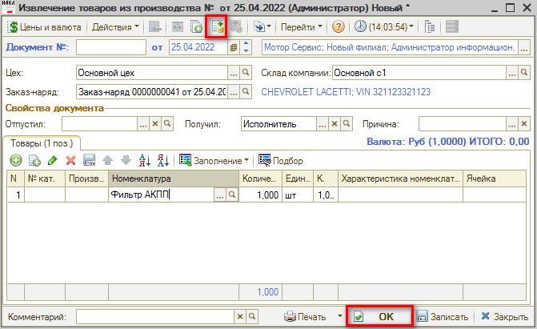
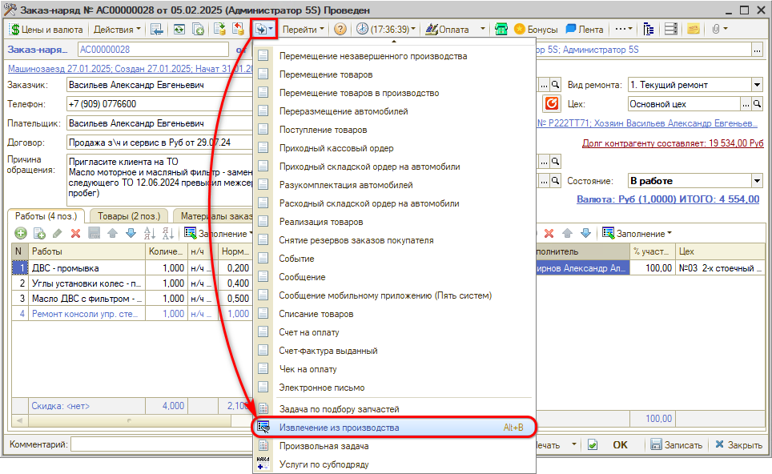
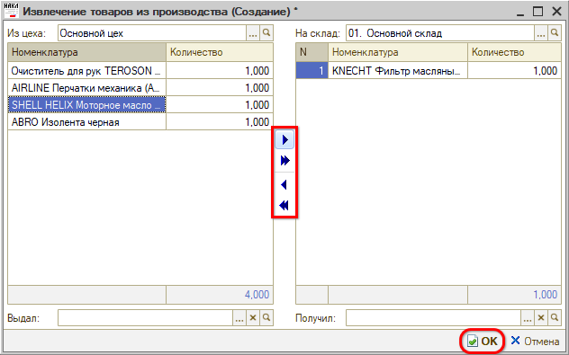

# Как оформить возврат товаров на склад из производства

<table><tr><td><b>Время чтения:</b> 4 мин.</td><td><b>Обновлено:</b> 06.06.2025</td></tr></table>

Источник: https://www.5systems.ru/help/kak-oformit-vozvrat-tovarov-na-sklad-iz-proizvodstva

Документ **"Извлечение товаров из производства"** предназначен для извлечения деталей, требуемых для выполнения работ по заказ-наряду из производства обратно на склад компании.

Для открытия реестра документов “Извлечение товаров из производства” необходимо перейти в пункт меню "Автосервис", на вкладке “Приемка", в разделе "Товары в производстве" выбрать пункт “Извлечение из производства”.

Из реестра “Извлечение товаров из производства” можно ввести новый документ нажатием на кнопку “Добавить”.

В окне создания документа необходимо ввести или скорректировать обязательные поля: Склад компании, Заказ-наряд, Цех, также можно указать Причину.

Однако почти всегда документ формируется из Заказ-наряда. Рекомендуется создавать извлечение из него.

Зайдя в Заказ-наряд на вкладку “Товары” можно увидеть список товаров, которые используются в производстве. Только те детали, которые были перемещены в производство, доступны для извлечения.

## Создание документа “Извлечение из производства” на основании Заказ-наряда вручную

### 1. Ввод на основании

В данном случае необходимо, находясь в документе Заказ-наряд, нажать кнопку “Ввести на основании” и выбрать “Извлечение товаров из производства”:

Откроется окно создания документа, где можно скорректировать табличную часть, выбрав детали, которые требуется извлечь из производства.

### 2. Ручное заполнение табличной части через кнопку “Подбор”

В документе “Извлечение товаров из производство” нажимаем кнопку “Подбор” и выбираем детали, которые необходимо извлечь из производства по выбранному Заказ-наряду.

### 3. Ручное заполнение табличной части через кнопку “Добавить”

В документе “Извлечение товаров из производства” нажимаем кнопку “Добавить” и заполняем табличную часть из справочника “Номенклатура”.

### 4. Проведение документа

После проверки заполнения документа нажимаем кнопку “Провести” либо кнопку “ОК” (запись с проведением и закрытием формы).

## Создание документа “Извлечение из производства” с помощью формы быстрого ввода

Также оформить извлечение на основании заказ-наряда можно с помощью специальной формы быстрого ввода документа. Перейти к ней можно из заказ-наряда через кнопку *"Создать на основании → Извлечение из производства":*

Открывается форма создания документа, в левой части которой можно выбрать товары, которые необходимо извлечь из производства, и с помощью кнопок добавить их в создаваемый документ:

---

**Теги:** складской учет, извлечение из производства, возврат на склад, заказ-наряд
