

# Как оформить возврат товаров от покупателя

<table><tr><td><b>Время чтения:</b> 5 мин.</td><td><b>Обновлено:</b> 16.09.2024</td></tr></table>

Источник: https://www.5systems.ru/help/kak-oformit-vozvrat-tovarov-ot-pokupatelya

## Содержание

1. [Ввод документа на основании](#ввод-документа-на-основании)
2. [Автоматическое заполнение таблицы при выборе документа отгрузки](#автоматическое-заполнение-таблицы-при-выборе-документа-отгрузки)
3. [Автоматическое заполнение таблицы через кнопку “Подбор”](#автоматическое-заполнение-таблицы-через-кнопку-подбор)
   - [1. Подбор по проданным партиям](#1-подбор-по-проданным-партиям)
   - [2. Подбор номенклатуры](#2-подбор-номенклатуры)
4. [Ручное заполнение таблицы документа “Возврат товаров от покупателя”](#ручное-заполнение-таблицы-документа-возврат-товаров-от-покупателя)
5. [Проведение документа](#проведение-документа)

Документ **“Возврат товаров от покупателя”** предназначен для отражения в учете операции по возврату от покупателей ранее купленных товаров.

Для создания документа “Возврат товаров от покупателя” необходимо перейти в пункт меню "Автосервис", на вкладке “Продажа", в разделе "Документы" выбрать пункт “Возврат от покупателей”:

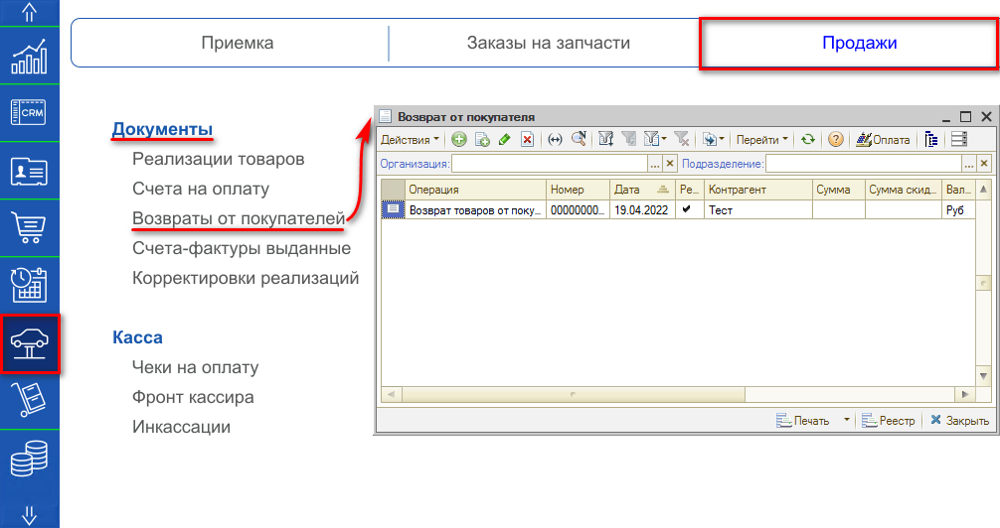

В реестре документов “Возврат от покупателя” создаем новый документ и выбираем вид хозяйственной операции - *Возврат товаров от покупателя*:

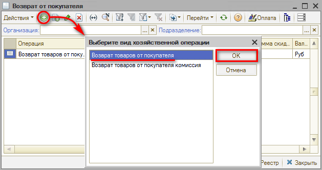

Откроется окно создания документа, в котором необходимо указать: *Склад компании*, на который возвращается товар; *Контрагента* (покупателя); *Договор*, *Причину возврата*.

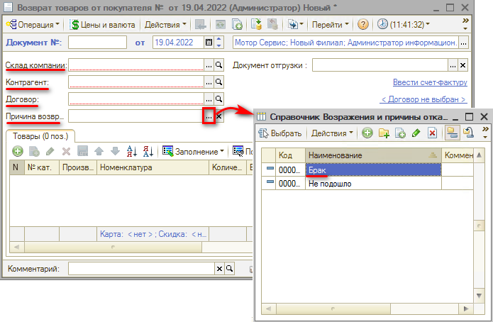

Документ “Возврат товаров от покупателя” обычно вводится на основании документа продажи, однако есть и другие способы.

## Ввод документа на основании

Нажимаем кнопку “Ввести на основании” и выбираем *Возврат от покупателя* из одного из следующих документов:

1. Реализации товаров:  
   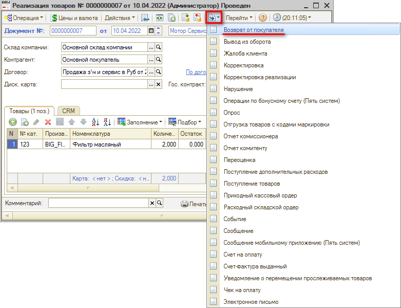
2. Заказ-наряда:  
   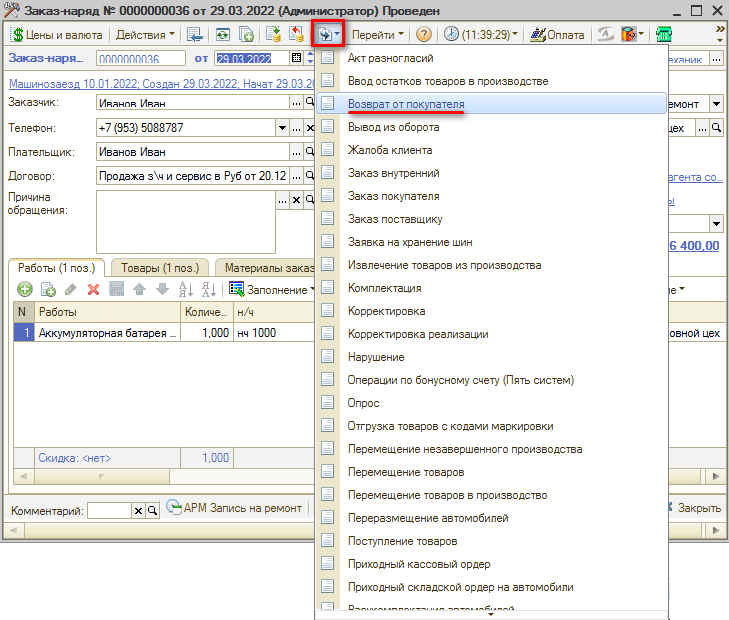

Откроется окно создания документа ”Возврат товаров от покупателя” с товарами из документа продажи. Если требуется, то изменяем количество товаров на необходимое и указываем причину возврата:

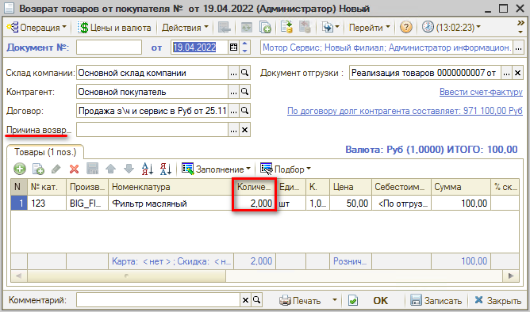

## Автоматическое заполнение таблицы при выборе документа отгрузки

При выборе документа отгрузки табличная часть заполнится теми товарами, которые были в выбранном документе:

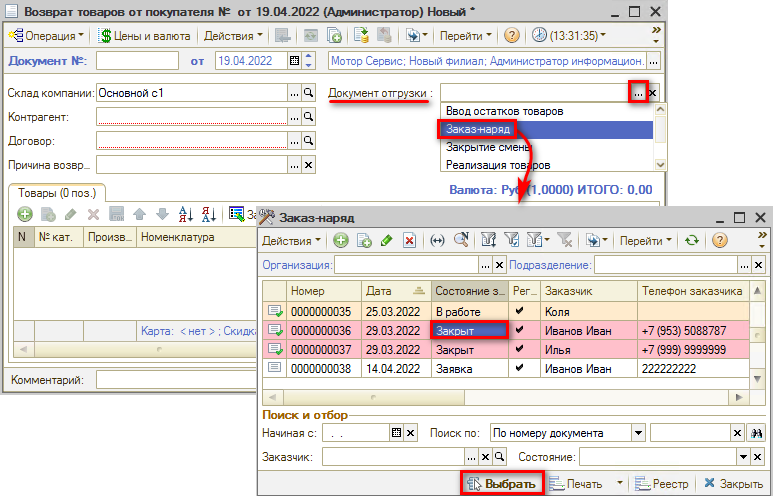

## Автоматическое заполнение таблицы через кнопку “Подбор”

### 1. Подбор по проданным партиям

В документе “Возврат товаров от покупателя” при нажатии кнопки “Подбор” и выборе кнопки “Подбор по проданным партиям” откроется окно “Подбор номенклатуры”:

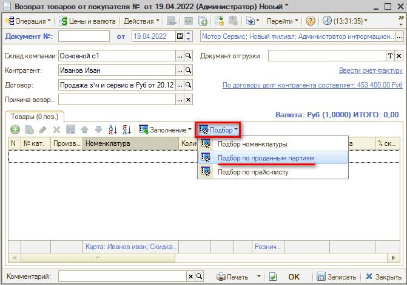

Указываем *“Период с”* проданных партий, нажимаем кнопку *“Обновить”*. Появится номенклатура товаров, указываем количество товаров возврата:

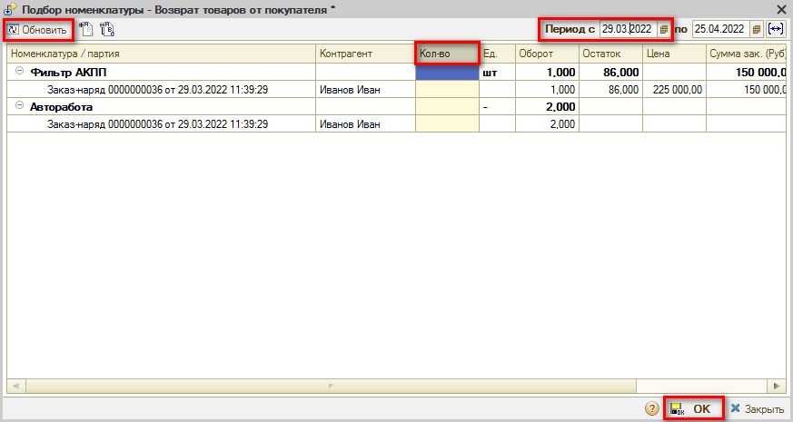

### 2. Подбор номенклатуры

В документе “Возврат товаров от покупателя” при нажатии кнопки “Подбор” и выборе кнопки *“Подбор номенклатуры”* откроется окно *“Подбор”*, где мы вручную выбираем товар возврата и его количество:

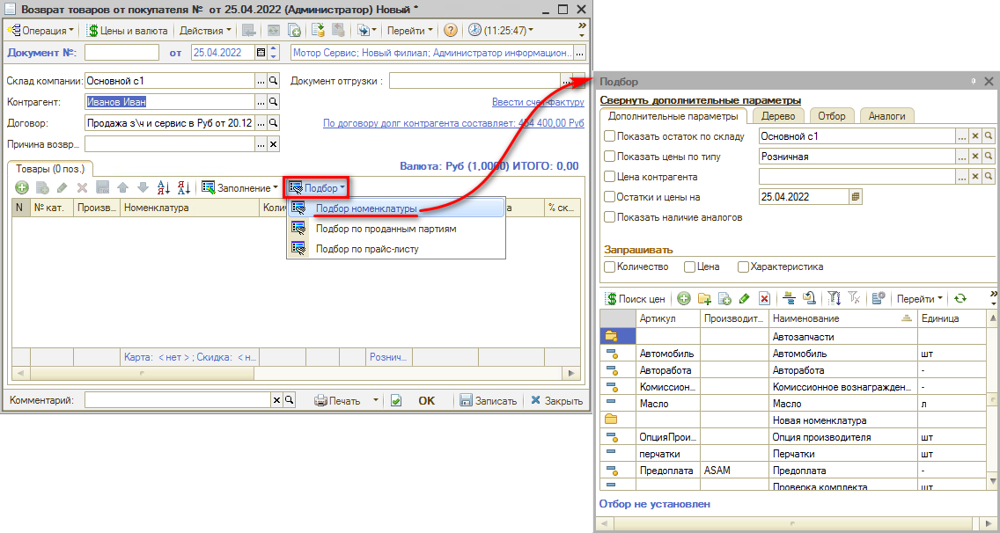

## Ручное заполнение таблицы документа “Возврат товаров от покупателя”

В окне документа нажимаем кнопку *“Добавить”*, появится новая строка табличной части документа, далее выбираем номенклатуру и указываем количество вручную:

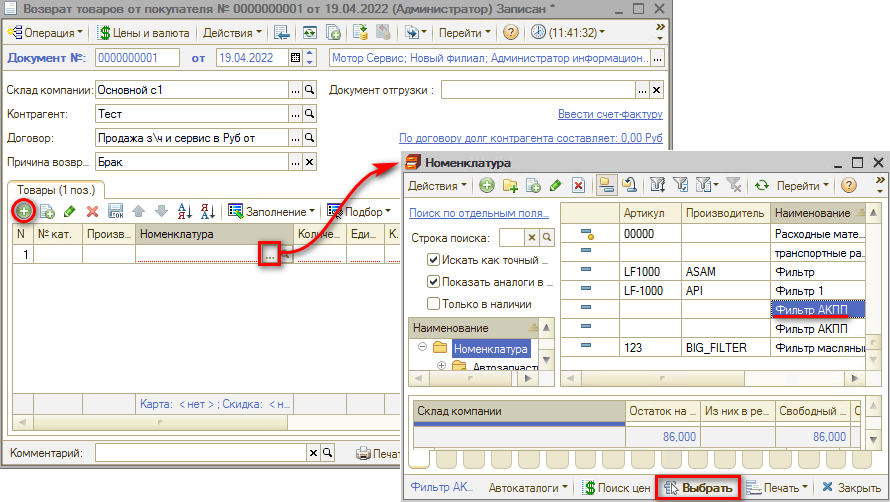

## Проведение документа

После проверки заполнения документа нажимаем кнопку *“Провести”* либо кнопку *“ОК”* (запись с проведением и закрытием формы):

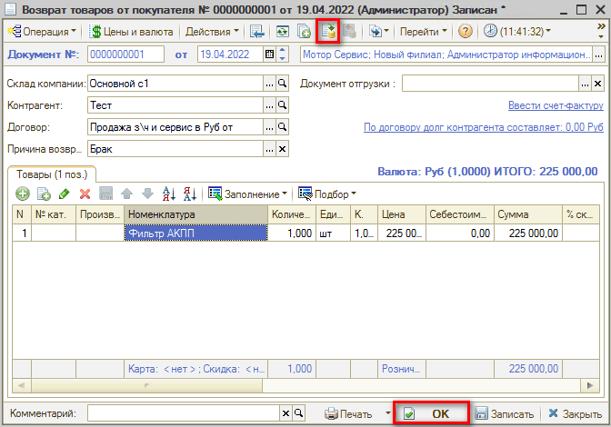

*Как **пробить возвратный чек**, см. в уроке "[Как сделать возврат по кассе](https://www.5systems.ru/help/kak-sdelat-vozvrat-po-kasse#chek_vozvrata)".*

---

**Теги:** складской учет, возврат товаров, покупатель, проданные партии

