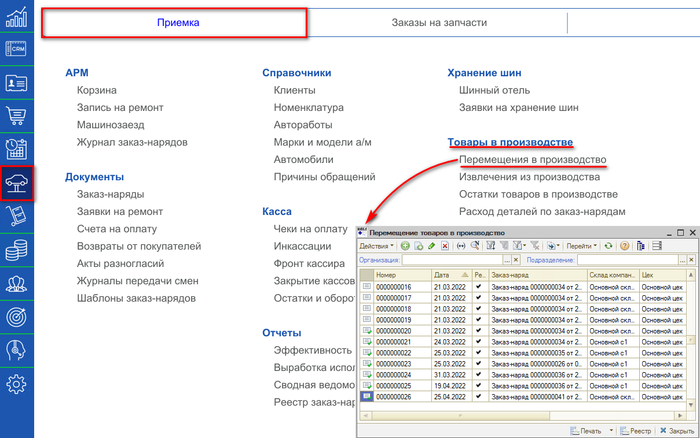
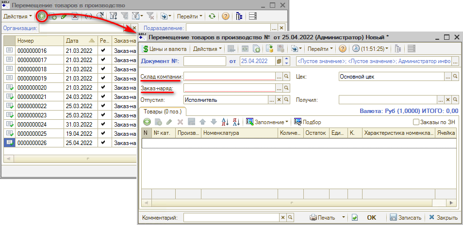
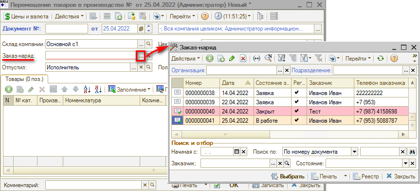
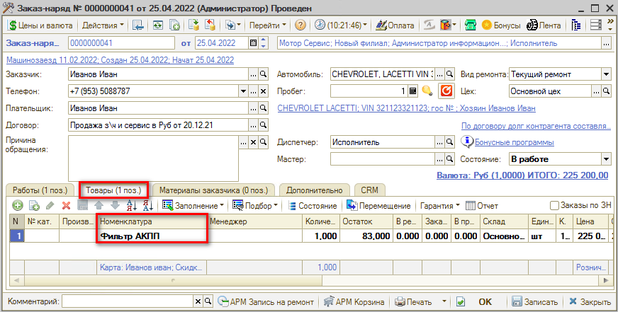
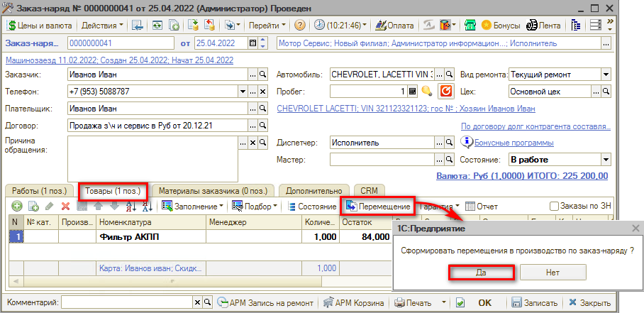
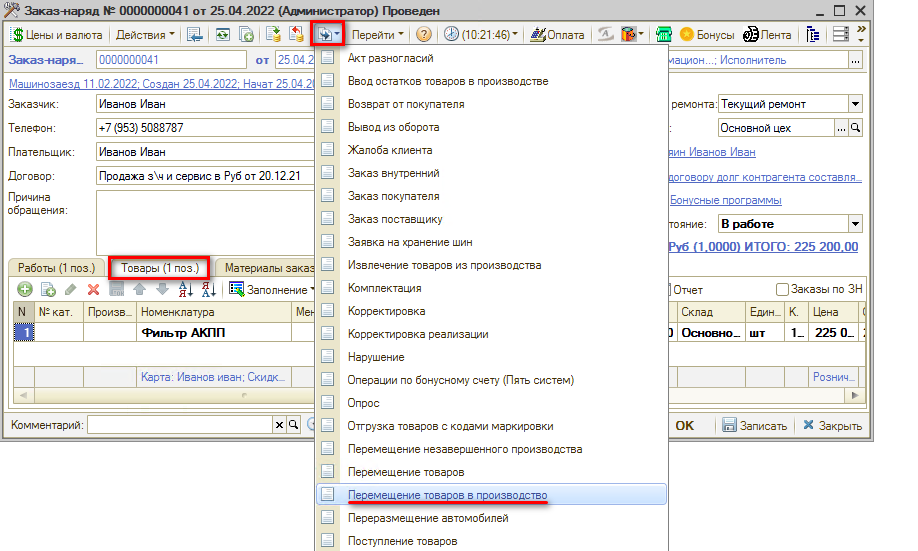
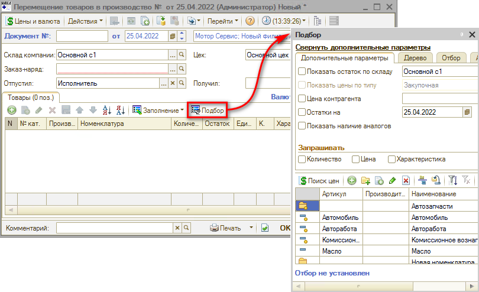
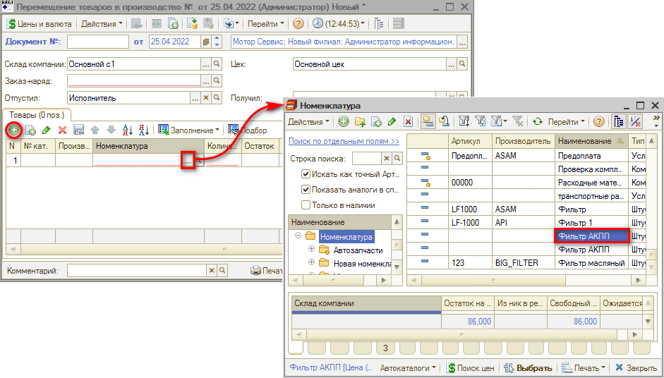
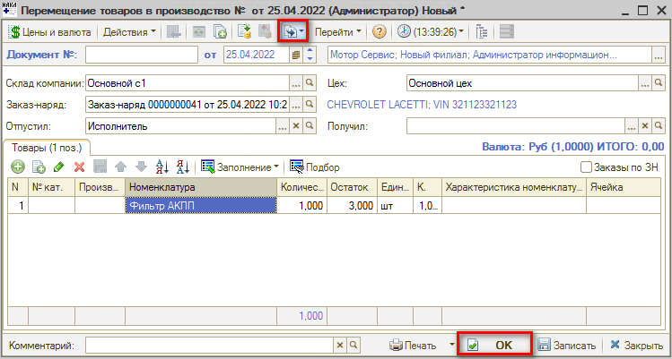

# Как оформить выдачу товаров со склада под заказ-наряд

<table><tr><td><b>Время чтения:</b> 4 мин.</td><td><b>Обновлено:</b> 08.07.2022</td></tr></table>

Источник: https://www.5systems.ru/help/kak-oformit-vydachu-tovarov-so-sklada-pod-zakaz-naryad

## Содержание

1. [Создание документа из Заказ-наряда по кнопке “Перемещение”](#создание-документа-из-заказ-наряда-по-кнопке-перемещение)
2. [Создание документа “Перемещение в производство” на основании Заказ-наряда](#создание-документа-перемещение-в-производство-на-основании-заказ-наряда)
3. [Ручное заполнение табличной части через кнопку “Подбор”](#ручное-заполнение-табличной-части-через-кнопку-подбор)
4. [Ручное заполнение табличной части через кнопку “Добавить”](#ручное-заполнение-табличной-части-через-кнопку-добавить)
5. [Проведение документа](#проведение-документа)

Документ "Перемещение товаров в производство" предназначен для перемещения деталей, требуемых для выполнения работ по заказ-наряду со склада компании или от заказчика в производство.

Для открытия реестра документов “Перемещение товаров в производство” необходимо перейти в пункт меню "Автосервис", на вкладке “Приемка", в разделе "Товары в производстве" выбрать пункт “Перемещения в производство”:

Из реестра “Перемещение товаров в производство” можно ввести новый документ нажатием на кнопку “Добавить”:

В окне создания документа необходимо ввести или скорректировать обязательные поля: *Склад компании*, *Заказ-наряд*, *Отпустил*, *Цех*.

Однако почти всегда документ формируется из Заказ-наряда. *Рекомендуется* создавать перемещение из него.

Зайдя в Заказ-наряд на вкладку “Товары” можно увидеть список товаров, которые будут использоваться в производстве. При этом детали, которые выделены жирным шрифтом, требуется переместить в производство.

## Создание документа из Заказ-наряда по кнопке “Перемещение”

Для создания документа необходимо перейти в Заказ-наряд, по которому требуется переместить товары в производство и нажать кнопку *“Перемещение”*. После подтверждения выполнения данного действия будет создан и проведен документ “Перемещение товаров в производство”. В нем будут заполнены обязательные поля и перечислены детали, которые требовалось переместить и отдать в производство. В документ подтянется номенклатура, которая была в остатке на складе.

## Создание документа “Перемещение в производство” на основании Заказ-наряда

В данном случае необходимо, находясь в документе Заказ-наряд, нажать кнопку *“Ввести на основании”* и выбрать *“Перемещение товаров в производство”*:

Откроется окно создания документа, где требуется вручную заполнить табличную часть.

## Ручное заполнение табличной части через кнопку “Подбор”

В документе “Перемещение товаров в производство” нажимаем кнопку *“Подбор”* и выбираем детали, которые необходимо переместить в производство по выбранному Заказ-наряду:

## Ручное заполнение табличной части через кнопку “Добавить”

В документе “Перемещение товаров в производство” нажимаем кнопку *“Добавить”* и заполняем табличную часть из справочника “Номенклатура”:

## Проведение документа

После проверки заполнения документа нажимаем кнопку *“Провести”* либо кнопку *“ОК”* (запись с проведением и закрытием формы).

---

**Теги:** складской учет, перемещение в производство, заказ-наряд, выдача товаров

