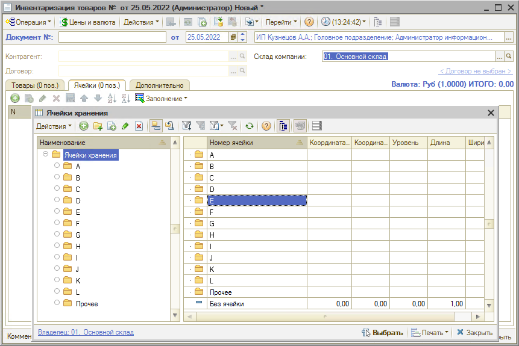
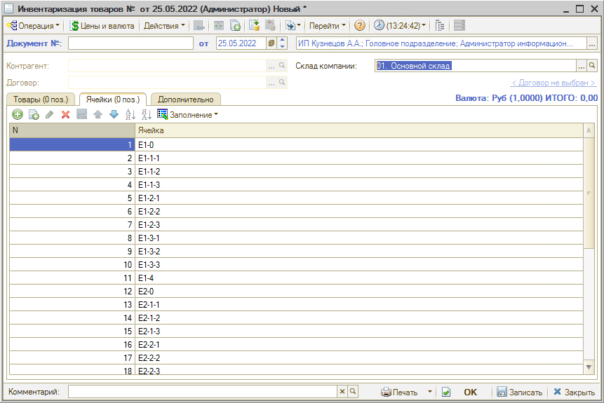
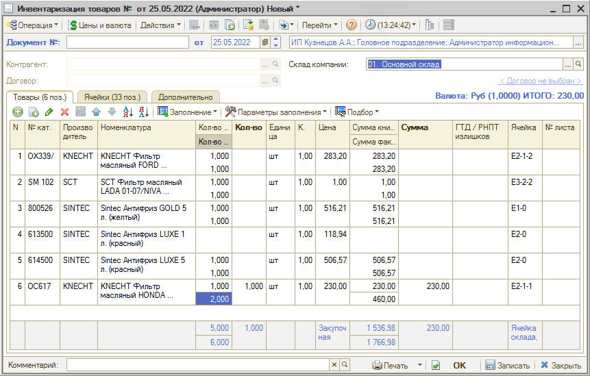

# Как оформить инвентаризацию по ячейкам хранения

<table><tr><td><b>Время чтения:</b> 3 мин.</td><td><b>Обновлено:</b> 08.07.2022</td></tr></table>

Источник: https://www.5systems.ru/help/kak-oformit-inventarizaciyu-po-yacheykam-khraneniya

Если склад запчастей достаточно большой, то провести ревизию за один раз и зафиксировать остатки бывает проблематично. В данном случае используется методика выборочной инвентаризации, согласно которой кладовщик регулярно делает перерасчет товаров *по ячейкам*. Для отражения выборочного пересчета товаров в программе создан механизм *инвентаризации по ячейкам хранения*.

## Заполнение документа ячейками

В документе *Инвентаризация* должен быть выбран склад, в котором есть ячейки: при этом активируется вкладка “Ячейки”. Можно заполнить ячейки вручную, либо с помощью кнопки автозаполнения – *всеми ячейками* склада либо *по группам ячеек*:

При заполнении по группе ячеек можно выбрать группы, которые были заданы в карточке данного склада (см. урок [*Как создать ячейки хранения для склада*](../Как%20создать%20ячейки%20хранения%20для%20склада/kak-sozdat-yacheyki-khraneniya-dlya-sklada.md)):

При этом таблица на вкладке заполнится ячейками по выбранной группе:

## Заполнение состава товаров

После заполнения ячеек необходимо перейти на вкладку *Инвентаризации* “Товары” для заполнения состава товаров.

Используется кнопка автозаполнения *Заполнение → Заполнить по ячейкам хранения*:

Таблица заполняется товарами по выбранным ячейкам:

Далее требуется пересчитать товары в ячейках на складе, ввести фактическое количество и провести документ.

---

**Теги:** складской учет, инвентаризация, ячейки хранения, адресное хранение
