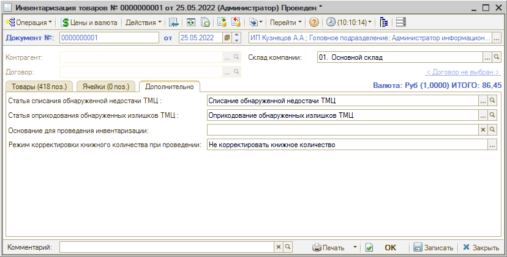

# Как оформить инвентаризацию товаров на складе

<table><tr><td><b>Время чтения:</b> 4 мин.</td><td><b>Обновлено:</b> 21.11.2022</td></tr></table>

Источник: https://www.5systems.ru/help/kak-oformit-inventarizaciyu-tovarov-na-sklade

Чтобы отразить в учете факт проведения инвентаризации товаров на складе необходимо создать документ *"Инвентаризация товаров"*. Для этого требуется открыть реестр документов *Инвентаризация товаров*: Запчасти и склад → Склад → Учет товаров → Инвентаризация товаров (или в типовом меню: Документы → Складские документы → Инвентаризация товаров)

В списке инвентаризаций нужно создать новый документ добавлением:

В документе необходимо указать склад, по которому проводится инвентаризация, и заполнить товарные позиции вручную или с помощью кнопки автозаполнения:

Пример документа, заполненного складскими остатками по группе “Автозапчасти”:

После заполнения *Инвентаризации* удобно распечатать “Пустографку”, чтобы отмечать в ней количество пересчитываемого товара (у пользователя должно быть право печатать непроведенные документы):

Затем нужно внести в форму документа фактическое количество товаров на складе (при этом автоматически проставляются значения в графах “Кол-во” и “Сумма”) и провести документ.

При проведении документа автоматически производится *списание недостачи* и *оприходование излишков* товара (разницы между фактическим и учетным количеством) на склад по выбранной статье (указываются на вкладке “Дополнительно”):

Если в результате инвентаризации не зафиксировано отклонений фактического количества товара от учетного в какую-либо сторону, то при проведении документа никаких движений по учетным блокам сформировано не будет.

## Описание столбцов таблицы вкладки “Товары”

На вкладке *Товары* содержится таблица инвентаризуемых товаров. Столбцы таблицы:

- ***Номенклатура*** – номенклатура (товар).
- ***Кол-во книжн.,*** ***Кол-во факт.*** – расчетное (по базе данных) количество товара и фактическое количество.
- ***Кол-во*** – количество расчетное минус количество фактическое. Отрицательные разницы (недостачи) отображаются красным шрифтом.
- ***Единица*** – единица измерения товара.
- ***Цена*** – цена закупки на момент инвентаризации.
- ***Сумма книжн., Сумма факт.*** – оценочная (расчетная) сумма товара по данным из базы данных и фактическая сумма товара. Рассчитываются от цены закупки.
- ***Сумма*** – сумма фактическая минус сумма расчетная. Отрицательные суммы отображаются красным шрифтом.
- ***ГТД / РНПТ*** – номер грузовой таможенной декларации (для автомобилей поступивших по импорту) или регистрационный номер (РНПТ) для прослеживаемых товаров.
- ***Ячейка*** – ячейка хранения для номенклатуры. Значение хранится в номенклатуре в разрезе складов.
- ***№ листа*** – номер листа инвентаризационной ведомости.

---

**Теги:** складской учет, инвентаризация, склад, остатки

