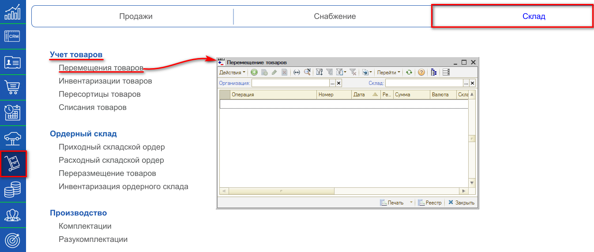
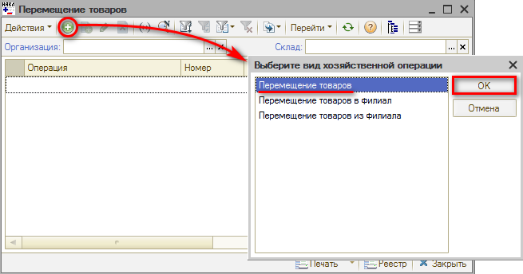
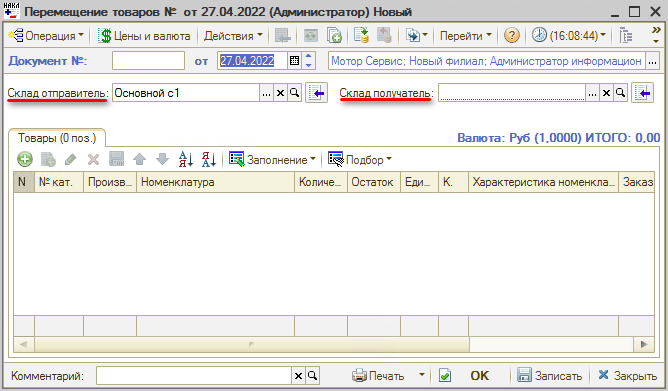
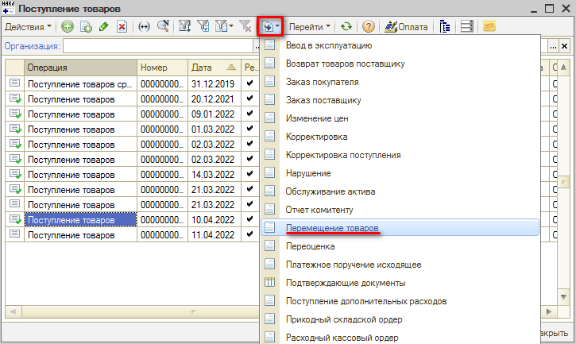
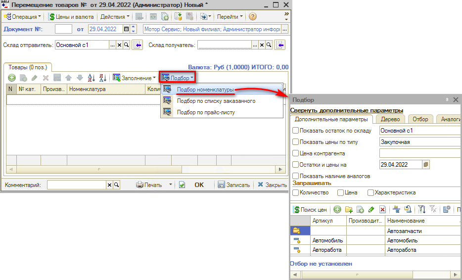
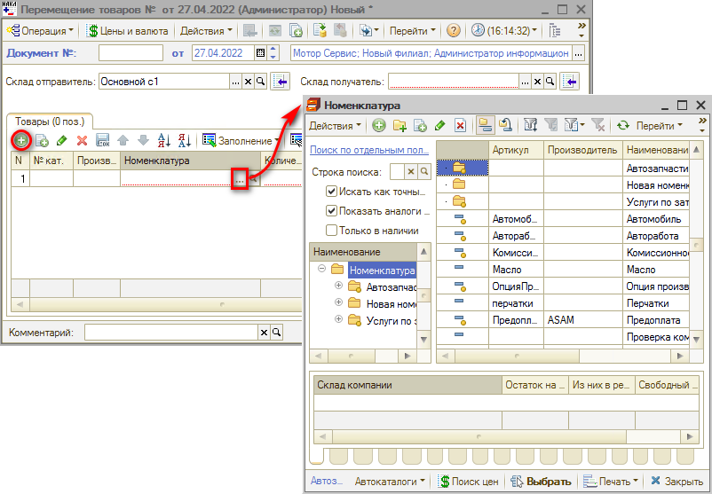
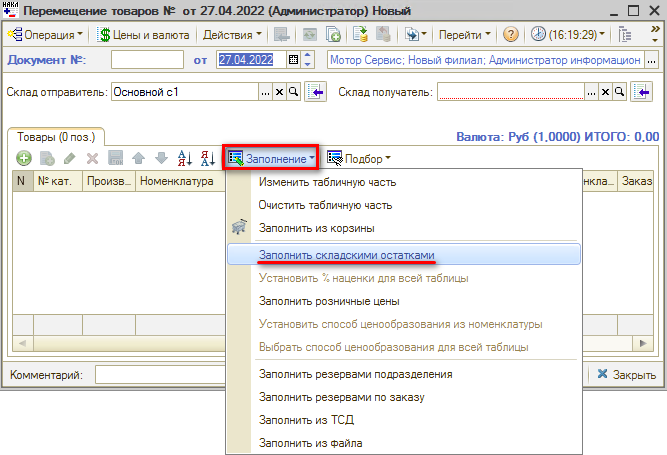
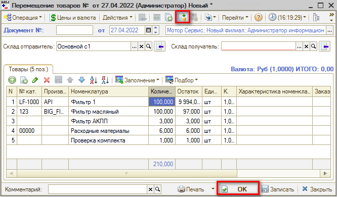

# Как оформить перемещение товаров с одного склада на другой

<table><tr><td><b>Время чтения:</b> 6 мин.</td><td><b>Обновлено:</b> 27.05.2022</td></tr></table>

Документ **“Перемещение товаров”** необходим для отражения в учете факта перемещения товаров *со склада на склад*.

Для открытия реестра документов “Перемещение товаров” необходимо перейти в пункт меню "Запчасти и склад", на вкладке “Склад", в разделе "Учет товаров" выбрать пункт “Перемещение товаров”.

Из реестра “Перемещение товаров” можно ввести новый документ нажатием на кнопку “Добавить” и выбрать вид хозяйственной операции - Перемещение товаров.

В окне создания документа необходимо ввести или скорректировать обязательные поля: Склад отправитель, Склад получатель. Далее вручную заполнить табличную часть и провести документ.

В данном случае Склад отправитель - это склад, с которого необходимо переместить товар, а Склад получатель - склад, на который будет перемещен товар. Для проведения документа у автора должны быть права доступа и к складу отправителю и к складу получателю.

## Ввод перемещения товаров на основании документа “Поступление товаров”

Для автоматического заполнения табличной части документа по поступлению товаров необходимо зайти в нужный документ “Поступление товаров” и по кнопке “Ввести на основании” выбрать Перемещение товаров.

## Ручное заполнение табличной части через кнопку “Подбор”

В документе “Перемещение товаров” нажимаем кнопку “Подбор” и выбираем детали и их количество, которое необходимо переместить на другой склад.

## Ручное заполнение табличной части через кнопку “Добавить”

В документе “Перемещение товаров” нажимаем кнопку “Добавить” и заполняем табличную часть из справочника “Номенклатура”, указываем необходимое количество единиц товара для перемещения.

## Заполнение документа через “Заполнение складскими остатками”

Если у вас на складе небольшое количество наименований товаров, то можно заполнить документ “Перемещение товаров” с помощью кнопки “Заполнение складскими остатками”. В данном случае табличная часть заполнится номенклатурой, которая есть на остатке у Склада отправителя.

При большом количестве номенклатуры на остатке склада, заполнение табличной части документа может быть длительным.

## Проведение документа

После проверки заполнения документа нажимаем кнопку “Провести” либо кнопку “ОК” (запись с проведением и закрытием формы).

---

**Теги:** складской учет, перемещение товаров, склад
