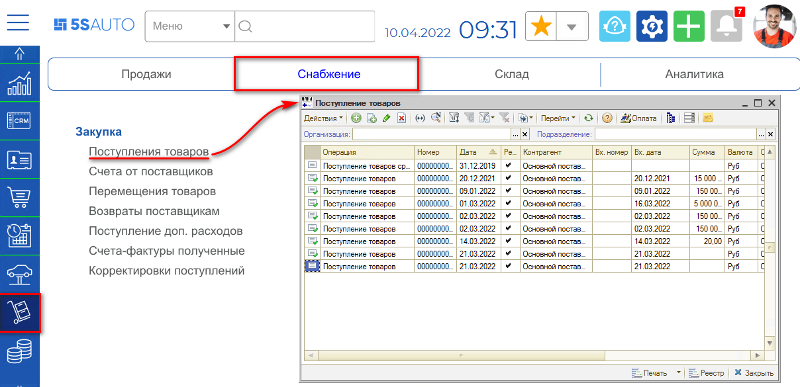
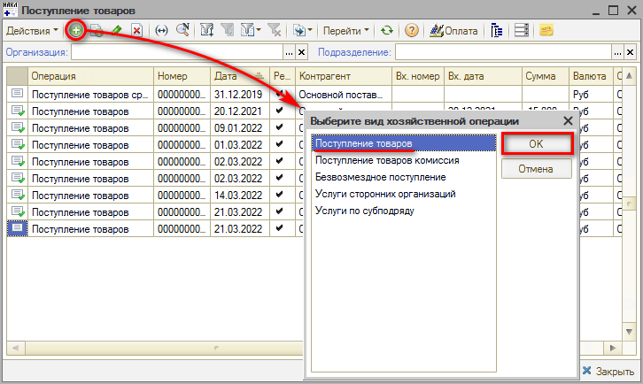
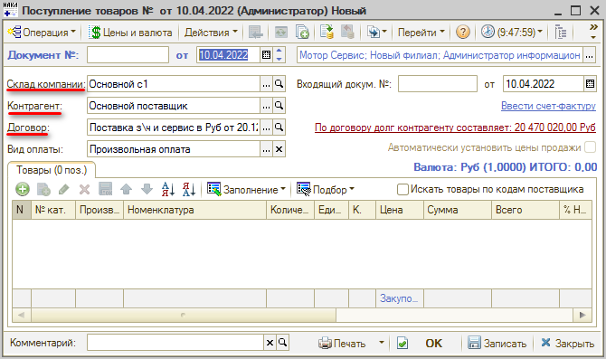
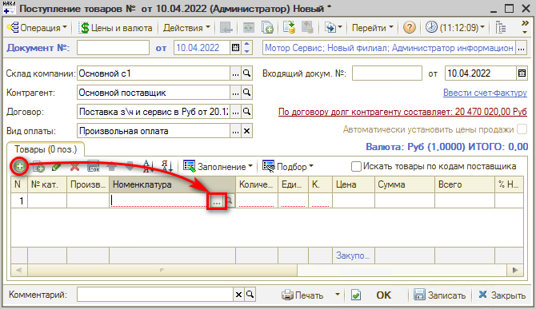
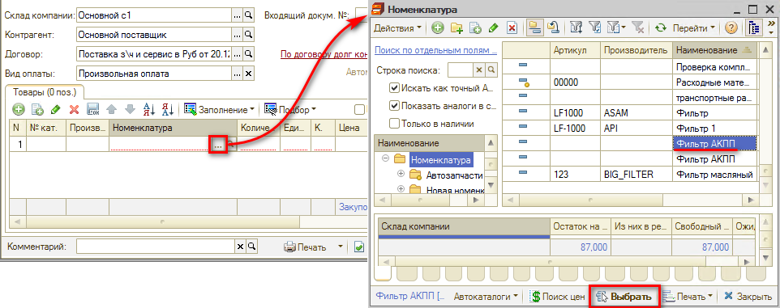
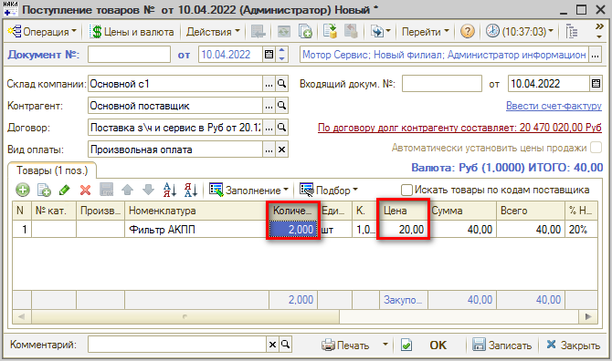
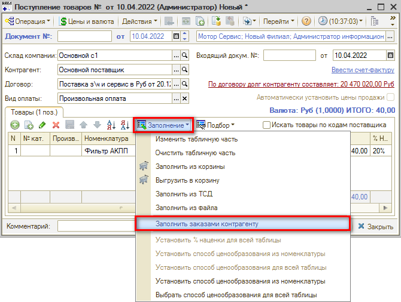
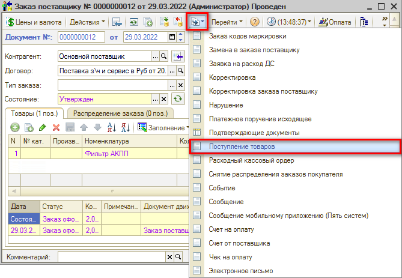
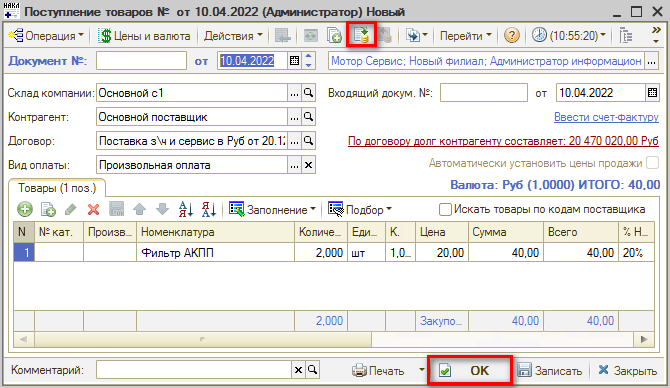

# Как оформить поступление товаров от поставщика

<table><tr><td><b>Время чтения:</b> 3 мин.</td><td><b>Обновлено:</b> 11.09.2026</td></tr></table>

Источник: https://www.5systems.ru/help/kak-oformit-postuplenie-tovarov-ot-postavschika

## Содержание

1. [Ручное заполнение товаров](#ручное-заполнение-товаров)
2. [Автоматическое заполнение товаров](#автоматическое-заполнение-товаров)
3. [Проведение документа](#проведение-документа)

Документ **"Поступление товаров"** предназначен для фиксации факта поступления товаров.

Для создания документа “Поступление товаров” необходимо перейти в пункт меню "Запчасти и склад", на вкладке “Снабжение", в разделе "Закупка" выбрать пункт “Поступления товаров”:

В реестре документов “Поступление товаров” создаем новый документ и выбираем вид хозяйственной операции - Поступление товаров.

Откроется окно создания документа, в котором необходимо указать: Склад компании, на который пришел товар; Контрагента (поставщика); Договор.

Далее заполняется табличная часть документа, где указывается перечень поступивших от этого поставщика товаров. Добавить товары в табличную часть можно через кнопку добавить или по кнопке Заполнение.

## Ручное заполнение товаров

В этом случае номенклатура, количество и сумма закупки выбираются вручную.

Если есть связанная номенклатура, которую Вы хотите добавить, то выберите ее и подтвердите или нажмите “Закрыть”.

После выбора номенклатуры, указываем Количество и Цену за одну единицу товара.

## Автоматическое заполнение товаров

Кнопка Заполнение позволяет массово добавить товар. Например, по документу заказа поставщику:

При вводе документа “Поступление товаров” на основании документа “Заказ поставщику”, табличная часть автоматически заполнится отгруженными товарами.

## Проведение документа

После проверки заполнения документа нажимаем кнопку Провести либо кнопку ОК (запись с проведением и закрытием формы).

---

**Теги:** складской учет, поступление товаров, поставщик, приход

