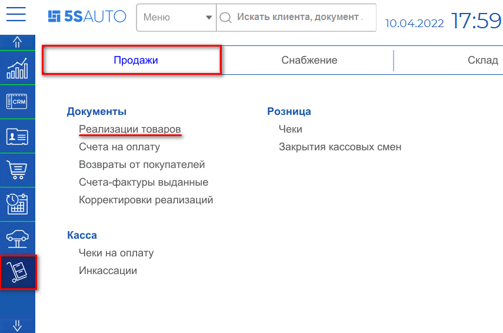
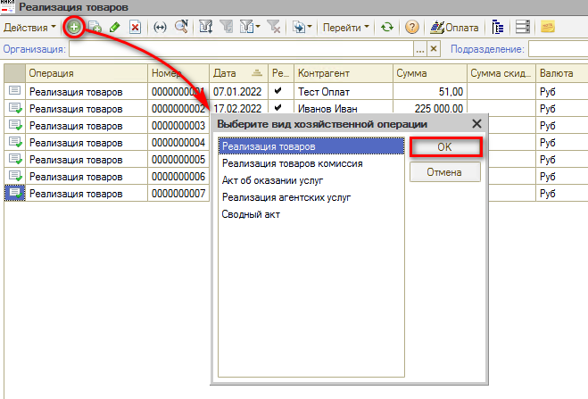
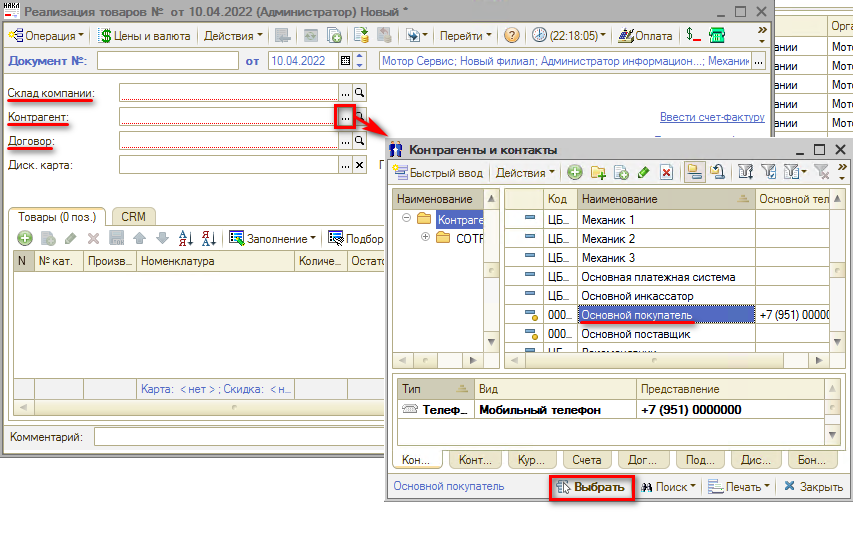
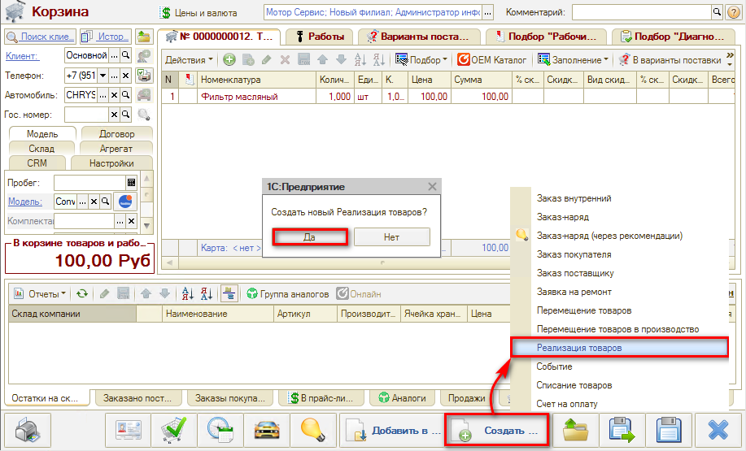
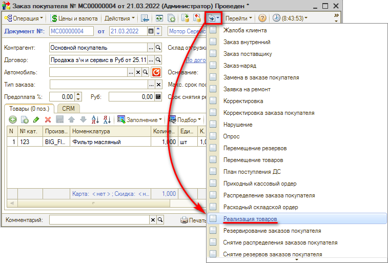
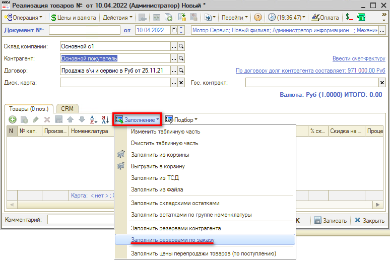
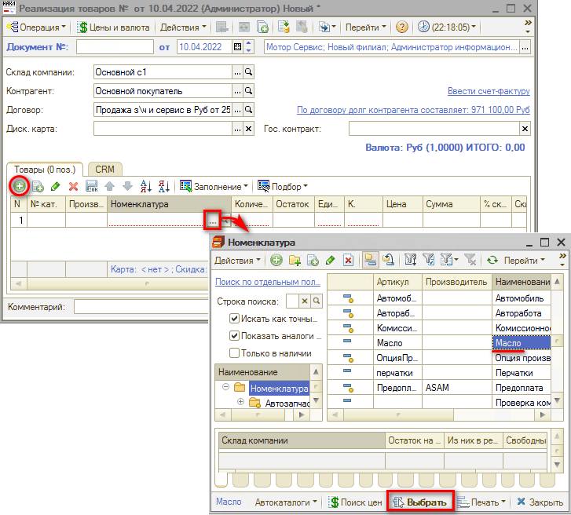
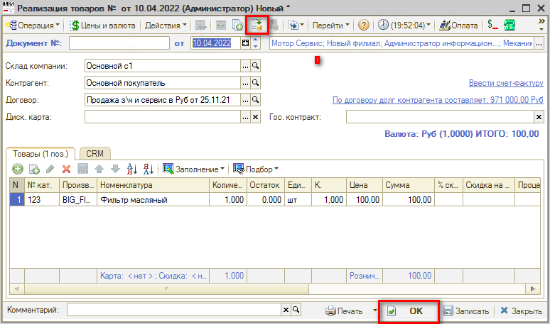

# Как оформить продажу товаров клиенту

<table><tr><td><b>Время чтения:</b> 4 мин.</td><td><b>Обновлено:</b> 08.07.2022</td></tr></table>

Источник: https://www.5systems.ru/help/kak-oformit-prodazhu-tovarov-klientu

Документ **"Реализация товаров"** предназначен для фиксации факта реализации (отгрузки) товаров и услуг.

Для создания документа “Реализация товаров” необходимо перейти в пункт меню "Запчасти и склад", на вкладке “Продажа", в разделе "Документы" выбрать пункт “Реализации товаров”:

В реестре документов “Реализация товаров” создаем новый документ и выбираем вид хозяйственной операции - Реализация товаров:

Откроется окно создания документа, в котором необходимо указать: *Склад компании*, с которого реализуются товары; *Контрагента* (покупателя); *Договор*.

Контрагентом выбираем текущего покупателя. Если покупатель не занесен в базу, то необходимо внести его данные, а если нет возможности, то выбираем предопределенного контрагента “Основной покупатель”.

Далее заполняется табличная часть документа, где указывается перечень реализуемых товаров. Добавить товары в табличную часть можно через кнопку добавить или по кнопке Заполнение.

## Заполнение реализации товаров через АРМ "Корзина"

Если подобранные клиентом запчасти присутствуют на складе в свободном остатке, то можно сразу из АРМ “Корзина” создавать документ "Реализация товаров:

## Ввод реализации товаров на основании документа "Заказ покупателя"

Если для контрагента создавался документ “Заказ покупателя”, то можно создать документ "Реализация товаров" на его основании. В таком случае отгруженные товары автоматически перенесутся в табличную часть документа продажи.

## Заполнение документа "Реализация товара" по документу-основанию

Если в шапку документа указать документ-основание - “Заказ покупателя”, то табличную часть можно заполнить по кнопке “Заполнение” - “Заполнить резервами по заказу”.

## Ручное наполнение табличной части документа

Добавлять товары можно вручную, выбирая из справочника “Номенклатура” и указывая количество единиц товара.

## Проведение документа

После проверки заполнения документа нажимаем кнопку Провести либо кнопку ОК (запись с проведением и закрытием формы).

---

**Теги:** складской учет, реализация товаров, продажа, клиент
