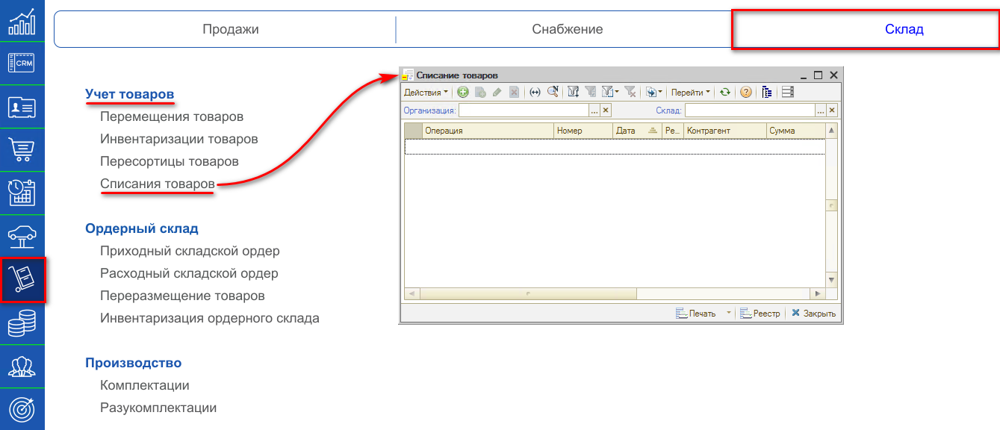
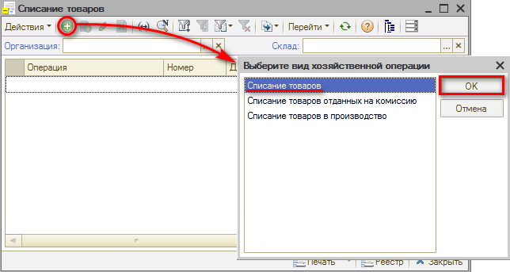
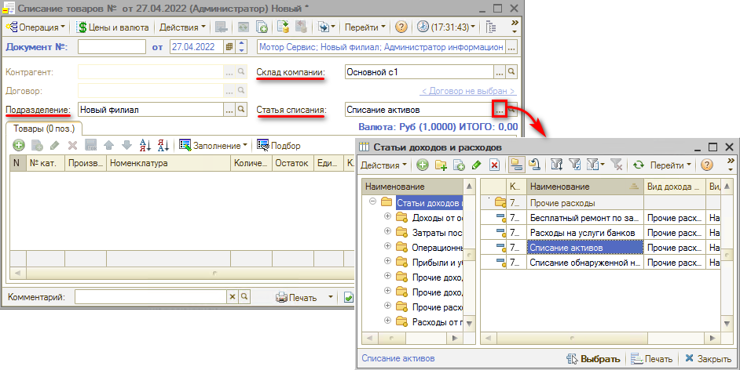
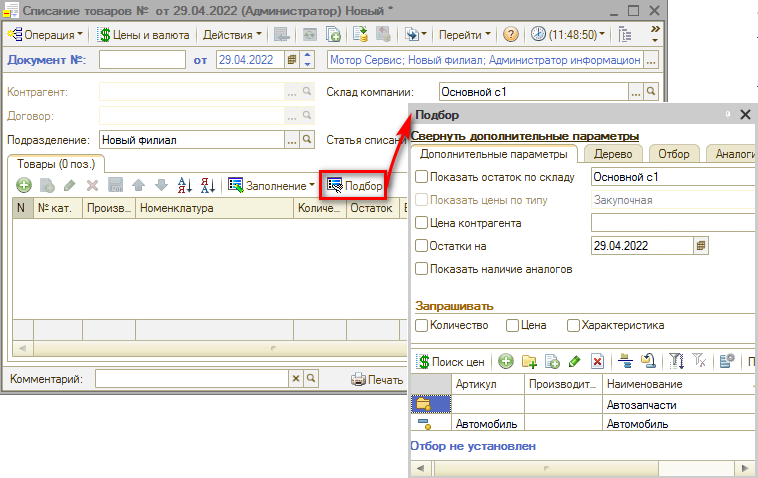
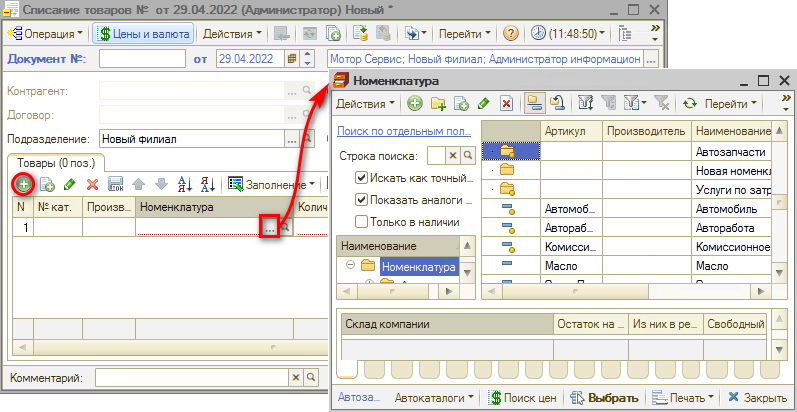
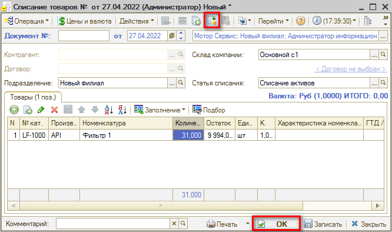

# Как оформить списание товаров

<table><tr><td><b>Время чтения:</b> 3 мин.</td><td><b>Обновлено:</b> 14.10.2022</td></tr></table>

Источник: https://www.5systems.ru/help/kak-oformit-spisanie-tovarov

Документ **“Списание товаров”** необходим для отражения в учете факта списания товаров с указанием склада, по которому происходит списание, по выбранной статье.

Для открытия реестра документов “Перемещение товаров” необходимо перейти в пункт меню "Запчасти и склад", на вкладке “Склад", в разделе "Учет товаров" выбрать пункт “Списания товаров”.

Из реестра “Списание товаров” можно ввести новый документ нажатием на кнопку “Добавить” и выбрать вид хозяйственной операции - Списание товаров.

В окне создания документа необходимо ввести или скорректировать обязательные поля: Подразделение, Статья списания, Склад компании.

## Ручное заполнение табличной части через кнопку “Подбор”

В документе “Списание товаров” нажимаем кнопку “Подбор” и выбираем детали и их количество, которое будет списано по указанной статье списания.

## Ручное заполнение табличной части через кнопку “Добавить”

В документе “Списание товаров” нажимаем кнопку “Добавить” и заполняем табличную часть из справочника “Номенклатура”, указываем необходимое количество единиц товара для списания.

## Проведение документа

После проверки заполнения документа нажимаем кнопку “Провести” либо кнопку “ОК” (запись с проведением и закрытием формы).

---

**Теги:** складской учет, списание товаров, склад

