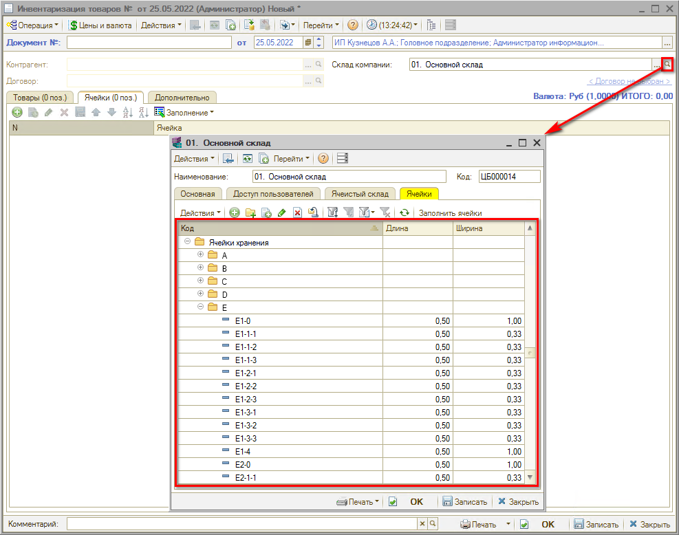
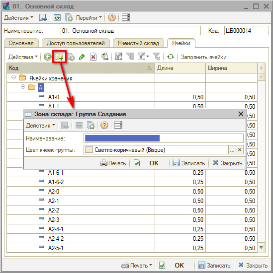
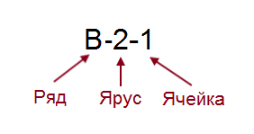

# Как создать ячейки хранения для склада

<table><tr><td><b>Время чтения:</b> 3 мин.</td><td><b>Обновлено:</b> 08.07.2022</td></tr></table>

Источник: https://www.5systems.ru/help/kak-sozdat-yacheyki-khraneniya-dlya-sklada

Систематизация склада по местам хранения – ячейкам – производится с целью равномерного распределения и быстрого поиска товаров.

## Создание ячеек хранения

Для организации ячеек хранения склад может быть разделен на отдельные помещения, секции, ряды, ярусы и сами ячейки.

В программе структура склада, отражающая это деление, задается в карточке склада на вкладке “Ячейки”:

Для создания новой группы ячеек требуется нажать кнопку “Добавить группу” и задать наименование:

*\*Примечание: Для ручного ввода наименования группы требуется нажать кнопку “Действия → Редактировать код”.*

Созданные ячейки и группы сохраняются в справочнике “Ячейки хранения” и затем используются при оформлении инвентаризации по ячейкам хранения (см. урок [*Как оформить инвентаризацию по ячейкам хранения*](../Как%20оформить%20инвентаризацию%20по%20ячейкам%20хранения/kak-oformit-inventarizaciyu-po-yacheykam-khraneniya.md)).

## Справочник “Ячейки хранения”

Каждый элемент справочника описывает некоторое физическое место хранения (ячейку). Ячейка характеризуется местоположением и размерами.

При создании ячеек из формы карточки склада задается код, отражающий ряд (координата Y), место (координата X) и уровень, в котором находится ячейка (например "1-2-3" - 1 место во 2 ряду на 3 уровне), а также указываются длина и ширина ячейки в единицах размерности склада:

Код ячейки также может выглядеть так:

Или так:

## Распределение товаров по складам

После того, как склад разбили по ячейкам, все поступающие товары распределяются по ним. Для распределения товаров по ячейкам склада:

- предварительно всем товарам присваиваются штрихкоды,
- печатается и клеится этикетка на товар с его штрихкодом и номером ячейки.

Для последующего считывания штрихкодов с целью отгрузки товара используется сканер штрихкодов.

---

**Теги:** складской учет, ячейки хранения, адресное хранение, склад
