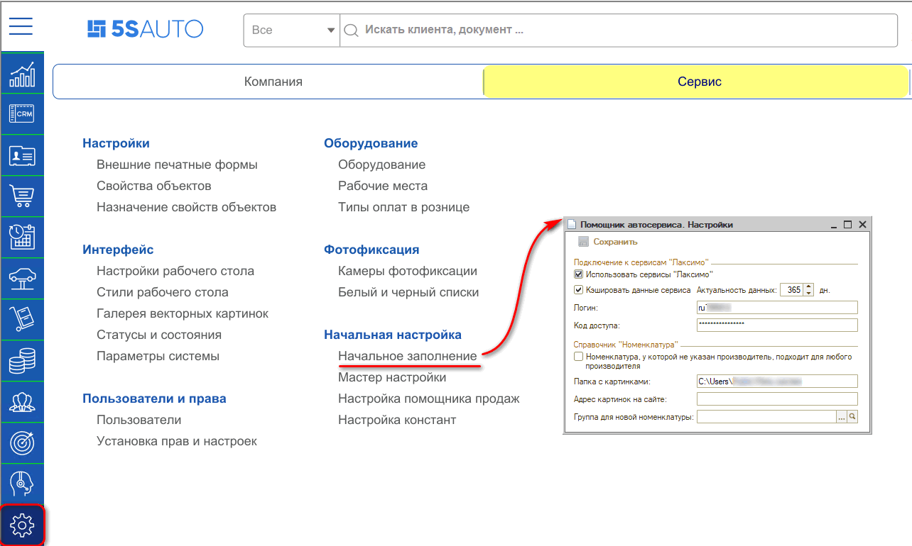
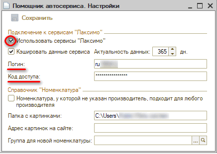
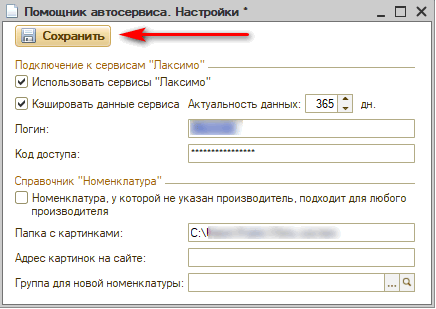

# Как подключить онлайн-каталог

<table><tr><td><b>Время чтения:</b> 4 мин.</td><td><b>Обновлено:</b> 27.05.2022</td></tr></table>

Источник: https://www.5systems.ru/help/kak-podklyuchit-onlayn-katalog

В программе предусмотрена возможность просматривать и использовать данные из *оригинальных каталогов Laximo*.

Для подключения к сервисам Laximo, необходимо:

1. Приобрести лицензию для внедрения в 1С на [сайте Laximo](https://www.laximo.ru).
2. Произвести настройки подключения к сервисам Laximo в программе.

Подключить каталоги Laximo можно с помощью настроек *Помощника автосервиса*. Открыть *Помощник автосервиса* можно через меню программы: *Администрирование → Сервис → Начальная настройка → Начальное заполнение,* либо через верхнее меню: *CRM → Помощник автосервиса → Настройки сервиса*.

Скопируйте параметры подключения (Логин и Код доступа) из своего профиля на [сайте Laximo](https://www.laximo.ru). Найти их можно в *Личном кабинете → Профили*.

В открывшемся окне установите флажок у параметра "Использовать сервисы "Лаксимо", заполните параметры "Логин" и "Код доступа":

Галочка *"Кэшировать данные сервиса"* означает, что полученные данные из сервисов Laximo будут кэшироваться на количество дней, указанное в параметре "Актуальность данных". Кэширование помогает ускорить процесс получения данных из сервисов Laximo.

Далее нажмите кнопку "Сохранить":

Сервис подключен: после идентификации автомобиля станет доступна возможность поиска по оригинальным деталям.

О работе с онлайн каталогом можно ознакомиться в [курсе видеоуроков](../../../articles/5S%20AUTO/Проценка%20запчастей%20и%20работ/Работа%20с%20онлайн-каталогом%20запчастей/rabota-s-onlayn-katalogom-zapchastey.md).

---

**Теги:** онлайн-каталог, OEM каталог, подключение, настройка

