

# Как настроить график работы цеха

<table><tr><td><b>Время чтения:</b> 8 мин.</td><td><b>Обновлено:</b> 19.06.2026</td></tr></table>

Источник: https://www.5systems.ru/help/kak-nastroit-grafik-raboty-cekha

## Содержание

1. [Справочник "Графики работы"](#справочник-графики-работы)
2. [Как открыть справочник графиков работ](#как-открыть-справочник-графиков-работ)
3. [Настройка графика](#настройка-графика)
   - [Запись на ремонт ведется по постам](#запись-на-ремонт-ведется-по-постам)
   - [Запись на ремонт ведется по исполнителям](#запись-на-ремонт-ведется-по-исполнителям)

## Справочник "Графики работы"

Справочник **"[Графики работы](../../../articles/5S%20AUTO/Запись%20на%20ремонт/Начальные%20настройки%20для%20работы%20в%20АРМ%20Запись%20на%20ремонт/nachalnye-nastroyki-dlya-raboty-v-arm-zapis-na-remont.md#особенности-настройки-справочника-графики-работ)"** используется для хранения графиков работ всей компании. В справочнике хранятся временные интервалы работы, по количеству строк табличной части шаблона графика. Количество строк табличной части шаблона графика определяется периодичностью графика. Одна строка табличной части определяет временные показатели одного дня. При необходимости разбития на временные интервалы одного дня (строки табличной части), используется реквизит табличной части «Смены».

Может быть фиксированным, в этом случае элемент справочника выступает в роли шаблона графика. Может быть детальным, тогда заполняется на каждую конкретную дату с использованием данных шаблона.

## Как открыть справочник графиков работ

Графики работ чаще всего открываются из элементов, для которых их надо настраивать, например, подразделения или цеха.

Также открыть справочник графиков можно из меню интерфейса программы – *Управление персоналом → Сотрудники → Графики Работы:*

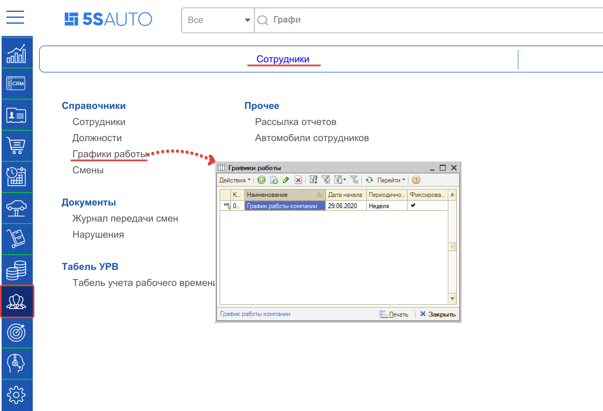

либо из типового меню программы — *Справочники → Календари → Графики работ:*

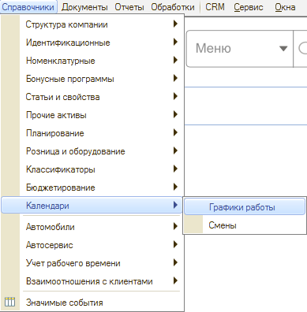

На базе знаний есть статья, описывающее настройки и подробности использования табеля учета. [Перейти к статье.](../../../articles/5S%20AUTO/Персонал%20и%20мотивация/Табель%20учета%20рабочего%20времени/tabel-ucheta-rabochego-vremeni.md)

## Настройка графика

График работы компании настраивается согласно реальному графику.

Первый важный момент:

- Если записи на ремонт будут по постам, то график работы настраивается на организацию, или на каждое подразделение, если у них разное время работы.
- Если записи на ремонт будут по исполнителям, то на каждого исполнителя необходимо создать свой график работы.

Второй важный момент:

- От настройки графика будет зависеть отображаемое время работы в АРМ Запись на ремонт:

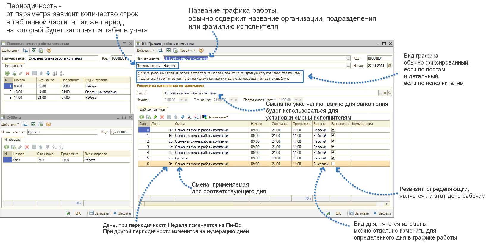

### Запись на ремонт ведется по постам

В случае, если запись на ремонт ведется по постам, то первое, что необходимо изменить - предопределенный "График работы компании".

Если графики работы подразделений или организаций отличаются друг от друга, то необходимо создавать новый график.

Решаем какая будет периодичность. Чаще всего периодичность "Неделя", в субботу и воскресенье сокращенный день.

Рассмотрим примеры.

#### Пример 1.

С 9 до 21 каждый день.

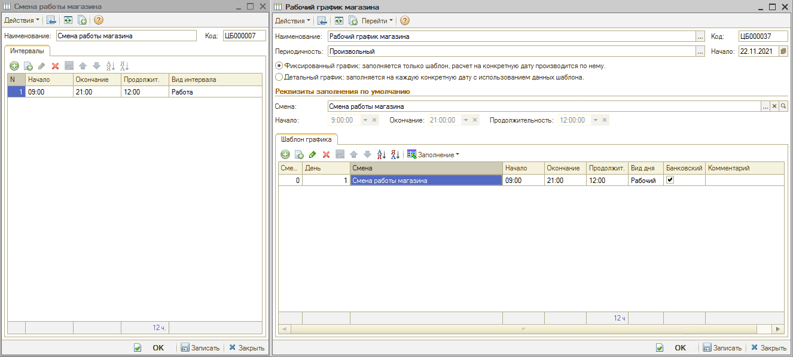

#### Пример 2.

С 9 до 21 каждый день, обед с часу до двух.

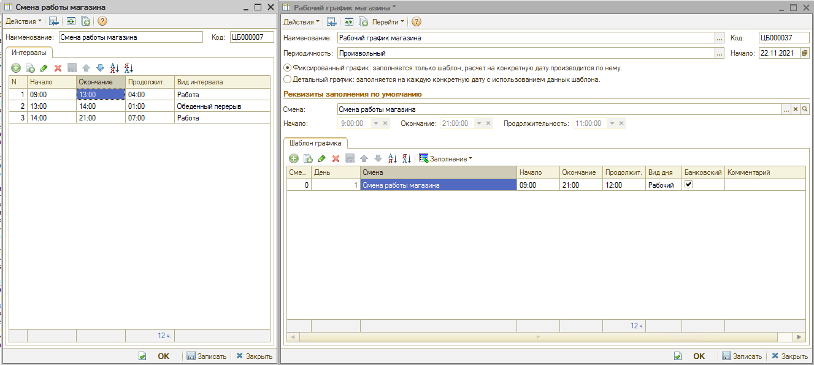

#### Пример 3.

Понедельник-Пятница С 9 до 21 каждый день, обед с часу до двух. В субботу с 9 до 19 без обеда. Воскресенье выходной.

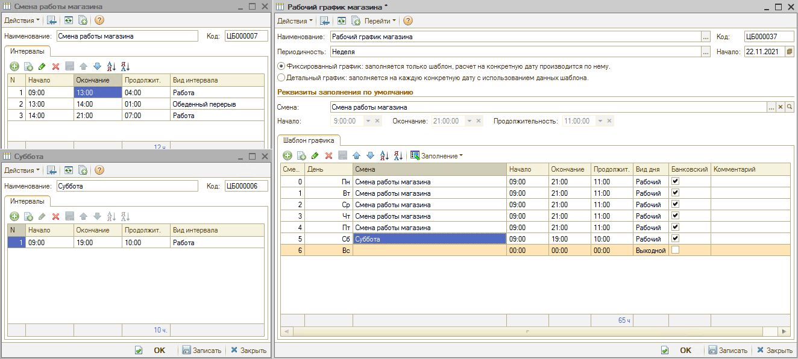

Либо так: выбираем произвольную периодичность, выбираем начало - понедельник и составляем шаблон на 7 дней.

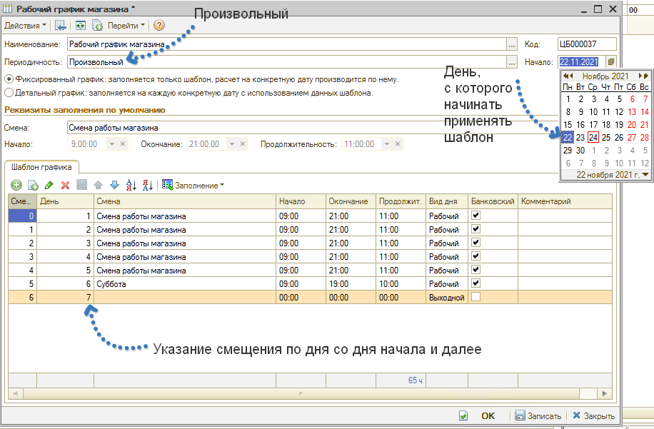

### Запись на ремонт ведется по исполнителям

#### Стандартный вариант

Перед этапом настройки графиков работ исполнителей обязательно необходимо настроить графики работ как по постам, т. е. чтобы у подразделений, складов и основных цехов был привязан корректный график работы. После сделанных настроек необходимо на каждого занесенного в базу исполнителя создать свой график работы. Ему установить Произвольную периодичность и вид Детальный график. Смена на каждого исполнителя выбирается в зависимости от смены работы подразделения, который ему соответствует.

Шаблон графика заполнять не требуется. Сам график на каждого исполнителя заполняется ответственным лицом в Табеле учета. При правильных настройках Плановое рабочее время сотрудника, указанное в табеле автоматически переносится в его график работы.

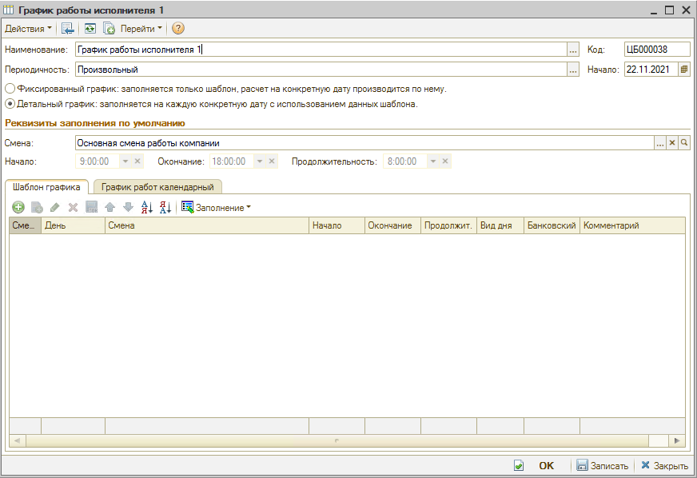

#### Вариант посменной работы исполнителей

В случае если для сотрудников предусмотрено 2 смены, например, "2 через 2" или "3 через 3", рекомендуются следующие настройки. Создать 2 графика с произвольной периодичностью и видом *"Фиксированный",* выбрать смену (например, 12-часовую для механика).

В шаблон графика добавить количество строк, соответствующее периодичности посменного графика, например, 2 рабочих дня и 2 выходных (итого период = 4 дня). Для рабочих дней указывается смена (подтягивается автоматически из заполненного выше реквизита "Смена"). Для выходных указывается вид дня "Выходной".

Далее *– важный момент –* для сотрудников первой и второй смены нужно установить свои *даты начала,* т.е. с какого числа начинает для них действовать этот график. В рассматриваемом примере "2 через 2" для первой смены устанавливается дата 01.01, а для второй смены – 03.01:

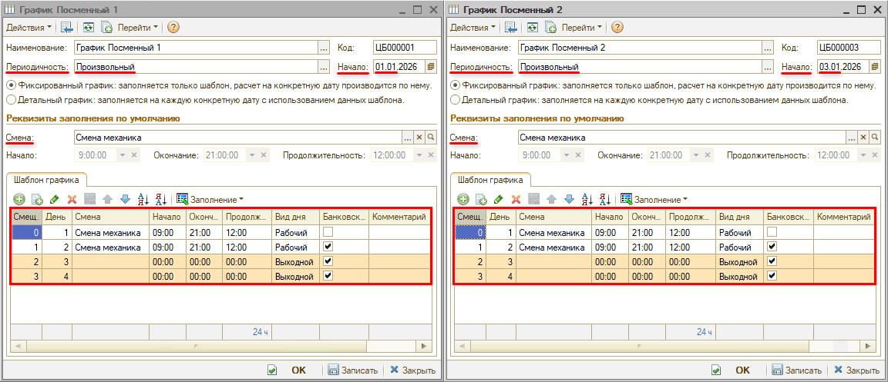

В случае если требуется настроить гибкий график с учетом праздничных дней, отпусков и т.д., то следует настроить *детализированный график.*

Для этого требуется: создать копированием график для конкретного сотрудника, который будет работать в эту смену, проверить заполнение параметра "Смена" (при необходимости выбрать нужную). Выбрать вариант "Детальный график", перейти на появившуюся вкладку "График работ календарный", нажать кнопку "Заполнение → Заполнить по графику". В открывшемся окне "Заполнение календарного графика" выбрать периодичность заполнения или задать произвольный период. Затем нажать кнопку "Выполнить" и "Закрыть".

Календарный график работ будет заполнен в соответствии с шаблоном графика и с учетом периодов, указанных в смене (рабочие часы и перерывы):

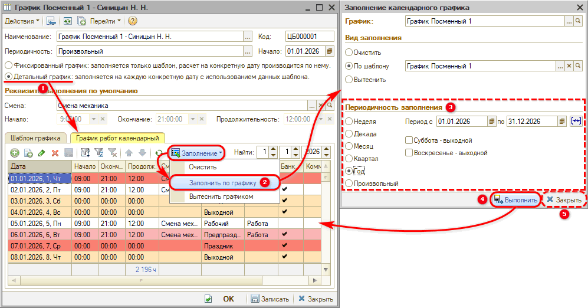

Далее можно вручную настроить все дни, например, указать праздники, отпуска (если график настраивается на конкретного сотрудника) и т.д., чтобы затем автоматически заполнялся табель. Затем повторить действия по созданию и настройке детальных графиков для каждого сотрудника обеих смен.

*Примечание:* Также примеры настройки фиксированного и детального графика приведены в справке от Раруса в программе – перейти можно из формы справочника графиков работы или из карточки графика нажатием на кнопку "Справка":

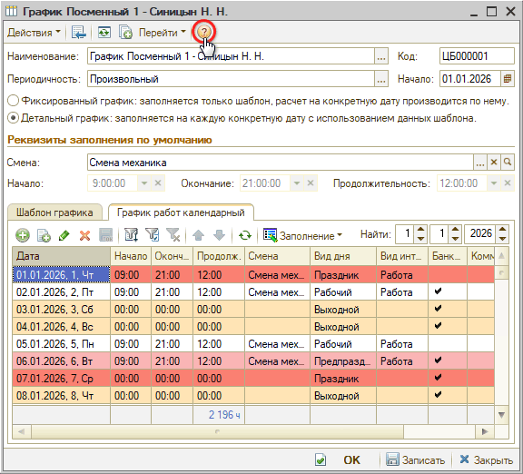

---

**Теги:** запись на ремонт, график работы, цех, смены, планировщик

