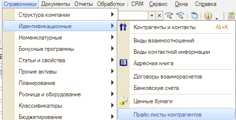
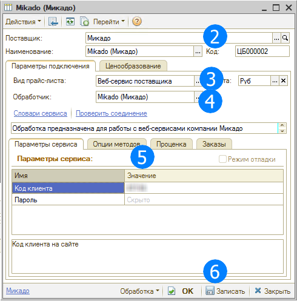
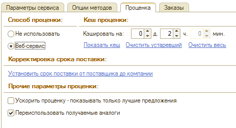
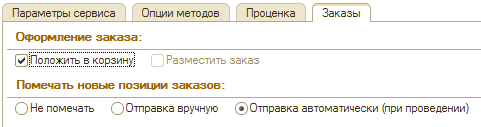

# Как подключить веб-сервис поставщика

<table><tr><td><b>Время чтения:</b> 3 мин.</td><td><b>Обновлено:</b> 08.07.2022</td></tr></table>

Источник: https://www.5systems.ru/help/kak-podklyuchit-veb-servis-postavschika

## Содержание

1. [Создание Веб прайс-листа](#создание-веб-прайс-листа)
2. [Настройка параметров для проценки](#настройка-параметров-для-проценки)
3. [Настройка параметров для отправки заказа поставщику](#настройка-параметров-для-отправки-заказа-поставщику)

## Создание Веб прайс-листа

Для создания Веб прайс-листа необходимо выполнить следующие действия:

1. Создать прайс-лист (Справочники → Идентификационные → Прайс-листы контрагентов)  
   
2. В поле "Поставщик" выбираем юр. лицо – с кем заключен договор.
3. В поле "Вид прайс-листа" выбрать значение "Веб-сервис поставщика".
4. В поле "Обработчик" выбрать веб-сервис поставщика.
5. Произвести настройки подключения к Веб-сервису. Для каждого Веб-сервиса предусмотрены собственные настройки подключения.
6. Сохранить изменения:  
   
7. Произвести настройку Веб-сервиса:
   - указать параметры для проценки,
   - указать параметры для отправки заказа поставщику, либо размещения заказа в корзине у поставщика.

## Настройка параметров для проценки

Настройка производится на вкладке "Проценка". *Пример стандартной настройки на скриншоте:*

Для настройки проценки используются следующие параметры:

<table><tr><td><b>Параметр</b></td><td><b>Значения</b></td><td><b>Описание</b></td></tr><tr><td>Способ проценки</td><td>- Не использовать - Веб-сервис</td><td>Включает или отключает использование данного прайс-листа в проценке</td></tr><tr><td>Переиспользовать получаемые аналоги</td><td>Да/Нет</td><td>Использовать или нет аналоги, получаемые от поставщика, для поиска наличия на складах и в загруженных локально прайс-листах</td></tr><tr><td>Установить срок поставки от поставщика до компании</td><td>Форма ввода срока поставки</td><td>Добавляется к сроку поставки из Веб-сервиса</td></tr><tr><td>Кэш проценки</td><td>Поля ввода дней, часов или минут</td><td>Позволяет запоминать результат поиска цен из Веб-сервиса на указанное время. После чего снова обращается к Веб-сервису за актуальными данными. Значительно ускоряет проценку. При установленном кэшировании проценки есть возможность просмотреть детали, запомненные в кэше и очистить кэш, используя опцию "Статистика кэш"</td></tr></table>

## Настройка параметров для отправки заказа поставщику

В Системе предусмотрена возможность либо отправить заказ поставщику, либо разместить заказ в корзине поставщика. Настройка производится на вкладке "Заказы". Возможность выбора типа оформления заказа зависит от конкретного веб-сервиса. *Пример стандартной настройки на скриншоте:*

Для настройки отправки заказа поставщику используются следующие параметры:

<table><tr><td><b>Параметр</b></td><td><b>Значения</b></td><td><b>Описание</b></td></tr><tr><td>Положить в корзину</td><td>Да/Нет</td><td>Включает или отключает возможность размещения заказа в корзине поставщика</td></tr><tr><td>Разместить заказ</td><td>Да/Нет</td><td>Включает или отключает возможность непосредственного размещения заказ у поставщика</td></tr><tr><td>Помечать новые позиции заказов</td><td>- Не помечать - Отправка вручную - Отправка автоматически (при проведении)</td><td>Служит для заполнения по умолчанию поля "Веб заказ" в табличной части заказа поставщику</td></tr></table>

---

**Теги:** поиск цен, веб-сервис поставщика, подключение, прайс-листы

