# Примеры подключения поставщиков Armtek, Rossko, Berg, Mikado

<table><tr><td><b>Время чтения:</b> 12 мин.</td><td><b>Обновлено:</b> 29.08.2022</td></tr></table>

Источник: https://www.5systems.ru/help/primery-podklyucheniya-postavschikov-armtek-rossko-berg-mikado

## Содержание

- [1. Настройка Веб-сервиса Armtek (Армтек)](#1-настройка-веб-сервиса-armtek-армтек)
    - [Параметры подключения](#параметры-подключения)
    - [Опции методов](#опции-методов)
      - [Описание опций в Веб-сервисах Armtek (Армтек)](#описание-опций-в-веб-сервисах-armtek-армтек)
- [2. Настройка Веб-сервиса Rossko (Росско)](#2-настройка-веб-сервиса-rossko-росско)
    - [Опции методов](#опции-методов-1)
- [3. Настройка Веб-сервиса Berg (Берг)](#3-настройка-веб-сервиса-berg-берг)
    - [Опции методов](#опции-методов-2)
- [4. Настройка Веб-сервиса Mikado (Микадо)](#4-настройка-веб-сервиса-mikado-микадо)
    - [Опции методов](#опции-методов-3)

## 1. Настройка Веб-сервиса Armtek (Армтек)

Обработчик предназначен для работы с Веб-сервисами компании "Армтек".

Для использования Веб-сервисов Armtek (Армтек) необходимо:

1. Быть клиентом компании "Армтек".
2. Иметь не менее одного логина для работы в ЭТП: [https://etp.armtek.ru](https://etp.armtek.ru/)
3. Отправить менеджеру компании "Армтек" запрос на подключение к Веб-сервисам со следующей информацией:
   - Логин, по которому будет обращение к Веб-сервису (рекомендуется иметь отдельный логин для Веб-сервисов). 
     **Обратите внимание!** После того, как вам зарегистрировали новый логин для работы с Веб-сервисом АРМТЕК, необходимо ОБЯЗАТЕЛЬНО зайти в ЭТП и СМЕНИТЬ пароль! Если этого не сделать, то вызовы к Веб-сервису будут возвращать ошибку с текстом: "Ошибка авторизации пользователя. Необходимо сменить пароль. Зайдите в ЭТП и измените пароль". При игнорировании этого сообщения, данный логин блокируется автоматически!
   - Список IP-адресов, с которых будет происходить обращение к Веб-сервисам (данное требование необязательное, но позволит повысить вашу безопасность).

Пример сообщения в адрес менеджера Армтек (для ускорения процесса можете так же ему позвонить):

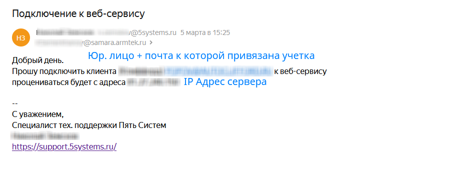

При работе через Веб-сервисы Armtek (Армтек) существует ограничение на общее количество поисковых запросов в сутки. По умолчанию, это значение равно 1000. В случае превышения данного значения Веб-сервисы вернут соответствующую ошибку.

#### Параметры подключения

Параметры подключения к Веб-сервису поставщика настраиваются на вкладке "Параметры сервиса".

Для подключения Веб-сервисов Armtek (Армтек) необходимо указать следующие параметры:

- *Сервер* - адрес сервиса (на момент создания статьи это ***ws.armtek.ru***),
- *Логин* - почта, на которую привязана уч. запись Армтек,
- *Пароль*.

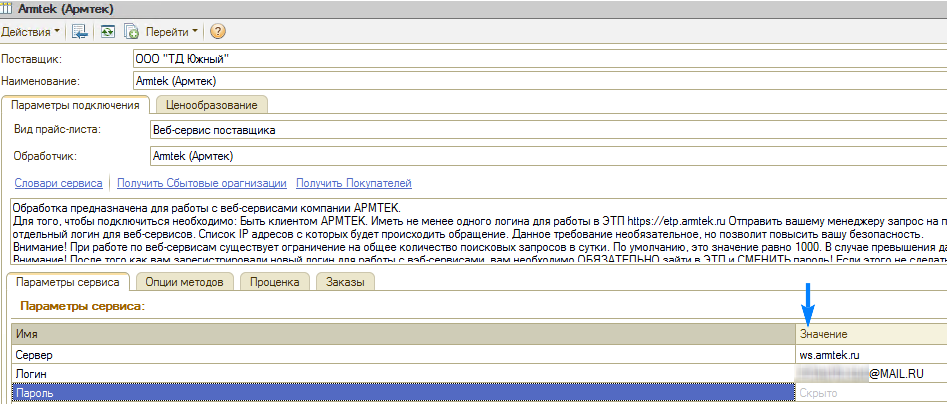

После заполнения учетных данных нажимаем «Записать», а после «Получить Сбытовые организации» и «Получить покупателей»:

#### Опции методов

Опции методов используются как при поиске цен, так и при отправке заказа поставщику. По умолчанию используются опции, установленные в карточке прайс-листа. Если требуется, то при проценке или отправке заказа поставщику вручную, могут быть назначены собственные значения опций, необходимые в данный момент.

Опции методов настраиваются на вкладке "Опции методов".

На скриншоте ниже пример минимальных настроек для работы:

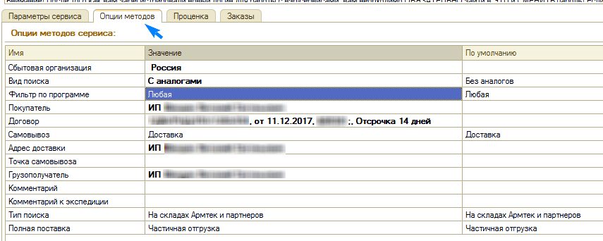

##### Описание опций в Веб-сервисах Armtek (Армтек)

<table><tr><td><b>Опция</b></td><td><b>Значения</b></td><td><b>Описание</b></td></tr><tr><td>Сбытовая организация</td><td>Из словаря сервиса</td><td>Сбытовая организация, к которой выполняются запросы на проценку и выполняются заказы</td></tr><tr><td>Вид поиска</td><td>- Без аналогов - С аналогами</td><td>Определяет возвращать ли аналоги в проценке или нет</td></tr><tr><td>Фильтр по программе</td><td>- Легковая программа - Грузовая программа - Любая</td><td>Определяет какая программа должна быть в результатах выполнения запроса по поиску цен</td></tr><tr><td>Покупатель</td><td>Из словаря сервиса</td><td>Покупатель, от лица которого выполняется проценка и оформление заказов</td></tr><tr><td>Договор</td><td>Из словаря сервиса</td><td>Договор покупателя со сбытовой организацией при оформлении заказа</td></tr><tr><td>Самовывоз</td><td>- Доставка - Самовывоз</td><td>Определяет тип доставки: доставка или самовывоз</td></tr><tr><td>Адрес доставки</td><td>Из словаря сервиса</td><td>Адрес для службы доставки компании "Армтек"</td></tr><tr><td>Точка самовывоза</td><td>Из словаря сервиса</td><td>Адрес точки самовывоза при оформлении заказа</td></tr><tr><td>Грузополучатель</td><td>Из словаря сервиса</td><td>Грузополучатель в реализации товара</td></tr><tr><td>Комментарий</td><td>Строка</td><td>Комментарий к заказу</td></tr><tr><td>Комментарий к экспедиции</td><td>Строка</td><td>Комментарий к экспедиции</td></tr><tr><td>Тип поиска</td><td>- На основном складе - На всех складах Армтек - На складах Армтек и партнеров</td><td>Признак проверки наличия товара при оформлении заказа</td></tr></table>

## 2. Настройка Веб-сервиса Rossko (Росско)

Для использования веб-сервисов компании Rossko (Росско) необходимо **самостоятельно получить ключи доступа** в личном кабинете на портале.

Чтобы получить ключи доступа:

1. Перейдите на сайт [https://rossko.ru/#where](https://rossko.ru/#where).
2. Выберите город для начала работы.
3. Зарегистрируйтесь и/или авторизуйтесь на сайте города, выбранного на предыдущем шаге  
   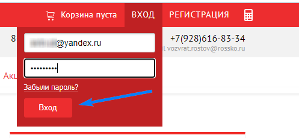
4. Перейдите к настройкам через личный кабинет:  
   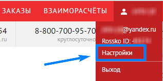
5. Получите ключи доступа,  
   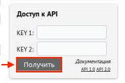  
   а также рекомендуем сразу включить аналоги:  
   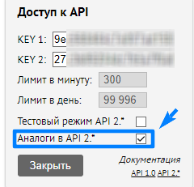

*Внимание!* Веб сервис имеет минутные и дневные ограничения по количеству запросов.

**При наличии ключей доступа в карточке прайс-листа**:

1. Заполните параметры подключения (Ключ1 и Ключ2).
2. Сохраните изменения, нажав кнопку "Записать".
3. Обновите словари сервиса, нажав кнопку-ссылку "Обновить словари оформления заказов":  
   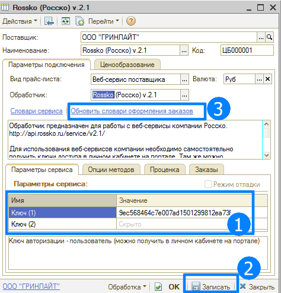
4. Настройте опции методов: на скриншоте ниже пример минимальных настроек для работы:  
   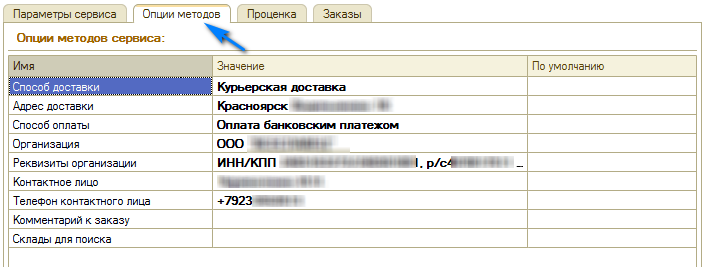
5. Сохраните изменения.

#### Опции методов

В Веб-сервисах Rossko (Росско) предусмотрены следующие опции:

<table><tr><td><b>Опция</b></td><td><b>Значения</b></td><td><b>Описание</b></td></tr><tr><td>Способ доставки</td><td>Из словаря сервиса</td><td>Определяет способ доставки заказа</td></tr><tr><td>Адрес доставки</td><td>Из словаря сервиса</td><td>Определяет адрес доставки заказа</td></tr><tr><td>Способ оплаты</td><td>Из словаря сервиса</td><td>Определяет способ оплаты заказа</td></tr><tr><td>Организация</td><td>Из словаря сервиса</td><td>Определяет организацию, оформляющую заказы</td></tr><tr><td>Реквизиты организации</td><td>Строка</td><td>Определяет реквизиты организации, оформляющей заказы</td></tr><tr><td>Контактное лицо</td><td>Строка</td><td>Определяет контактное лицо по заказу</td></tr><tr><td>Телефон контактного лица</td><td>Строка</td><td>Определяет телефон для связи с контактным лицо</td></tr><tr><td>Комментарий к заказу</td><td>Строка</td><td>Комментарий к заказу</td></tr><tr><td>Склады для поиска</td><td>Строка</td><td>Ограничение складов для поиска остатков (например: "HST924, HST228, HST28")</td></tr></table>

## 3. Настройка Веб-сервиса Berg (Берг)

Для использования Веб-сервисов Berg (Берг) **необходимо получить ключ доступа**. Для этого:

1. Зарегистрируйтесь и/или авторизуйтесь на сайте поставщика: [http://berg.ru](http://berg.ru/).
2. Перейдите на страницу [http://berg.ru/api/keys](http://berg.ru/api/keys) напрямую или через меню "Еще"->Настройки API:  
   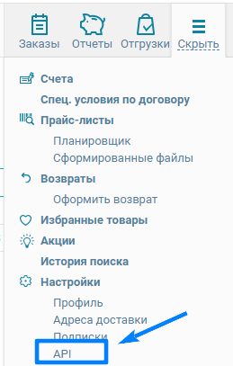  
   Если страница недоступна, то запросите у назначенного Вам менеджера доступ к ней.
3. Сгенерируйте ключ на данной странице:

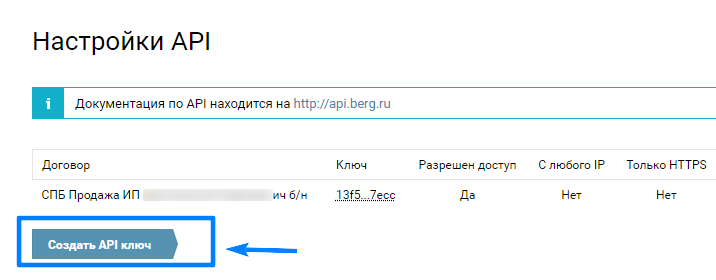

**При наличии ключа доступа в карточке прайс-листа**:

1. Заполните параметры подключения (Ключ), берем данные с ЛК 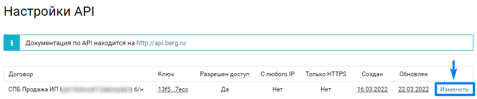 &nbsp;&nbsp; 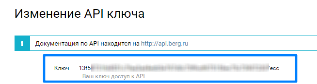
2. Запишите изменения, нажав кнопку "Записать".
3. Обновите словари сервиса, нажав кнопки-ссылки "Обновить Адреса доставки" и "Обновить Статусы заказов":  
   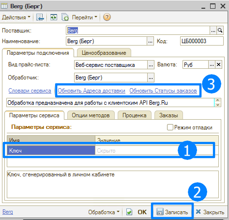
4. Настройте опции методов: на скриншоте ниже пример минимальных настроек для работы.  
   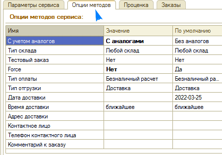
5. Запишите изменения.

#### Опции методов

В Веб-сервисах Berg (Берг) предусмотрены следующие опции:

<table><tr><td><b>Опция</b></td><td><b>Значения</b></td><td><b>Описание</b></td></tr><tr><td>С учетом аналогов</td><td>- С аналогами - Без аналогов (по умолчанию)</td><td>Определяет показывать предложения в проценке с аналогами или без</td></tr><tr><td>Тип склада</td><td>- Любой склад (по умолчанию) - Склад текущего филиала - Центральный склад - Дополнительные склады</td><td>Определяет какие склады должны быть в результатах проценки</td></tr><tr><td>Тестовый заказ</td><td>- Да - Нет (по умолчанию)</td><td>Определяет реальный или тестовый заказ отправлять поставщику. Тестовый заказа будет сохранен и доступен в истории заказов, но не будет принят к дальнейшей обработке.</td></tr><tr><td>Force</td><td>- Да (по умолчанию) - Нет</td><td>Определяет осуществлять ли заказ даже если запрашиваемого количества нет на складе, с которого производится заказа, либо заказывается количество товара не кратное минимальной норме отгрузки, либо позиция дороже переданной клиентом максимальной цены. Если установить значение "Да", то позиция с неверным количеством или максимальной ценой будет пропущена, а информация о ней будет добавлена в массив warning. Все остальные позиции будут размещены в заказ.</td></tr><tr><td>Тип оплаты</td><td>- Безналичный расчет (по умолчанию) - Наличный расчет</td><td>Определяет тип оплаты заказа</td></tr><tr><td>Тип отгрузки</td><td>- Самовывоз - Доставка (по умолчанию)</td><td>Определяет тип отгрузки заказа</td></tr><tr><td>Дата доставки</td><td>Строка</td><td>Определяет дату доставки. По умолчанию устанавливается ближайшая дата доставки.</td></tr><tr><td>Время доставки</td><td>- До 15:00 - После 15:00 - ближайшее (по умолчанию)</td><td>Определяет время доставки</td></tr><tr><td>Адрес доставки</td><td>Из словаря сервиса</td><td>Определяет адрес доставки для типа отгрузки "Доставка"</td></tr><tr><td>Контактное лицо</td><td>Строка</td><td>Контактное лицо по заказу</td></tr><tr><td>Телефон контактного лица</td><td>Строка</td><td>Телефон для связи с контактным лицом</td></tr><tr><td>Комментарий к заказу</td><td>Строка</td><td>Произвольный комментарий к заказу</td></tr></table>

## 4. Настройка Веб-сервиса Mikado (Микадо)

Обработчик предназначен для работы с Веб-сервисами компании Микадо: [http://mikado-parts.ru/office/helpws.asp](http://mikado-parts.ru/office/helpws.asp).

Доступ к сервисам предоставляется зарегистрированным клиентам. Управление доступом к WebService осуществляется на странице [http://mikado-parts.ru/office/ws_panel.asp](http://mikado-parts.ru/office/ws_panel.asp).

Для подключения поставщика через обработку Mikado (Микадо) необходимо:

1. Зарегистрироваться на сайте [http://mikado-parts.ru](http://mikado-parts.ru/).
2. Получить доступ к Веб-сервисам, см. раздел *Доступ к WebService* в [http://mikado-parts.ru/office/helpws.asp](http://mikado-parts.ru/office/helpws.asp).  
   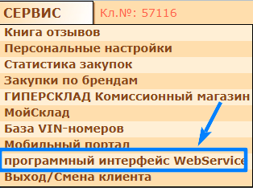
3. На странице [http://mikado-parts.ru/office/ws_panel.asp](http://mikado-parts.ru/office/ws_panel.asp). Включаем доступ к WebService и корзине, а также добавляем IP сервера (где установлена 1С) с которого ведется проценка.  
   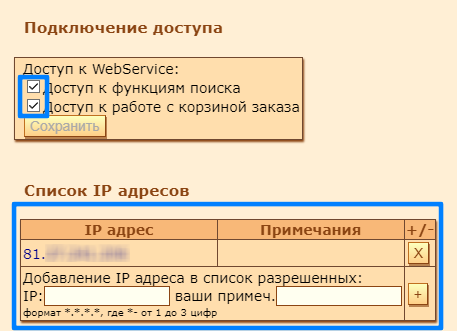

После получения всех необходимых для подключения параметров выполняются следующие действия для Веб прайс-листа:

1. Заполнение параметров подключения (Логин-пароль от ЛК)
2. Сохранение параметров подключения.  
   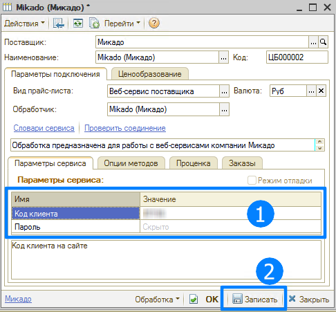
3. Настройка опций методов:  
   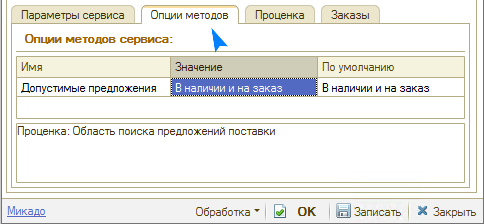
4. Сохранение всех изменений.

#### Опции методов

Опции методов настраиваются на вкладке "Опции методов".

В Веб-сервисах Mikado (Микадо) предусмотрены следующие опции:

<table><tr><td><b>Опция</b></td><td><b>Значения</b></td><td><b>Описание</b></td></tr><tr><td>Допустимые предложения</td><td>- В наличии и на заказ (по умолчанию) - Только в наличии</td><td>Определяет показывать предложения в проценке только "в наличии" или в том числе и "на заказ"</td></tr></table>

---

**Теги:** поиск цен, веб-сервис поставщика, Armtek, Rossko, Berg, Mikado

