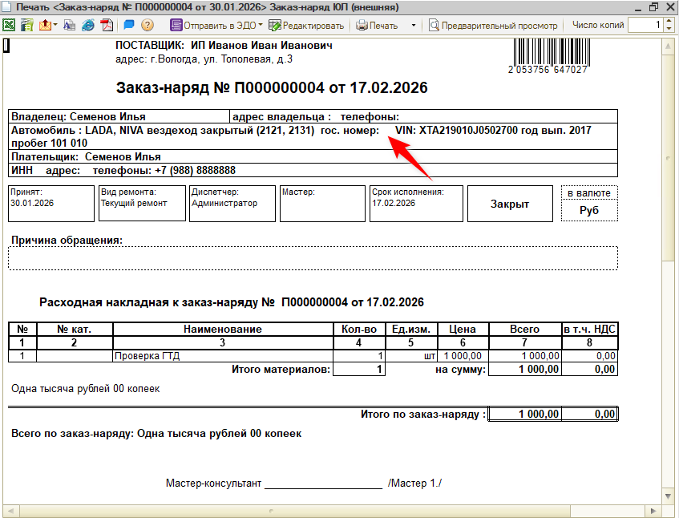
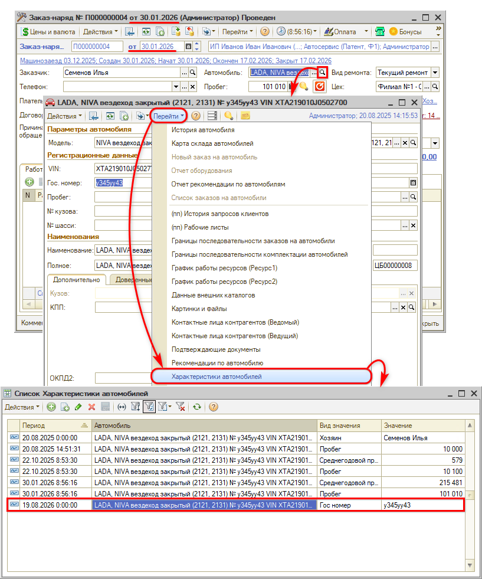
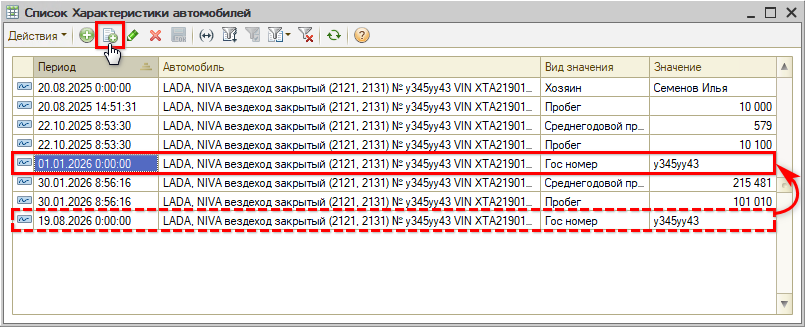

# В печатной форме заказ-наряда не выводится гос. номер автомобиля

**Обновлено:** 24.08.2026

## Проблема

В печатной форме [заказ-наряда](https://www.5systems.ru/help/zakaz-naryady) поле **«гос. номер»** пустое, хотя в карточке автомобиля номер заполнен.

## Причина

Заказ-наряд создан раньше, чем гос. номер был введен в программу.

Характеристики [автомобиля](https://www.5systems.ru/help/avtomobili-0) — гос. номер, пробег, владелец — хранятся в регистре **«Характеристики автомобилей»** с привязкой к дате. В документ подставляется то значение, которое было актуально **на дату создания документа**. Если на тот момент записи о гос. номере еще не было, подставлять нечего — поле остается пустым, и в печатной форме тоже.

Чтобы это проверить, откройте из проблемного заказ-наряда карточку автомобиля и выберите **«Перейти» → «Характеристики автомобилей»**. В колонке **«Период»** видно, когда появилась запись с видом значения **«Гос номер»**.

Дату самого заказ-наряда смотрите в шапке документа, рядом с его номером. В примере на скриншотах заказ-наряд создан 30.01.2026, а запись о гос. номере — 19.08.2026, то есть на полгода позже.

## Решение

Добавьте в регистр запись о гос. номере с более ранней датой, чем дата создания заказ-наряда:

1. Откройте регистр **«Характеристики автомобилей»** — из карточки автомобиля через **«Перейти»**.
2. Выделите строку с видом значения **«Гос номер»** и скопируйте ее — кнопкой **«Добавить копированием»** на панели.
3. В новой строке установите **«Период»** раньше даты создания заказ-наряда.
4. Запишите строку.

После этого гос. номер выводится в печатной форме. Старую запись удалять не нужно: регистр хранит историю, а в документ подставляется значение, актуальное на его дату.

## Материалы для изучения

- «[Заказ-наряды](https://www.5systems.ru/help/zakaz-naryady)» — работа с документом и его печатные формы.
- «[Автомобили](https://www.5systems.ru/help/avtomobili-0)» — карточка автомобиля и ее реквизиты.
- «[Корректировка пробега автомобиля](https://www.5systems.ru/help/korrektirovka-probega-avtomobilya)» — как устроен регистр «Характеристики автомобилей» и как править его записи.

## Похожие вопросы

- В печатной форме заказ-наряда не выводится гос. номер автомобиля
- В з\н <...>, в печатной форме з\н не выгружается в форму гос номер автомобиля
- Не выгружается гос номер а\м в печатную форму з\н. Заказчику это важно. прошу исправить

## Теги

заказ-наряд, печатная форма, гос. номер, автомобиль, характеристики автомобилей, регистр сведений, дата документа, не выводится
