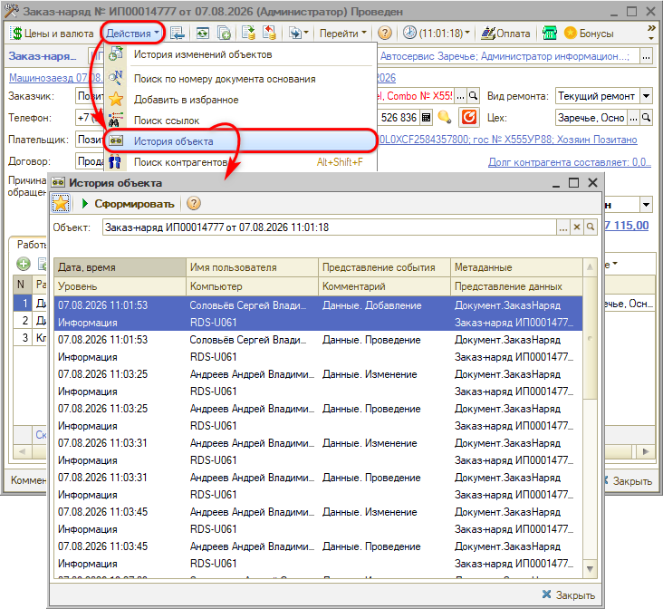

# Как посмотреть историю изменений документа

Для того, чтобы посмотреть в программе историю изменений документа, — например, проверить, кто поменял исполнителя в заказ-наряде, — есть несколько способов. Они отличаются глубиной хранения и тем, насколько подробно видно изменение.

## 1. История объекта

Самый простой способ, если известен конкретный документ. Откройте документ и выберите в меню **«Действия» → «История объекта»**, затем нажмите **«Сформировать»**. История объекта может подгружаться несколько минут.

В окне истории по каждому событию видно дату и время, имя пользователя, компьютер, с которого работали, и само событие (добавление, изменение, проведение и др.). 

Тот же механизм работает для справочников. Например, чтобы узнать, кем была изменена настройка доступности состояния заказ-наряда, откройте справочник «Состояния заказ-нарядов», выделите нужное состояние и вызовите «Действия → История объекта».

*Обратите внимание:* история объекта показывает, **кто и когда** правил документ, но не показывает, **какое именно поле** изменилось. Чтобы увидеть, что в документе поменялся именно исполнитель, нужен третий способ — версионирование.

## 2. Журнал регистрации

Общий механизм платформы 1С: в нем фиксируются все действия пользователей, а не только по одному документу.

Учтите два ограничения:

- журнал работает медленно, особенно на большой базе;
- данные в нем хранятся ограниченное время — как правило, от одного до трех месяцев.

## 3. Версионирование документов и справочников

Механизм сохраняет версии документа целиком, поэтому позволяет сравнить две версии и увидеть, какие именно реквизиты изменились — в том числе исполнителя в заказ-наряде.

Требует предварительной настройки: версии начинают сохраняться только с момента ее включения, задним числом историю получить не удастся. Поэтому механизм имеет смысл настроить заранее.

Подробнее см. статью [Версионирование](https://www.5systems.ru/help/versionirovanie).

## Кто скрывается за именем пользователя

В истории отображается учетная запись, под которой работали в программе. Учетные записи ведутся в системе аутентификации 5S Cloud: администратор может изменить логин, электронную почту и пароль пользователя, а также заблокировать или разблокировать его. При установке признака «Уволен» учетная запись блокируется автоматически.
