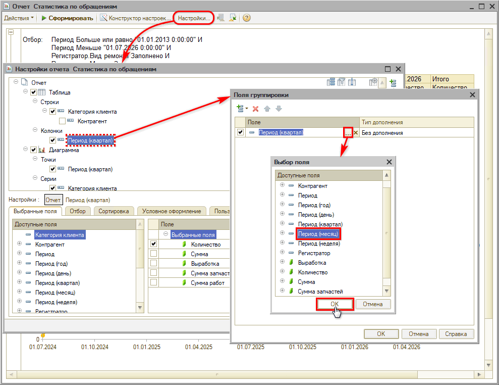
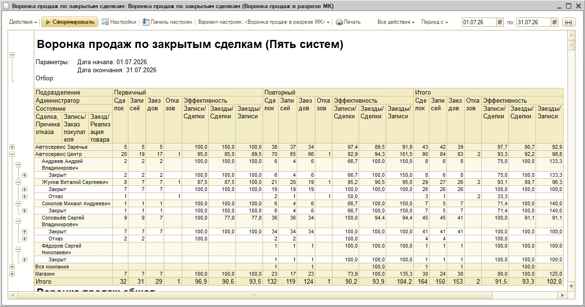
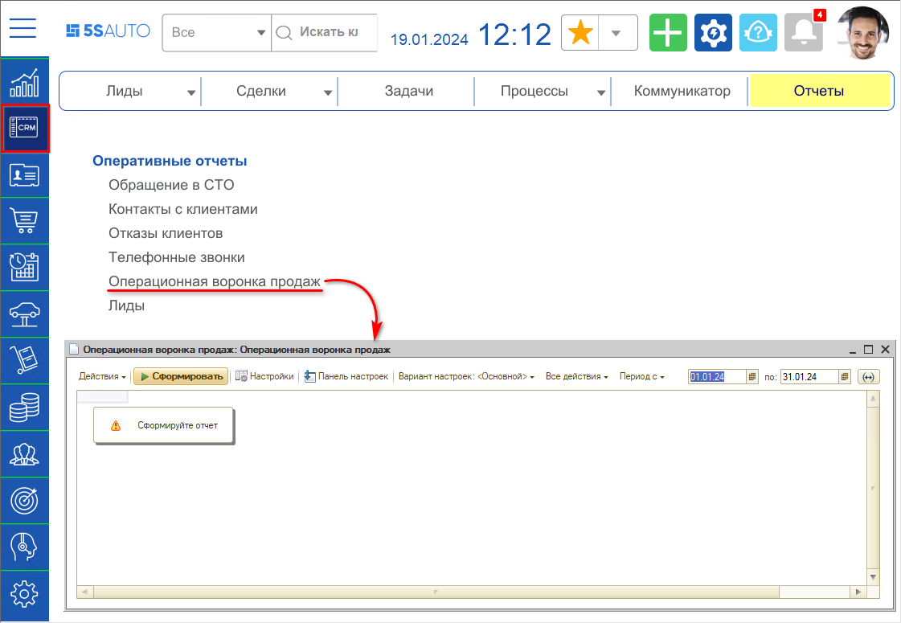
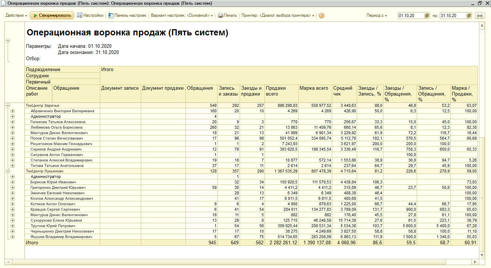

# Как посмотреть количество уникальных клиентов, обратившихся за период

Для того, чтобы увидеть количество новых клиентов за определенный период, в программе предусмотрено несколько отчетов:

1. Статистика по обращениям (анализ заездов) 
2. Обращения клиентов в автосервис
3. Воронка продаж по закрытым сделкам
4. Операционная воронка продаж
5. Сводная ведомость

Данные отчеты считают обращения, записи и заезды. Один и тот же клиент за период может обратиться несколько раз, поэтому число обращений может быть больше числа клиентов.

Ближе всего к задаче отчет «Статистика по обращениям», который делит клиентов на первичных, повторных и лояльных. Количество первичных за период — это и есть новые уникальные клиенты, обратившиеся впервые. Остальные отчеты дают более широкую картину по воронке продаж.

## Статистика по обращениям (анализ заездов)

Основной отчет для этой задачи. Он разделяет клиентов на три категории:

- **Первичные** — за период приобрели запчасти или заехали первый раз,
- **Повторные** — заехали второй раз,
- **Лояльные** — заехали третий раз и более.

Перейти можно через типовое меню: **CRM → Все операции → Отчеты → Статистика по обращениям**.

По умолчанию отчет группирует данные по категориям клиентов за квартал:

Период группировки можно изменить, например на месяц:

Обратите внимание: отчет работает только по заказ-нарядам и реализациям товаров — данные формируются через регистр накопления «Обращения (Пять систем)», куда запись попадает после закрытия заказ-наряда или проведения документа «Реализация товаров». Обращения, не дошедшие до заезда, в этот отчет не попадут.

Подробнее см. статью [Отчет "Статистика по обращениям"](https://www.5systems.ru/help/otchet-statistika-po-obrascheniyam-zaezdam).

## Обращения клиентов в автосервис

Самый простой отчет по обращениям: показывает, сколько клиентов обратилось за период, сколько из них записалось и сколько реально заехало.

Открыть отчет можно через типовое меню: **Сервис → Все операции → Отчеты → Обращения клиентов в автосервис**.

Перед формированием задайте нужный период в настройках:

Отчет покажет количество обращений, записей, заездов и отказов, а также конверсию на каждом этапе:

Число обратившихся за период видно на пересечении строки **«Входящие обращения»** и колонки **«Количество обращений»** — в примере это 739. Строка **«Итого»** (768) шире: в нее входят также исходящие обращения, инициированные самим сервисом через приглашения по рекомендациям и на ТО. Строки можно развернуть для просмотра показателей в разрезе сотрудников (администраторов).

*Примечание:* Отчет показывает количество обращений, а не уникальных клиентов: один и тот же клиент за период может обратиться несколько раз. Сколько из обратившихся пришли впервые, показывает отчет «[Статистика по обращениям](#статистика-по-обращениям-анализ-заездов)» — в нем есть категория «Первичные».

Подробнее см. статью [Отчет «Обращения клиентов в автосервис»](https://www.5systems.ru/help/otchet-obrascheniya-klientov-v-avtoservis).

## Воронка продаж по закрытым сделкам

Считает клиентов по обращениям (лидам и сделкам) и показывает, на каком этапе клиент ушел в отказ. В отчет попадают только закрытые сделки — с результатом в виде успешной продажи или зафиксированного отказа.

Перейти к отчету: **CRM → Отчеты → Воронки продаж → Воронка по закрытым сделкам**.

Задайте период в полях «Период с» и «по» и нажмите «Сформировать». Показатели выводятся тремя блоками — «Первичный», «Повторный» и «Итого», а строки группируются по подразделениям, администраторам и состояниям сделок. Количество первичных обращений за период видно в колонке «Сделок» блока «Первичный»:

Подробнее см. статью [Отчет "Воронка продаж по закрытым сделкам"](https://www.5systems.ru/help/otchet-voronka-prodazh-po-zakrytym-sdelkam).

## Операционная воронка продаж

В отличие от воронки по закрытым сделкам формируется по текущей деятельности — на основании документов записи и продажи за период. В отчет попадают и закрытые, и открытые сделки, поэтому он подходит для контроля текущего количества обращений.

Перейти к отчету: **CRM → Отчеты → Операционная воронка продаж**.

Отдельные колонки «Обращения (первичные)» и «Обращения (повторные)» позволяют оценить, сколько новых клиентов обратилось за период:

Учтите, что по одному обращению может быть несколько записей, а в отчет попадают и «старые» обращения, документы по которым созданы в текущем периоде.

Подробнее см. статью [Отчет «Операционная воронка продаж»](https://www.5systems.ru/help/otchet-operacionnaya-voronka-prodazh).

## Сводная ведомость

Универсальный отчет с настраиваемым набором показателей. Перейти к нему можно через **Автосервис → Аналитика → Базовые отчеты → Сводная ведомость**. Задайте период в полях «Период с» и «по» и нажмите «Сформировать» — в колонке «Количество Заказ-Нарядов» будет видно число заездов за период по каждому подразделению и итогом по компании:

Отчет удобен, когда нужно свести данные по клиентам вместе с другими показателями работы сервиса в одну таблицу.

Подробнее см. статью Отчет «Сводная ведомость» (в разработке).

---

**Теги:** отчеты, CRM, уникальные клиенты, первичные обращения, статистика по обращениям, воронка продаж, сводная ведомость
