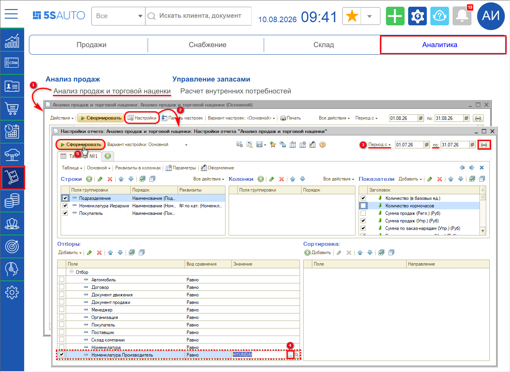
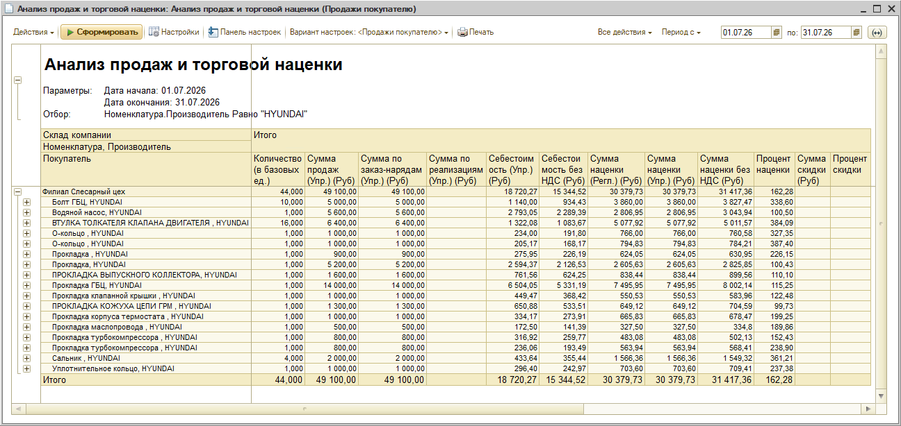

# Как посмотреть информацию по продажам за определенный период по производителю?

Используйте отчет **«Анализ продаж и торговой наценки»**. В нем есть отбор по реквизиту *Номенклатура.Производитель*, поэтому отчет можно свести по одному производителю за нужный период.

## Как сформировать отчет

1. Откройте отчет: **Аналитика → Анализ продаж → Анализ продаж и торговой наценки**.
2. Нажмите **«Настройки»**.
3. Задайте период в полях **«Период с»** и **«по»**.
4. В блоке **«Отборы»** отметьте галочкой строку **«Номенклатура.Производитель»**, оставьте вид сравнения **«Равно»** и выберите нужного производителя по кнопке выбора.
5. Нажмите **«Сформировать»**.

В том же окне настроек можно изменить группировку строк — по умолчанию это **Подразделение**, **Номенклатура** (иерархия) и **Покупатель** — и набор показателей: количество в базовых единицах, суммы продаж, суммы по заказ-нарядам и по реализациям. При необходимости добавьте количество нормочасов, сумму продаж по регламентированному учету или НДС.

## Что покажет отчет

Отчет выведет продажи только по выбранному производителю за указанный период: по каждой позиции номенклатуры — количество, сумму продаж, себестоимость, сумму и процент наценки, а также сумму и процент скидки. Итоговая строка дает те же показатели по всему отбору.

В примере отобраны продажи запчастей HYUNDAI за июль: 44 единицы на 49 100,00 руб. при себестоимости 18 720,27 руб., наценка составила 30 379,73 руб., или 162,28 %.

Выбранные параметры отчет выводит в шапке — под ней видно, за какой период он сформирован и какой отбор применен.
