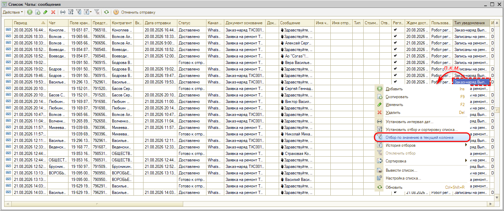

# Как посмотреть список всех отправленных сообщений

## Вопрос

Нужно посмотреть все сообщения с клиентами. В [сделке](https://www.5systems.ru/help/sobytiya-sdelki) отображаются не все, а в [ленте событий](https://www.5systems.ru/help/lenta-sobytiy) — только по конкретному клиенту.

## Ответ

Полный список сообщений хранится в регистре **«Сообщения»**. Откройте его через верхнее типовое меню: *CRM → Сообщения → Сообщения*.

В регистре по каждому сообщению видно период, чат, контрагента, дату отправки, статус, канал, документ-основание, текст сообщения и тип уведомления. Нужное сообщение можно найти по контрагенту, времени отправки и другим параметрам.

Чтобы оставить только нужные записи, нажмите на колонке правой кнопкой мыши и выберите **«Отбор по значению в текущей колонке»**. Например, так можно отобрать все сообщения по типу уведомления — о записи на ремонт или о выполнении заказ-наряда.

## Материалы для изучения

- «[Лента событий](https://www.5systems.ru/help/lenta-sobytiy)» — события и переписка по конкретному клиенту.
- «[Чаты клиента](https://www.5systems.ru/help/chaty-klienta)» — переписка с клиентом в мессенджерах.
- «[События сделки](https://www.5systems.ru/help/sobytiya-sdelki)» — что отображается в сделке.

## Похожие вопросы

- Как посмотреть список всех отправленных сообщений
- Где увидеть всю переписку с клиентами
- В сделке видны не все сообщения
- Как найти сообщение по контрагенту или дате
- Как отобрать сообщения по типу уведомления

## Теги

сообщения, регистр сообщений, чаты, переписка, лента событий, сделка, отбор по значению, тип уведомления, CRM
