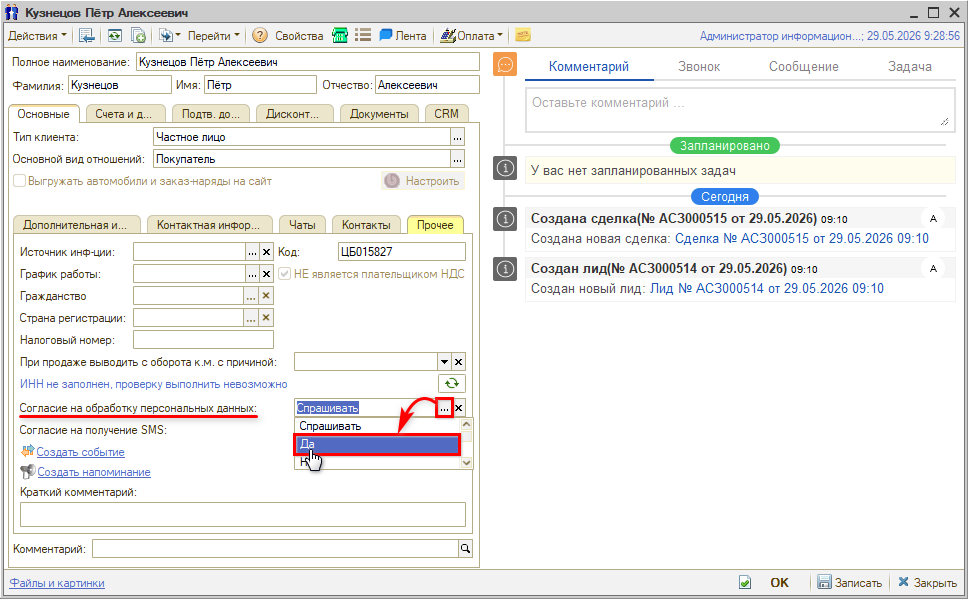
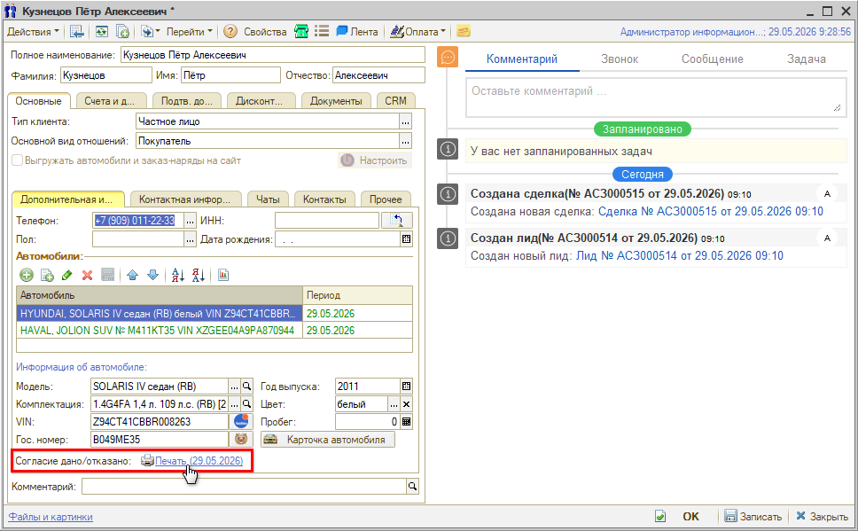
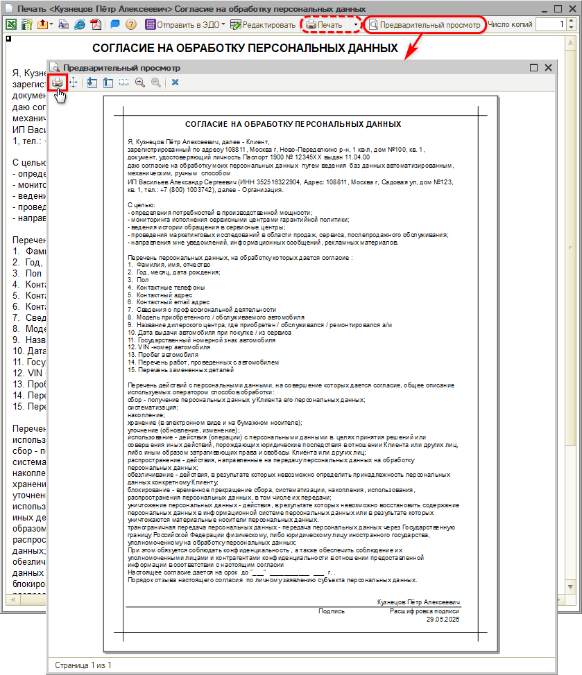

# Как распечатать согласие на обработку персональных данных

<table><tr><td><b>Создано:</b> 16.09.2026</td></tr></table>

## Вопрос

Как распечатать для клиента согласие на обработку персональных данных?

## Ответ

Чтобы распечатать согласие на обработку персональных данных для клиента, в карточке [контрагента](../../../../articles/5S%20AUTO/Работа%20с%20клиентами/Контрагенты%20и%20контакты/kontragenty-i-kontakty.md#карточка-контрагента) перейдите на вкладку **«Основные» → «Прочее»** и в реквизите **«Согласие на обработку персональных данных»** выберите значение **«Да»**:

Затем вернитесь на вкладку **«Дополнительная информация»** — напротив реквизита **«Согласие дано/отказано»** появляется ссылка на печать документа:

Нажмите на ссылку — откроется печатная форма согласия на обработку персональных данных по текущему контрагенту:

Для того чтобы данные по контрагенту и организации подтягивались в документ корректно, учитывайте, что программа ищет информацию в строго определенных полях контактной информации.

1. Данные по клиенту:
   - **Адрес клиента** — адрес из [контактной информации контрагента](../../../../articles/5S%20AUTO/Работа%20с%20клиентами/Контрагенты%20и%20контакты/kontragenty-i-kontakty.md#vkl_kont_inf) вида «Фактический адрес» или «Юридический адрес».
   - **Паспортные данные** — подтягиваются в случае, если в карточке контрагента на вкладке «[Подтверждающие документы](../../../../articles/5S%20AUTO/Работа%20с%20клиентами/Контрагенты%20и%20контакты/kontragenty-i-kontakty.md#3-подтв-документы)» добавлен и заполнен документ вида «Паспорт».
2. Данные по организации:
   - **Организация** — подтягивается из настроек текущего [пользователя](../../../../articles/5S%20AUTO/Пользователи%20и%20права/Пользователи/polzovateli.md) (карточка пользователя → вкладка «[Параметры пользователя](../../../../articles/5S%20AUTO/Пользователи%20и%20права/Пользователи/polzovateli.md#вкладка-параметры-пользователя)» → «Организация»).
   - **Адрес организации** — адрес из [контактных данных организации](../../../../articles/5S%20AUTO/Структура%20компании/Справочник%20Организации/spravochnik-organizacii.md#контактная-информация) вида «Юридический адрес».
   - **Телефон организации** — телефон из [контактных данных организации](../../../../articles/5S%20AUTO/Структура%20компании/Справочник%20Организации/spravochnik-organizacii.md#контактная-информация) вида «Рабочий телефон».

> *Комментарий: телефон клиента в печатную форму не выводится (и по закону не обязателен).*

При необходимости данные можно отредактировать вручную непосредственно в печатной форме, в том числе указать срок, до которого дается согласие.

*Примечание:* распечатка согласия на обработку персональных данных предусмотрена только для частных лиц, т. е. если в карточке контрагента выбран тип клиента **«Частное лицо»**.

## См. также

- [Не записывается карточка контрагента (не заполнен реквизит «Согласие на обработку персональных данных»)](../Не%20записывается%20карточка%20контрагента%20%28не%20заполнен%20реквизит%20«Согласие%20на%20обработку%20персональных%20данных»%29/ne-zapisyvaetsya-kartochka-kontragenta.md)

## Материалы для изучения

- «[Контрагенты и контакты](../../../../articles/5S%20AUTO/Работа%20с%20клиентами/Контрагенты%20и%20контакты/kontragenty-i-kontakty.md#карточка-контрагента)» — карточка контрагента: вкладки «Прочее», «Контактная информация» и «Подтв. документы».
- «[Пользователи](../../../../articles/5S%20AUTO/Пользователи%20и%20права/Пользователи/polzovateli.md#вкладка-параметры-пользователя)» — вкладка «Параметры пользователя»: организация текущего пользователя.
- «[Справочник «Организации»](../../../../articles/5S%20AUTO/Структура%20компании/Справочник%20Организации/spravochnik-organizacii.md#контактная-информация)» — контактная информация организации: юридический адрес и рабочий телефон.

## Похожие вопросы

> *Комментарий: тикетов по этому вопросу нет — похожие вопросы составлены по смыслу.*

- Как распечатать согласие на обработку персональных данных
- Как распечатать согласие на обработку персональных данных для клиента
- Где в карточке клиента печатная форма согласия на обработку персональных данных
- Почему в согласии на обработку персональных данных не заполнились адрес и паспортные данные клиента
- Почему в согласии на обработку персональных данных не подставились адрес и телефон организации
- Как указать срок, до которого дается согласие на обработку персональных данных

## Теги

контрагент, карточка клиента, частное лицо, согласие на обработку персональных данных, печатная форма, паспортные данные, контактная информация, организация, параметры пользователя
