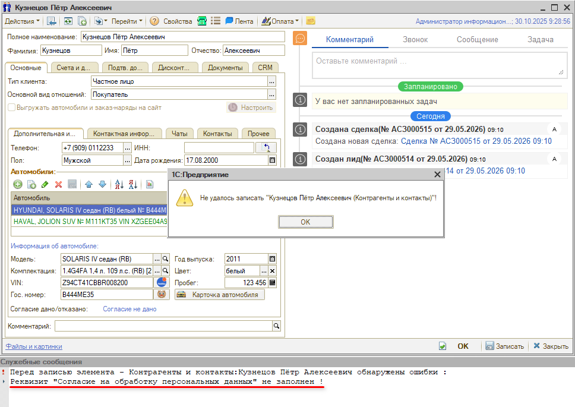
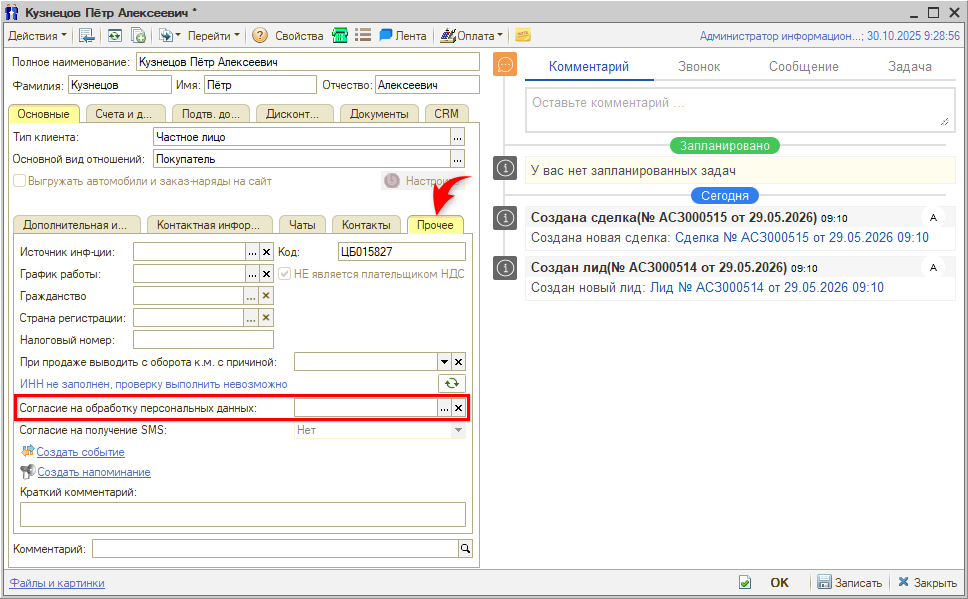
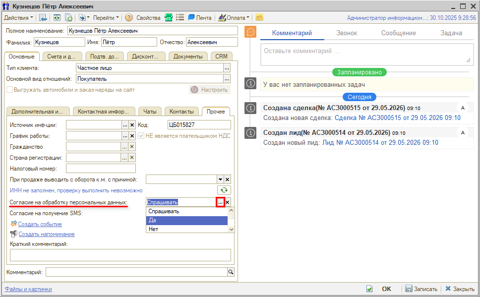

# Не записывается карточка контрагента (не заполнен реквизит «Согласие на обработку персональных данных»)

## Проблема

При записи карточки контрагента с типом клиента **«Частное лицо»** выходит ошибка, и в служебных сообщениях выводится причина:

> Перед записью элемента – Контрагенты и контакты:<наименование контрагента> обнаружены ошибки:  
> Реквизит "Согласие на обработку персональных данных" не заполнен!

Записать изменения не удается.

## Причина

В карточке контрагента на вкладке **«Основные» → «Прочее»** не заполнен реквизит **«Согласие на обработку персональных данных»**.

Такое бывает, если карточки клиентов создавались переносом данных из другой базы или из табличного документа. При создании карточки непосредственно в базе этот реквизит всегда заполняется по умолчанию значением **«Спрашивать»**.

## Решение

Перейдите на вкладку **«Прочее»** и выберите значение в этом реквизите:

- **«Спрашивать»** — значение по умолчанию;
- **«Да»** — если согласие от клиента получено.

После этого карточка записывается.

---

**Теги:** контрагент, карточка клиента, частное лицо, согласие на обработку персональных данных, не записывается, перенос данных, служебные сообщения
