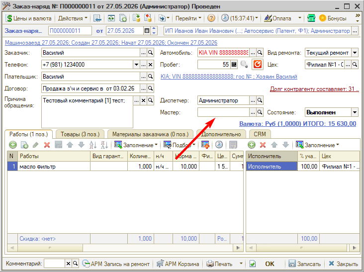
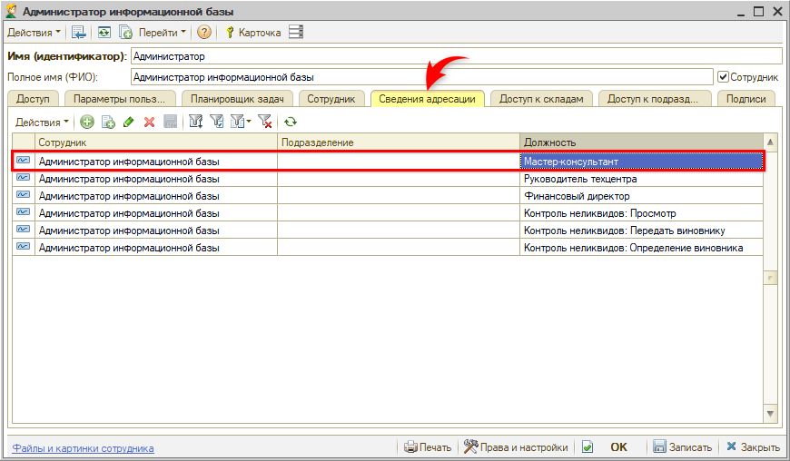

# Не заполняется Мастер в заказ-нарядах

## Проблема

При создании документа **«Заказ-наряд»** реквизит **«Мастер»** не подставляется автоматически — поле остается пустым, и мастера приходится каждый раз выбирать из списка вручную.

## Причина

Мастер подставляется в документ по данным регистра **«Сведения адресации»**: программа берет пользователя, за которым закреплена роль **«Мастер-консультант»**. Если у текущего пользователя такой роли нет, подставлять в реквизит нечего, и поле остается пустым.

## Решение

Роль назначается в карточке пользователя — потребуются права администратора:

1. Откройте карточку пользователя и перейдите на вкладку **«Сведения адресации»**.
2. Добавьте строку.
3. В колонке **«Должность»** выберите значение **«Мастер-консультант»**.
4. При необходимости укажите **«Подразделение»** — тогда роль будет действовать только в нем. Если подразделение не указано, роль действует на уровне всей компании.
5. Нажмите **«ОК»** или **«Записать»**.

После этого мастер подставляется в новые заказ-наряды автоматически.

Одному сотруднику можно назначить несколько ролей, а одну роль — распределить между несколькими сотрудниками в рамках подразделения или организации. Кроме подстановки мастера, роль «Мастер-консультант» влияет на адресацию задач и новых сделок в CRM, поэтому регистр «Сведения адресации» обязателен к заполнению для всех, кто работает с CRM и задачами.

Тот же регистр можно открыть и списком: *Администрирование → Компания → CRM → Сведения адресации* либо *CRM → Все операции → Регистры сведений → Сведения адресации*.

## Материалы для изучения

- «[Пользователи](https://www.5systems.ru/help/polzovateli#svedadr)» — карточка пользователя и вкладка «Сведения адресации».
- «[Адресация задач в CRM по исполнителям](https://www.5systems.ru/help/adresaciya-zadach-v-crm-po-ispolnitelyam)» — роли в регистре, за какие задачи они отвечают, и видеоинструкция.

---

**Теги:** заказ-наряд, мастер, мастер-консультант, сведения адресации, роли пользователей, адресация задач, карточка пользователя
