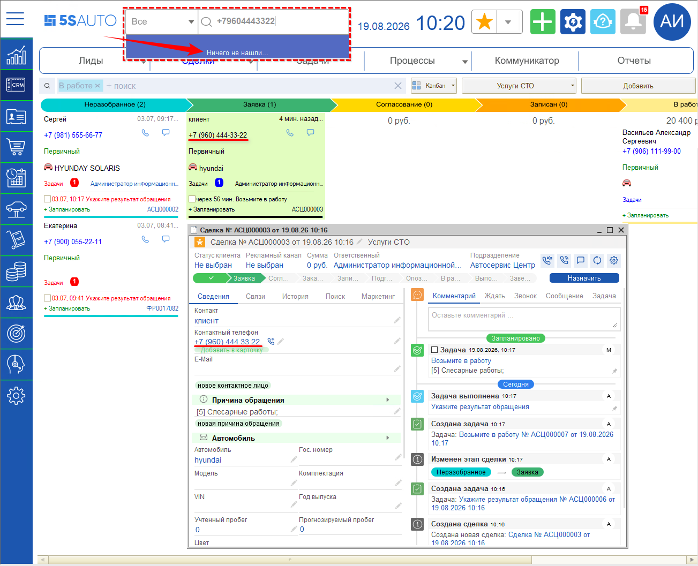
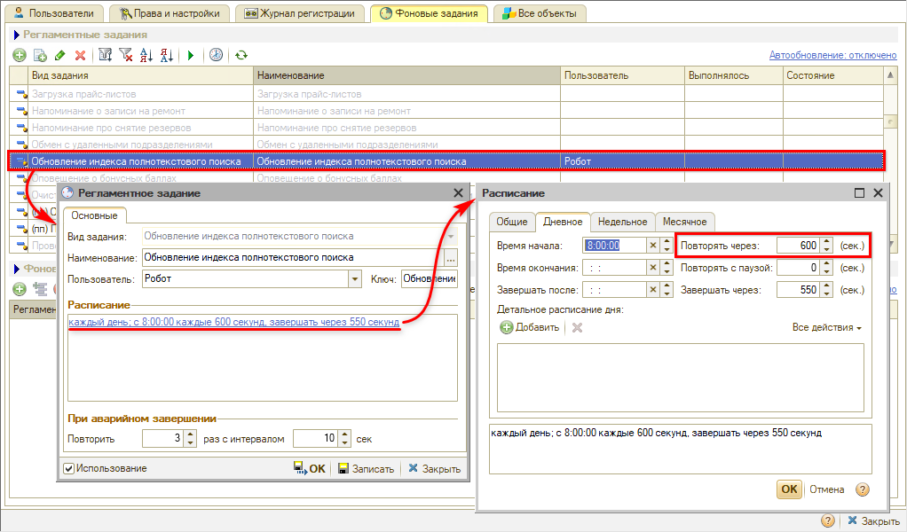

# Не находится клиент или сделка по номеру телефона

## Проблема

При поиске сделки на рабочем столе по номеру телефона (или другим параметрам) программа отвечает **«Ничего не нашли...»** (или выдает похожие результаты, но не находит нужный) — хотя сделка с этим номером есть и открывается вручную.

## Причина

Строка на верхней панели — это [полнотекстовый поиск](https://www.5systems.ru/help/rabota-s-polnotekstovym-poiskom). Он ищет не по самим данным, а по полнотекстовому индексу — служебной таблице, которая строится в базе и обновляется периодически, а не в момент ввода. Поэтому только что созданные или измененные сделки, контрагенты и автомобили попадают в поиск не сразу.

За обновление отвечает регламентное задание **«Обновление индекса полнотекстового поиска»**. По умолчанию оно выполняется каждые 600 секунд, то есть раз в 10 минут.

В примере на скриншоте сделка создана за несколько минут до поиска — задание еще не успело отработать, и номер в индекс не попал.

## Решение

**1. Дождитесь обновления индекса.**

Через 10 минут (или другой интервал, заданный в расписании) задание отработает, и поиск начнет находить номер.

**2. Обновите индекс вручную, если ждать некогда.**

Откройте *Администрирование → Обслуживание → Инструменты администратора → Управление полнотекстовым поиском* и нажмите **«Обновить индекс»**. По окончании программа пришлет уведомление. Подробнее о ручном обновлении индекса см. в [статье](https://www.5systems.ru/help/nastroyka-polnotekstovogo-poiska#ruchn_obnovl).

**3. Если ситуация повторяется часто — уменьшите интервал.**

Откройте регламентное задание **«Обновление индекса полнотекстового поиска»** в фоновых заданиях (*Администрирование → Обслуживание → Регламентные операции → Фоновые задания*), в расписании на вкладке **«Дневное»** уменьшите значение **«Повторять через»** и запишите настройки. Подробнее о настройке фонового обновления индекса см. в [статье](https://www.5systems.ru/help/nastroyka-polnotekstovogo-poiska#fon_obnovl).

*Примечание:* слишком маленький интервал заставляет задание работать почти непрерывно и нагружает сервер, поэтому уменьшать его стоит в разумных пределах.

## Материалы для изучения

- «[Работа с полнотекстовым поиском](https://www.5systems.ru/help/rabota-s-polnotekstovym-poiskom)» — что и как ищет строка поиска, разделы поиска в выпадающем списке.
- «[Настройка полнотекстового поиска](https://www.5systems.ru/help/nastroyka-polnotekstovogo-poiska)» — включение поиска, регламентное задание, ручное обновление и очистка индекса.

## Похожие вопросы

- Не находится клиент или сделка по номеру телефона
- Поиск отвечает «Ничего не нашли», хотя сделка есть
- Новая сделка не ищется по телефону
- Как обновить индекс полнотекстового поиска
- Почему поиск находит данные с задержкой

## Теги

поиск, полнотекстовый поиск, не находит, номер телефона, индекс поиска, обновление индекса, регламентное задание, фоновые задания, расписание
