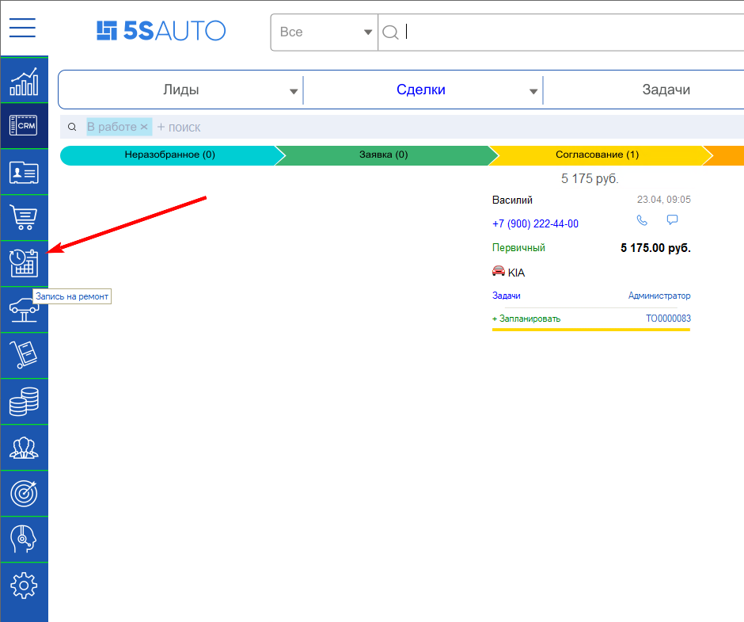
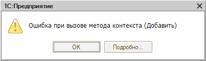
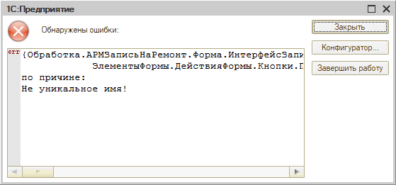

# Не открывается планировщик (АРМ «Запись на ремонт»)

## Проблема

Не удается зайти в планировщик, чтобы создать запись на ремонт. Планировщик открывается кнопкой **«Запись на ремонт»** на левой панели:

При открытии выходит ошибка:

> Ошибка при вызове метода контекста (Добавить)

Если нажать **«Подробно...»**, в расшифровке видно причину — **«Не уникальное имя!»**:

> {Обработка.АРМЗаписьНаРемонт.Форма.ИнтерфейсЗапи...  
>         ЭлементыФормы.ДействияФормы.Кнопки.П...  
> по причине:  
> Не уникальное имя!

## Причина

В справочнике **«Настройки АРМ»** оказались две записи с одинаковым наименованием. Наименование в этом справочнике должно быть уникальным: по нему программа собирает интерфейс планировщика, и на дубле построение формы прерывается.

## Решение

Откройте справочник «Настройки АРМ», найдите записи с совпадающими наименованиями и замените наименование одной из них на уникальное. После этого планировщик открывается.

---

**Теги:** планировщик, запись на ремонт, АРМ, настройки АРМ, не уникальное имя, дубль наименования, ошибка при вызове метода контекста
