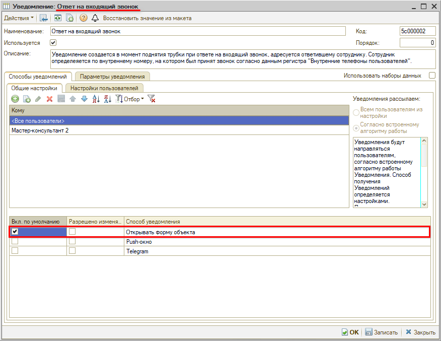
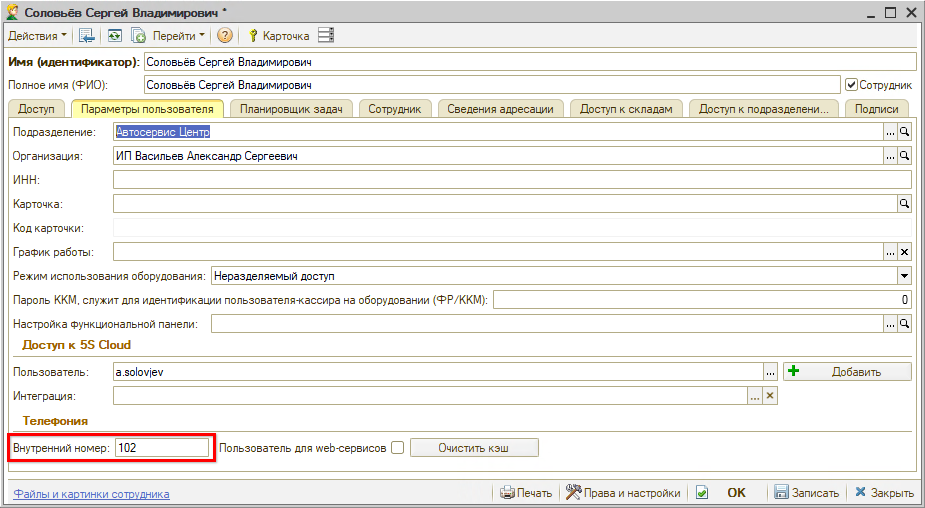
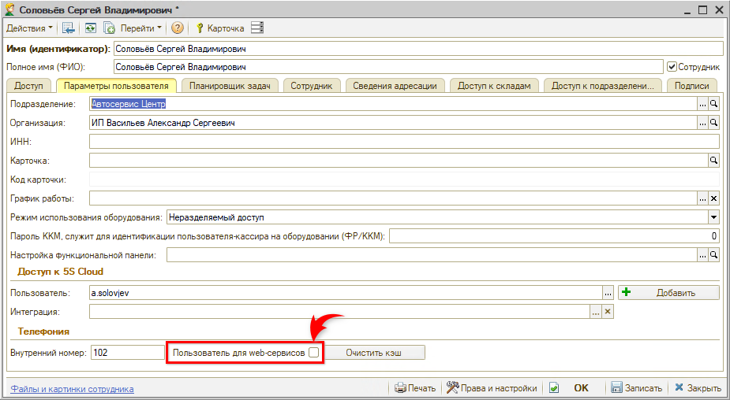

# Не открываются карточки лидов и сделок при поднятии трубки

## Проблема

У одного из сотрудников перестали автоматически открываться карточки лидов и сделок при поднятии телефонной трубки. У остальных сотрудников все работает штатно.

## Как это работает

Карточку открывает уведомление **«Ответ на входящий звонок»**:

> Уведомление создается в момент поднятия трубки при ответе на входящий звонок, адресуется ответившему сотруднику. Сотрудник определяется по внутреннему номеру, на котором был принят звонок согласно данным регистра "Внутренние телефоны пользователей".

Само открытие карточки — это действие способа уведомления **«Открывать форму объекта»**.

То есть программе нужно по внутреннему номеру однозначно определить сотрудника, адресовать ему уведомление и открыть форму объекта. Если хотя бы одно звено не срабатывает, карточка не открывается — при этом у остальных пользователей все продолжает работать.

## Возможные причины

1. Не заполнены внутренние телефоны пользователей.
2. У активных пользователей (вошедших в систему) пересекаются внутренние номера.
3. Не назначена должность CRM **«Оператор кол-центра»**.
4. В карточке пользователя стоит галочка **«Пользователь для web-сервисов»**.
5. В настройках уведомления отключен способ **«Открывать форму объекта»**.

## Решение

Проверьте настройки по порядку — потребуются права администратора.

**1. Заполните внутренний телефон пользователя.**

Внутренний номер указывается в карточке пользователя на вкладке **«Параметры пользователя»**, в группе **«Телефония»**. Заполняется он в том случае, если сотрудник (либо он и его сменщик) всегда работает с этим номером. При входе сотрудника в систему номер попадает в регистр «Внутренние телефоны пользователей текущей смены».

Если номера меняются от смены к смене, их заполняют не в карточке, а в регистре при открытии каждой смены: *Администрирование → Компания → CRM → Внутренние телефоны* либо *CRM → Все операции → Регистры сведений → Внутренние телефоны пользователей*.

Подробнее — в статьях «[Настройка внутренних телефонов сотрудников](https://www.5systems.ru/help/nastroyka-vnutrennikh-telefonov-sotrudnikov)» и «[Пользователи](https://www.5systems.ru/help/polzovateli#vnutr_tel)».

**2. Убедитесь, что внутренние номера не пересекаются.**

Откройте регистр внутренних телефонов и проверьте, что среди активных пользователей — тех, кто сейчас в системе, — один и тот же номер не закреплен за двумя сотрудниками. При пересечении программа не может определить, кому адресовать уведомление, и карточка не открывается. Лишнюю или устаревшую запись нужно убрать.

**3. Назначьте должность CRM «Оператор кол-центра».**

Уведомления адресуются по должностям CRM из регистра **«Сведения адресации»**. Если у сотрудника должность не назначена, адресовать уведомление некому. Откройте карточку пользователя, перейдите на вкладку **«Сведения адресации»**, добавьте строку с должностью **«Оператор кол-центра»** и запишите.

Подробнее — в статье «[Адресация задач в CRM по исполнителям](https://www.5systems.ru/help/adresaciya-zadach-v-crm-po-ispolnitelyam)».

**4. Снимите галочку «Пользователь для web-сервисов».**

Эта галочка находится в карточке пользователя на вкладке **«Параметры пользователя»**, рядом с внутренним номером (см. п. 1). Она предназначена только для служебного пользователя web-сервисов (робота): для обычного сотрудника ее устанавливать не нужно, иначе логика работы нарушается. Снимите галочку и запишите карточку.

Подробнее — в статье «[Пользователи](https://www.5systems.ru/help/polzovateli#parametry_polz)».

**5. Проверьте настройки уведомления.**

Откройте *Администрирование → CRM → справочник «Уведомления»* и найдите уведомление **«Ответ на входящий звонок»**. Проверьте, что установлен флажок **«Используется»**, а в списке способов уведомления у строки **«Открывать форму объекта»** стоит галочка **«Вкл. по умолчанию»** — именно она открывает связанный с уведомлением объект.

Если в колонке **«Разрешено изменять»** галочка стоит, пользователь мог отключить этот способ в своих личных настройках. Что каждый пользователь выставил себе, видно на вкладке **«Настройки пользователей»**.

Подробнее — в статье «[Настройка параметров уведомлений](https://www.5systems.ru/help/nastroyka-parametrov-uvedomleniy)».

После изменения настроек сотруднику нужно перезайти в программу.

## Материалы для изучения

- «[Настройка внутренних телефонов сотрудников](https://www.5systems.ru/help/nastroyka-vnutrennikh-telefonov-sotrudnikov)» — постоянные и меняющиеся номера, заполнение регистра.
- «[Пользователи](https://www.5systems.ru/help/polzovateli#parametry_polz)» — вкладка «Параметры пользователя»: внутренний номер и галочка для web-сервисов.
- «[Адресация задач в CRM по исполнителям](https://www.5systems.ru/help/adresaciya-zadach-v-crm-po-ispolnitelyam)» — должности в регистре «Сведения адресации» и за какие задачи они отвечают.
- «[Настройка параметров уведомлений](https://www.5systems.ru/help/nastroyka-parametrov-uvedomleniy)» — справочник «Уведомления», способы уведомления и личные настройки пользователей.

---

**Теги:** телефония, входящий звонок, лид, сделка, не открывается карточка, внутренний номер, внутренние телефоны пользователей, сведения адресации, должности CRM, пользователь для web-сервисов, уведомления, открывать форму объекта
