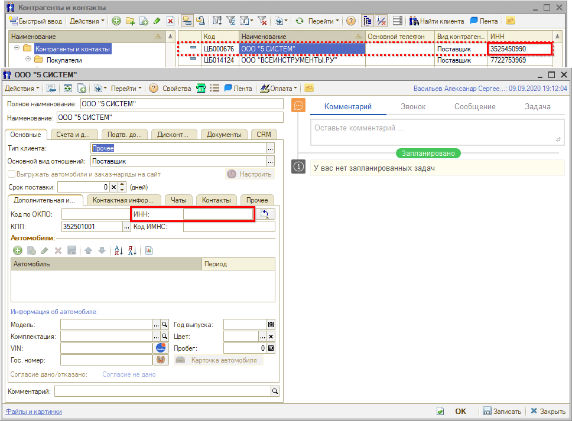
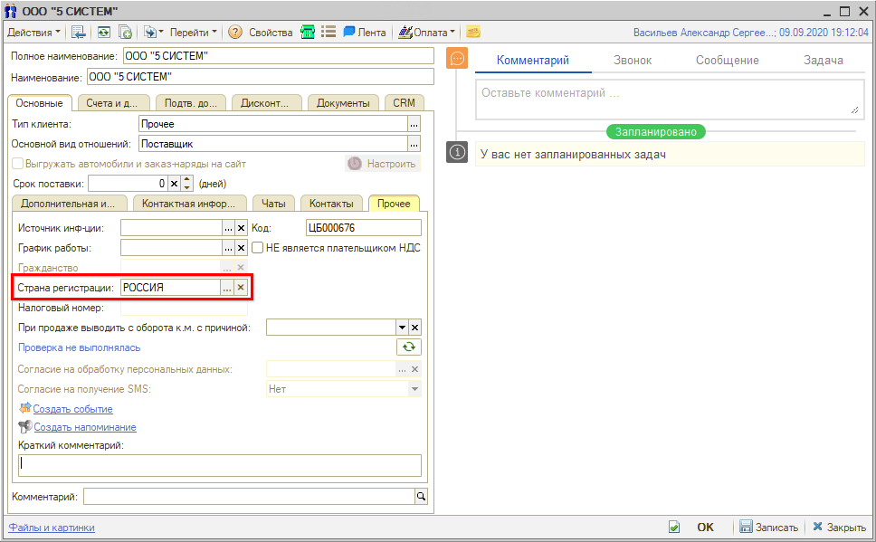
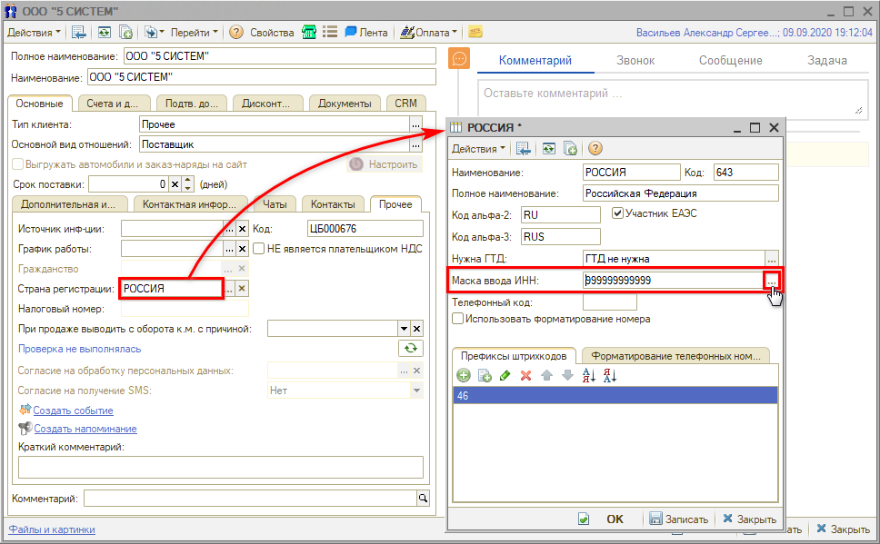
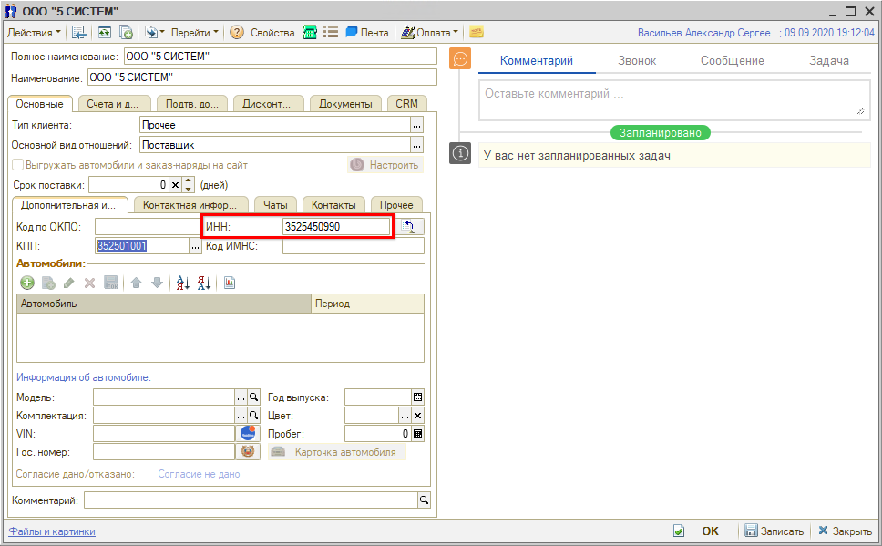

# Не отображается ИНН контрагента в карточке

<table><tr><td><b>Обновлено:</b> 24.08.2026</td></tr></table>

## Проблема

В карточке [контрагента](../../../../articles/5S%20AUTO/Работа%20с%20клиентами/Контрагенты%20и%20контакты/kontragenty-i-kontakty.md) поле **«ИНН»** пустое, хотя ИНН у него заполнен: если вывести в справочнике колонку **«ИНН»**, значение в ней есть.

## Причина

Если на вкладке **«Прочее»** заполнен параметр **«Страна регистрации»**, а у самой страны не заполнен реквизит **«Маска ввода ИНН»**, поле «ИНН» в карточке остается пустым, хотя значение в базе хранится.

Длина ИНН в разных странах разная — в России это 10 или 12 знаков, в Молдове 13. Поэтому формат поля задается не в карточке контрагента, а в справочнике стран: у каждой страны есть реквизит **«Маска ввода ИНН»**, и при выборе страны регистрации маска подставляется в карточку.

*Примечание:* если страна регистрации не указана, ИНН отображается — маска в этом случае не применяется.

## Решение

Заполните маску в карточке страны:

1. В карточке контрагента на вкладке **«Прочее»** нажмите на поле **«Страна регистрации»** правой кнопкой мыши и выберите **«Открыть»**.
2. В открывшейся карточке страны нажмите кнопку **[...]** у реквизита **«Маска ввода ИНН»** — значение заполнится автоматически.
3. Нажмите **«ОК»** или **«Записать»**.

Перезапишите карточку контрагента. После этого ИНН в ней отображается.

Маска задается один раз на страну и действует для всех контрагентов с этой страной регистрации.

## Материалы для изучения

- «[Контрагенты и контакты](../../../../articles/5S%20AUTO/Работа%20с%20клиентами/Контрагенты%20и%20контакты/kontragenty-i-kontakty.md)» — карточка контрагента и ее реквизиты.

## Похожие вопросы

- Не отображается ИНН контрагента в карточке
- ИНН в карточке контрагента. При сохранении не отображается ИНН в карточке контрагента. Хотя кажется, что само сохранение происходит, т.к. на форме списка контрагентов в столбце ИНН данные отображаются. Как это исправить?

## Теги

контрагент, ИНН, не отображается, маска ввода ИНН, страна регистрации, справочник стран, карточка контрагента
