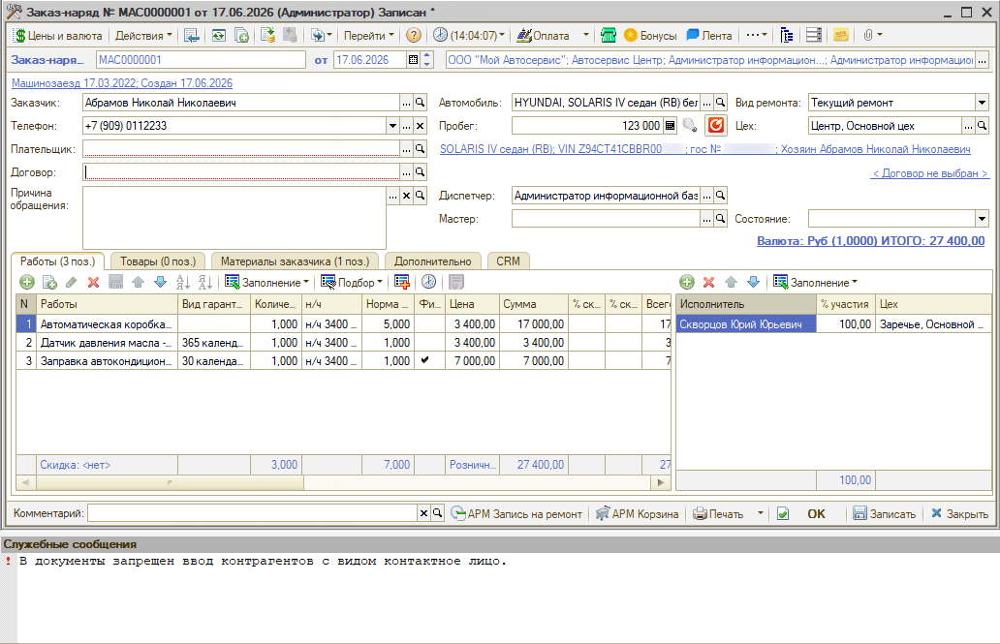
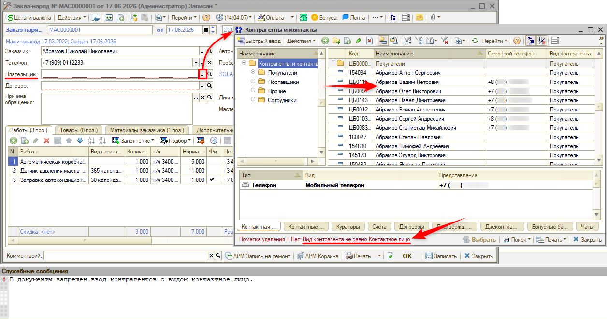
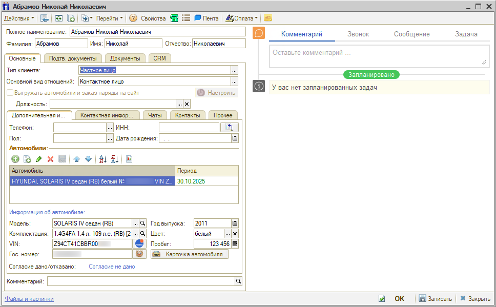
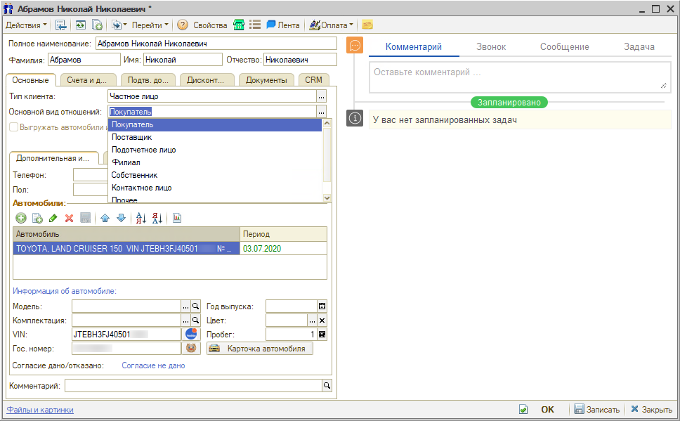
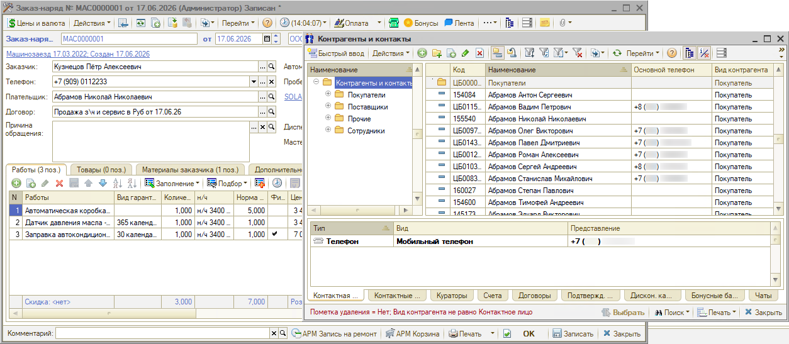

# Не получается выбрать контрагента плательщиком в заказ-наряде

<table><tr><td><b>Создано:</b> 23.09.2026</td></tr></table>

## Проблема

В заказ-наряде не получается указать нужного контрагента в поле «Плательщик» – например, заказчика по этому заказ-наряду: поле остается пустым, а в служебных сообщениях программа пишет:

> В документы запрещен ввод контрагентов с видом контактное лицо.

В форме выбора плательщика этого контрагента тоже нет: в строке отбора внизу формы стоит условие «Вид контрагента не равно Контактное лицо».

## Причина

В карточке контрагента в поле «Основной вид отношений» указано «Контактное лицо». Такого контрагента можно выбрать заказчиком в заказ-наряде (см. «[Контактные лица → Использование функционала](../../../../articles/5S%20AUTO/Работа%20с%20клиентами/Контактные%20лица/kontaktnye-lica.md#использование-функционала)»), но не плательщиком: при выборе плательщика контрагенты с видом «Контактное лицо» в список не попадают, а указать их в документе программа не дает.

## Решение

1. Откройте карточку контрагента в справочнике «Контрагенты и контакты» (см. «[Контрагенты и контакты → Способы перехода в справочник](../../../../articles/5S%20AUTO/Работа%20с%20клиентами/Контрагенты%20и%20контакты/kontragenty-i-kontakty.md#способы-перехода-в-справочник)»). Если плательщиком нужно указать заказчика, карточку можно открыть прямо из заказ-наряда кнопкой «Открыть» в поле «Заказчик».

2. На вкладке «Основные» в поле «Основной вид отношений» выберите вид, который соответствует роли контрагента, – например, «Покупатель» – и запишите карточку кнопкой «Записать» или «ОК». Какие бывают виды отношений, см. «[Контрагенты и контакты → «Основные»](../../../../articles/5S%20AUTO/Работа%20с%20клиентами/Контрагенты%20и%20контакты/kontragenty-i-kontakty.md#1-основные)».

   

3. Вернитесь в заказ-наряд и снова выберите контрагента в поле «Плательщик» – теперь он есть в списке.

   

Чтобы ошибка не повторялась, вид «Контактное лицо» указывайте только тем контрагентам, которые сами не оплачивают ремонт: такого контрагента можно выбрать заказчиком, но не плательщиком.

## Материалы для изучения

- «[Контрагенты и контакты](../../../../articles/5S%20AUTO/Работа%20с%20клиентами/Контрагенты%20и%20контакты/kontragenty-i-kontakty.md)» – карточка контрагента, основной вид отношений.
- «[Контактные лица](../../../../articles/5S%20AUTO/Работа%20с%20клиентами/Контактные%20лица/kontaktnye-lica.md)» – контактные лица клиента и их выбор заказчиком.
- «[Заказ-наряды → Данные по клиенту](../../../../articles/5S%20AUTO/Автосервис/Работа%20с%20Заказ-нарядами/Заказ-наряды/zakaz-naryady.md#данные-по-клиенту)» – заказчик и плательщик в заказ-наряде.

## Похожие вопросы

- Не получается выбрать контрагента плательщиком в заказ-наряде
- Почему в графе «Плательщик» не установить ФИО заказчика
- Клиент отсутствует в списке при выборе плательщика
- В документы запрещен ввод контрагентов с видом контактное лицо
- Установлен новый плательщик по заказ-наряду: "" по договору ""
- Вид контрагента не равно Контактное лицо
- Как сменить вид контрагента

## Теги

плательщик, заказ-наряд, заказчик, контрагент, карточка контрагента, основной вид отношений, вид контрагента, контактное лицо, покупатель
