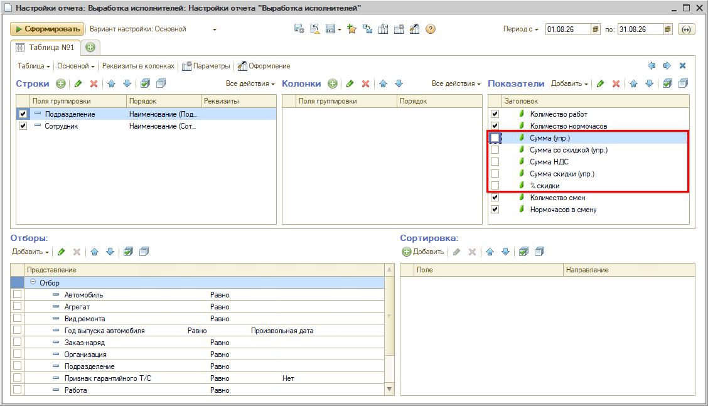
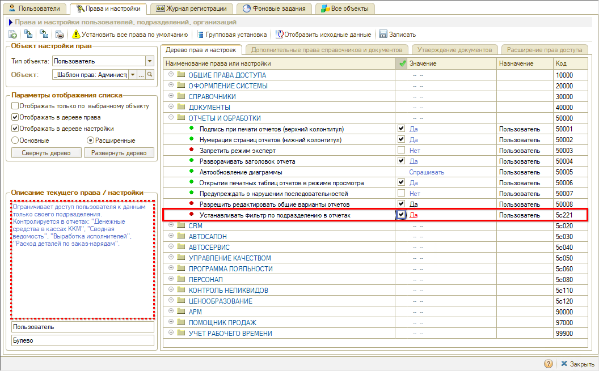
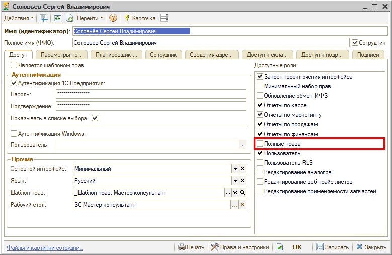

# Не получается выбрать показатели в настройках отчета

<table><tr><td><b>Обновлено:</b> 24.08.2026</td></tr></table>

## Проблема

В настройках отчета **«Выработка исполнителей»** у пользователя не получается включить денежные показатели — **«Сумма скидки (упр.)»**, **«% скидки»** и другие: галочки в области **«Показатели»** не ставятся.

*Примечание:* если такие показатели были включены по умолчанию, пользователь может снять с них галочки — но включить обратно уже не получится.

То же самое может быть в отчетах **«Сводная ведомость»**, **«Денежные средства в кассах ККМ»** и **«Расход деталей по заказ-нарядам»**.

## Причина

У пользователя включено ограничение права **«Устанавливать фильтр по подразделению в отчетах»**:

Это право ограничивает доступ пользователя к данным только своего подразделения и контролируется как раз в этих четырех отчетах — «Денежные средства в кассах ККМ», «Сводная ведомость», «Выработка исполнителей», «Расход деталей по заказ-нарядам». Пока ограничение действует, менять денежные показатели в настройках отчета нельзя.

При этом у пользователя нет роли **«Полные права»**:

## Решение

Настройки выполняет пользователь с правами администратора.

**Вариант 1. Отключить право «Устанавливать фильтр по подразделению в отчетах».**

Подходит в случае, если требуется предоставить доступ к указанным настройкам отчета для рядового сотрудника (не руководителя).

1. Откройте *Администрирование → Сервис → Пользователи и права → Установка прав и настроек* (или нажмите **«Права и настройки»** в справочнике пользователей).
2. В блоке **«Объект настройки прав»** для типа объекта **«Пользователь»** выберите пользователя или шаблон прав, который ему установлен.
3. В блоке **«Параметры отображения списка»** переключитесь на **«Расширенные»**.
4. В дереве прав найдите право **«Устанавливать фильтр по подразделению в отчетах»** (раздел **«ОТЧЕТЫ И ОБРАБОТКИ»**, код 5c221) — см. скриншот в разделе «[Причина](#pravo)».
5. В колонке **«Значение»** установите **«Нет»**.
6. Нажмите **«Записать»**.

**Вариант 2. Назначить роль «Полные права».**

В случае если сотрудник занимает руководящую должность, можно предоставить ему полные права.

Роль открывает **полные права** для работы с программой — и пользовательские, и администраторские, включая редактирование «Прав и настроек», создание пользователей, обновление конфигурации и доступ ко всем справочникам и документам. Поэтому назначают ее **руководителю** или системному администратору.

Роль выбирается в карточке пользователя на вкладке **«Доступ»**, в списке **«Доступные роли»** — см. скриншот в разделе «[Причина](#rol)».

При установке роли «Полные права» ограничение права **«Устанавливать фильтр по подразделению в отчетах»** на пользователя уже не действует: данная роль имеет приоритет над правом.

После этого показатели в настройках отчета включаются и выключаются обычными галочками.

## Материалы для изучения

- «[Роли пользователей](https://www.5systems.ru/help/roli-polzovateley)» — какие роли есть в программе и что дает «Полные права».
- «[Установка прав и настроек пользователя](https://www.5systems.ru/help/ustanovka-prav-i-nastroek-polzovatelya)» — форма прав, типы объектов настройки и дерево прав.
- «[Настройка отчетов на СКД](https://www.5systems.ru/help/nastroyka-otchetov-na-skd#pokaz)» — область «Показатели» в настройках отчета.
- «[Учет выработки исполнителей по нормочасам для работ с фиксированной стоимостью](https://www.5systems.ru/help/uchet-vyrabotki-ispolniteley-po-normochasam-dlya-rabot-s-fiksirovannoy-stoimostyu)» — отчет «Выработка исполнителей».

## Похожие вопросы

- Не получается выбрать показатели в настройках отчета
- Отчет «Выработка исполнителей». Какое право в настройках программы влияет на выбор столбцов «Сумма скидки» и «% скидки» в настройках отчета? У пользователя не получается выбрать столбцы
- Какое право влияет на выбор столбцов в настройках отчета?

## Теги

отчеты, выработка исполнителей, сводная ведомость, денежные средства в кассах ККМ, расход деталей по заказ-нарядам, показатели, настройки отчета, права пользователя, полные права, фильтр по подразделению
