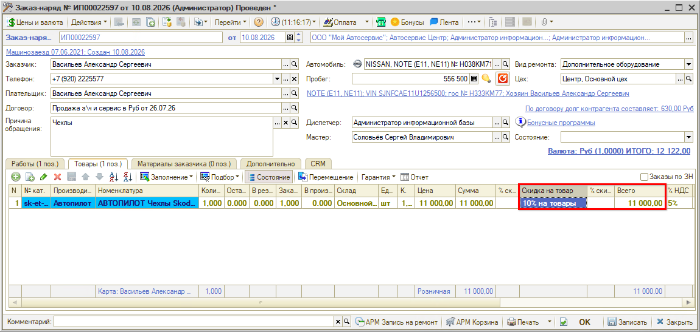
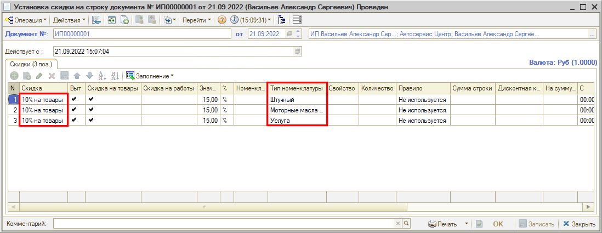
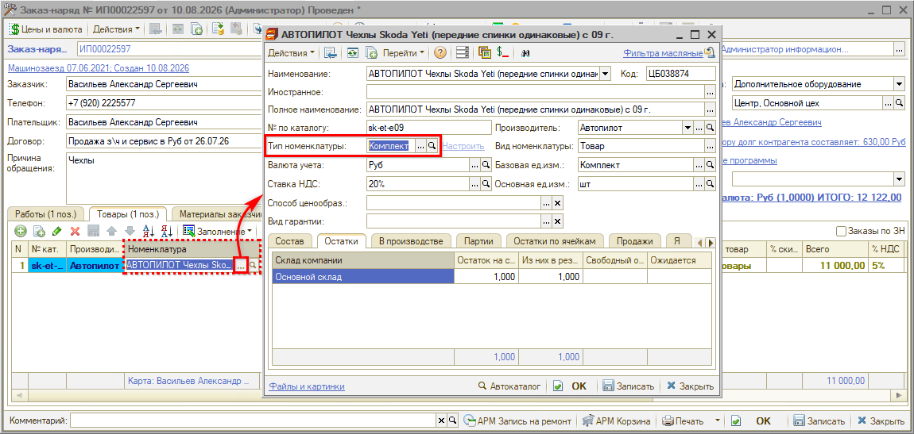

# Что делать, если не срабатывает скидка на строку

## Проблема

При выборе в документе скидки она не применяется: сумма по строке остается прежней, колонка «% скидки» не заполняется.

## Причина

Скидка на строку действует только для тех типов номенклатуры, для которых она была задана в документе **«Установка скидки на строку документа»**. Если для типа номенклатуры товара, выбранного в документе, данная скидка не была установлена, она не сработает.

В приведенном примере в документе продажи выбран товар с типом номенклатуры, для которого данная скидка не была установлена:

У товара тип номенклатуры **«Комплект»**, а скидка «10% на товары» задана для типов **«Штучный»**, **«Моторные масла»** и **«Услуга»**. Для типа номенклатуры "Комплект" эта скидка не была установлена, поэтому она не применилась.

## Решение

Проверьте соответствие типа номенклатуры у товара в документе и типов, для которых задана скидка. 

Варианты действий при несоответствии:
- выберите другую подходящую скидку в документе продажи (при наличии);
- добавьте в документ установки скидок строку с нужным типом номенклатуры (обратите внимание на соответствие подразделения документа установки скидок подразделению документа продажи);
- создайте новый документ установки скидок (обратите внимание на параметр "Действует с:" — скидка будет действовать с той даты и времени, которые указаны в этом параметре, поэтому рекомендуется установить здесь значение времени 0:00:00 для возможности использовать скидку в документах продажи на текущую дату).

## Рекомендуем для изучения

- Статья [Настройка скидок](https://www.5systems.ru/help/nastroyka-skidok)
- Урок [Как создать скидку на строку](https://www.5systems.ru/help/kak-sozdat-skidku-na-stroku)
