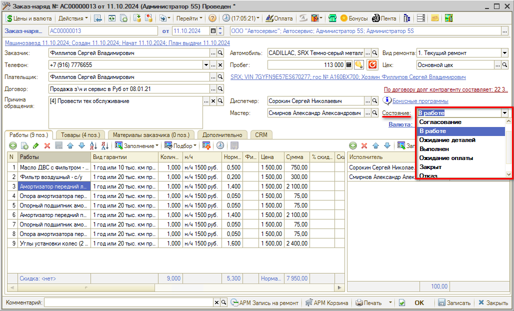
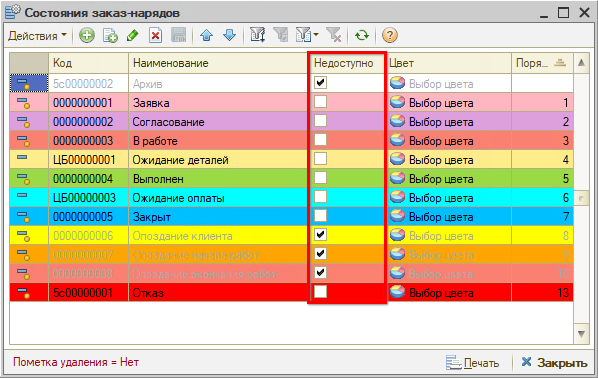
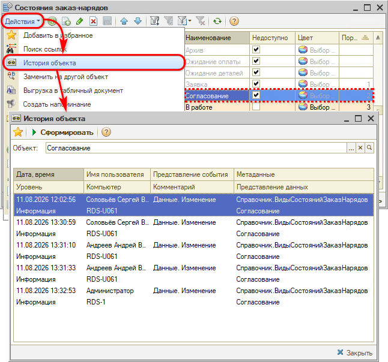

# Что делать, если пропадают состояния заказ-нарядов

## Проблема

Нужное состояние пропало из выпадающего меню заказ-наряда — например, невозможно выбрать состояние «Согласование».

## Решение

Чтобы состояние было *доступно для выбора* при работе с формой документа, у него *не должен* быть установлен признак **«Недоступно»**. Откройте справочник состояний заказ-нарядов, проверьте, не стоит ли галочка у нужного состояния, и снимите ее.

Узнать, кем была изменена настройка, можно через обработку **«История объекта»**: для этого выделите курсором нужное состояние и перейдите через меню справочника *«Действия → История объекта»:*

*Примечание:* История объекта может подгружаться несколько минут.

Подробнее о способах посмотреть, кто и когда правил документ, — в совете [Как посмотреть историю изменений документа](../Как%20посмотреть%20историю%20изменений%20документа/kak-posmotret-istoriyu-izmeneniy-dokumenta.md).

## Если нужного состояния нет в справочнике

Если в справочнике отсутствует нужное состояние, его можно добавить в этом же справочнике. Здесь же настраиваются видимость состояний и порядок их переключения в командной панели. После добавления состояния в справочник и записи документа выбор нового состояния станет доступен.

## Чтобы состояния не пропадали снова

Если состояния заказ-наряда пропадают часто, рекомендуется в [праве](https://www.5systems.ru/help/ustanovka-prav-i-nastroek-polzovatelya) *«Право доступа ВидыСостоянийЗаказНарядов»* установить значение *«Чтение»* для всех сотрудников, кроме администратора и/или директора.

## Рекомендуем для изучения

- Статья [Состояния заказ-наряда](https://www.5systems.ru/help/sostoyaniya-zakaz-naryada)

**Теги:** заказ-наряд, состояния, статусы, справочник состояний, недоступно, история объекта, права доступа
