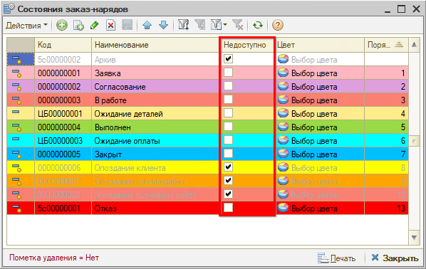

# Что делать, если пропадают состояния заказ-нарядов

## Проблема

Нужное состояние пропало из выпадающего меню заказ-наряда — например, невозможно выбрать состояние «Закрыт».

## Решение

Чтобы состояние было *доступно для выбора* при работе с формой документа, у него *не должен* быть установлен признак **«Недоступно»**. Откройте справочник состояний заказ-нарядов, проверьте, не стоит ли галочка у нужного состояния, и снимите ее.

Узнать, кем была изменена настройка, можно через меню справочника **«Действия → История объекта»**: выделите курсором нужное состояние и нажмите кнопку «История объекта». История объекта может подгружаться несколько минут.

## Если нужного состояния нет в справочнике

Если в справочнике отсутствует состояние — например, «Согласование», — его можно добавить в этом же справочнике. Здесь же настраиваются видимость состояний и порядок их переключения в командной панели. После добавления состояния в справочник и записи документа переход в новое состояние станет доступен.

## Чтобы состояния не пропадали снова

Если состояния заказ-наряда пропадают часто, рекомендуется в [праве](https://www.5systems.ru/help/ustanovka-prav-i-nastroek-polzovatelya) *«Право доступа ВидыСостоянийЗаказНарядов»* установить значение *«Чтение»* для всех сотрудников, кроме администратора и/или директора.

## Рекомендуем для изучения

- Статья [Состояния заказ-наряда](https://www.5systems.ru/help/sostoyaniya-zakaz-naryada)
