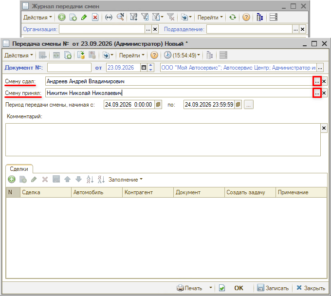
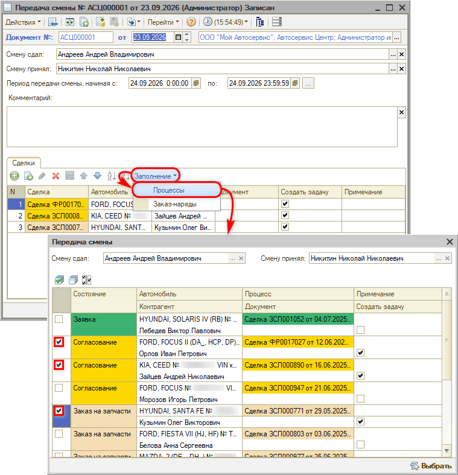
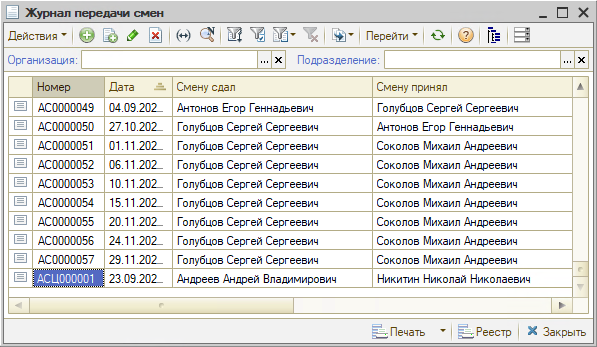

# Как мастеру-консультанту видеть сделки сменщика

<table><tr><td><b>Создано:</b> 23.09.2026</td></tr></table>

## Вопрос

Как сделать, чтобы мастер-консультант видел свои сделки и сделки своего сменщика? Можно ли указать в отборе сделок по менеджеру два значения?

## Ответ

В списке сделок в отборе по ответственному можно выбрать только одного сотрудника – вывести сделки двух менеджеров одновременно нельзя (см. «[Список сделок → 7. Отбор по ответственному](../../../../articles/5S%20AUTO/CRM/Список%20сделок/spisok-sdelok.md#7-отбор-по-ответственному)»).

Чтобы сменщик продолжил работу по сделкам и заказ-нарядам мастера-консультанта, передайте их документом «Передача смены»:

1. Откройте журнал передачи смен: **Автосервис → Приемка → Документы → Журналы передачи смен** или **CRM → Документы → Журнал передачи смен**.
2. Нажмите «Добавить». В поле «Смену сдал» выберите мастера-консультанта, который передает смену, в поле «Смену принял» – сменщика. В поле «Период передачи смены, начиная с … по» укажите, на какой период сменщик принимает смену. Для рассматриваемого примера: при графике 2/2 – с 25 по 26 сентября, на время отпуска – с 24 сентября по 22 октября, при работе в утреннюю и вечернюю смены – с 15:00 до 23:59 24 сентября (завтрашнего дня).

   

3. Нажмите «Заполнение» и выберите «Процессы» – в списке будут открытые сделки мастера из поля «Смену сдал». Отметьте сделки, которые нужно передать, и нажмите «Выбрать». Так же через «Заполнение → Заказ-наряды» можно передать заказ-наряды.

   

4. При необходимости укажите примечание по каждой сделке для сменщика. Если установить флажок «Создать задачу», сменщик получит задачу по этой сделке.
5. Запишите документ кнопкой «Записать» или «ОК».

Сменщик увидит переданные сделки в журнале передачи смен – в начале смены журнал стоит просматривать, чтобы запланировать работу. Подробнее – в статье «[Передача смен → Заполнение журнала передачи смен](../../../../articles/5S%20AUTO/Автосервис/Передача%20смен/peredacha-smen.md#заполнение-журнала-передачи-смен)».

*Примечание:* В журнале передачи смен пользователь видит только записи, в которых он участвует. Все записи видит только пользователь с должностью CRM «Управляющий директор».

## Материалы для изучения

- «[Передача смен](../../../../articles/5S%20AUTO/Автосервис/Передача%20смен/peredacha-smen.md)» – журнал передачи смен, передача заказ-нарядов и процессов.
- «[Список сделок](../../../../articles/5S%20AUTO/CRM/Список%20сделок/spisok-sdelok.md)» – отборы в списке сделок.

## Похожие вопросы

- Как мастеру-консультанту видеть сделки сменщика
- Можно ли сделать так, чтобы мастер-консультант видел свои сделки и сделки только своего сменщика
- Как указать в окне «Менеджер» два значения вместо одного
- Как мастеру-консультанту видеть сделки и задачи сменщика
- Как передать сделки другому мастеру при передаче смены
- Как передать незавершенные сделки и заказ-наряды сменщику

## Теги

передача смены, журнал передачи смен, сменщик, мастер-консультант, сделки, процессы, заказ-наряд, отбор по ответственному, задача
