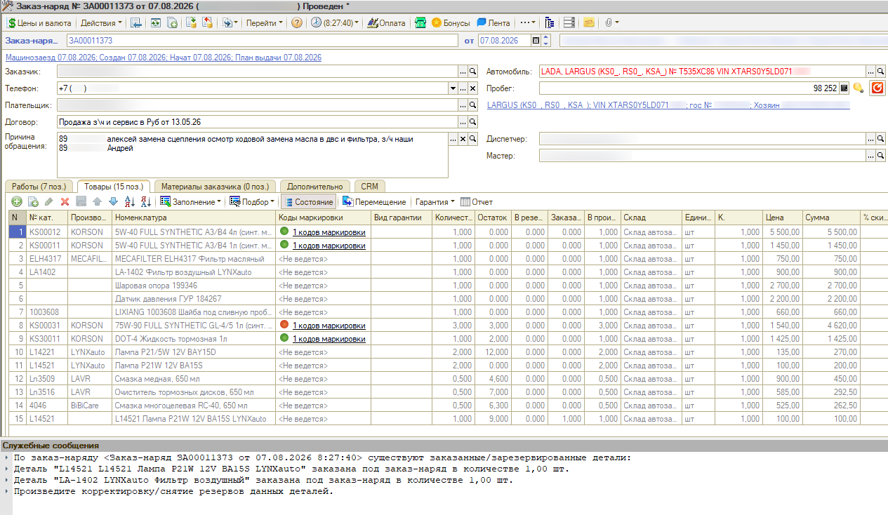
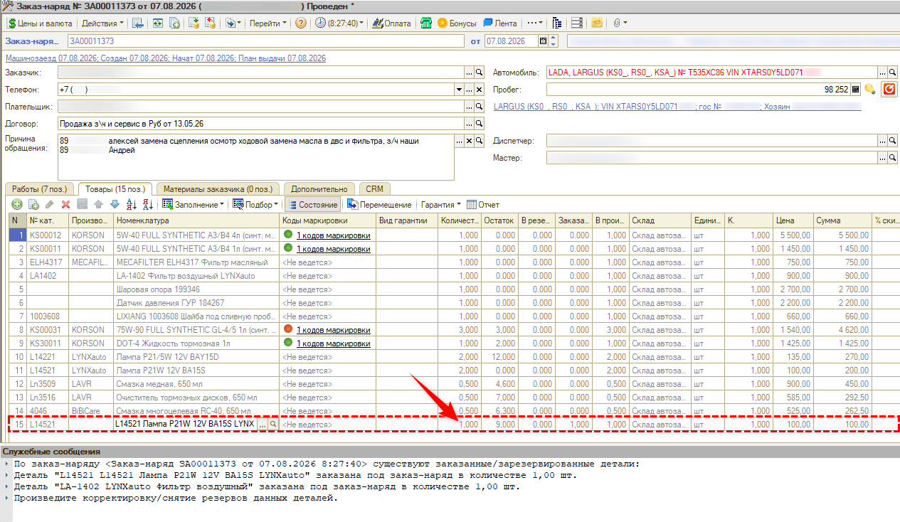
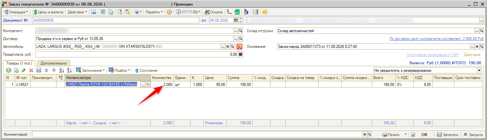
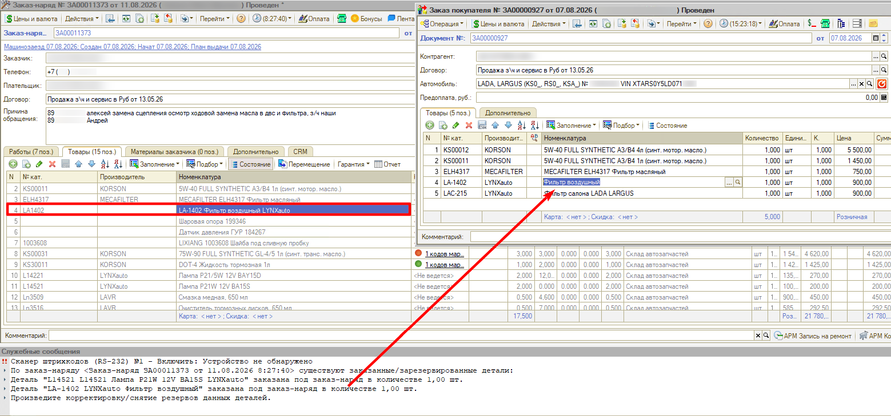

# Не закрывается заказ-наряд из-за заказанных деталей

<table><tr><td><b>Создано:</b> 22.09.2026</td></tr></table>

## Проблема

Заказ-наряд не переводится в состояние «Выполнен»: проведение прерывается, а в служебных сообщениях программа пишет, что по заказ-наряду существуют заказанные или зарезервированные детали, хотя все детали по нему уже списаны:

> По заказ-наряду <Заказ-наряд … от …> существуют заказанные/зарезервированные детали:  
> Деталь "…" заказана под заказ-наряд в количестве 1,00 шт.  
> Произведите корректировку/снятие резервов данных деталей.

## Причина

- Под заказ-наряд по заказу покупателя заказано другое количество деталей, чем использовано в работе: например, сотрудник ошибочно указал не то количество, заказали 2 шт., а поставщик привез одну, сначала рассчитывали на 2 шт., а хватило одной, либо заказали про запас. Поступление товаров оформили, количество в заказ-наряде поправили вручную, а корректировку заказа покупателя не сделали – в программе под заказ-наряд по-прежнему числится заказанной деталь, которая в нем не использована.
- В заказ-наряд добавлен не тот товар, который был заказан под покупателя: в заказе покупателя указана одна позиция справочника «Номенклатура» (например, «Фильтр воздушный»), а в заказ-наряд списана другая карточка (например, «LA-1402 Фильтр воздушный LYNXauto»). Для программы это разные товары, поэтому заказанная под заказ-наряд деталь остается незакрытой.

## Решение

1. Откройте заказ покупателя по заказ-наряду и сравните с заказ-нарядом детали из служебного сообщения: совпадают ли количество и карточка номенклатуры.

2. Приведите заказ покупателя в соответствие с заказ-нарядом:
   - если отличается **количество** – создайте на основании заказа покупателя документ «Корректировка заказа покупателя» и укажите в нем фактическое количество деталей; если деталь по заказу не нужна совсем, обнулите количество – см. «[Работа с заказами покупателя → Корректировка заказа покупателя](../../../../articles/5S%20AUTO/Работа%20с%20заказами/Работа%20с%20заказами%20покупателя/rabota-s-zakazami-pokupatelya.md#корректировка-заказа-покупателя)». В примере в заказ-наряде использована одна лампа, а в заказе покупателя заказаны две:

     

     

   - если отличается **номенклатура** – введите на основании заказа покупателя документ «Замена в заказе покупателя» и укажите в нем вместо заказанной детали ту карточку, которая фактически использована в заказ-наряде – см. «[Работа с заказами покупателя → Замена в заказе покупателя](../../../../articles/5S%20AUTO/Работа%20с%20заказами/Работа%20с%20заказами%20покупателя/rabota-s-zakazami-pokupatelya.md#замена-в-заказе-покупателя)». В примере в заказ-наряде списан «LA-1402 Фильтр воздушный LYNXauto», а в заказе покупателя указан «Фильтр воздушный»:

     

   *Примечание:* Если по детали установлен резерв, сначала снимите его документом «Снятие резервов заказов покупателей» – см. «[Работа с заказами покупателя → Снятие резерва с заказа покупателя](../../../../articles/5S%20AUTO/Работа%20с%20заказами/Работа%20с%20заказами%20покупателя/rabota-s-zakazami-pokupatelya.md#снятие-резерва-с-заказа-покупателя)». Если деталь распределена на заказ поставщику, сначала снимите распределение.

3. Проведите документ и повторите перевод заказ-наряда в состояние «Выполнен».

Чтобы ошибка не повторялась, при изменении количества оформляйте корректировку заказа покупателя, а в заказ-наряд добавляйте ту же карточку номенклатуры, что указана в заказе покупателя.

## См. также

- «[Заказ-наряд с маркированным товаром не переводится в статус «Выполнен»](../../Маркировка/Заказ-наряд%20с%20маркированным%20товаром%20не%20переводится%20в%20статус%20«Выполнен»/zakaz-naryad-s-markirovkoy-ne-perevoditsya-v-vypolnen.md)»

## Материалы для изучения

- «[Работа с заказами покупателя](../../../../articles/5S%20AUTO/Работа%20с%20заказами/Работа%20с%20заказами%20покупателя/rabota-s-zakazami-pokupatelya.md)» – заказ покупателя, корректировка, замена, снятие резерва.
- «[Автоматическое снятие резервов](../../../../articles/5S%20AUTO/Работа%20с%20заказами/Автоматическое%20снятие%20резервов/avtomaticheskoe-snyatie-rezervov.md)» – обработка и регламентное задание для снятия просроченных резервов.
- «[Заказ-наряды](../../../../articles/5S%20AUTO/Автосервис/Работа%20с%20Заказ-нарядами/Заказ-наряды/zakaz-naryady.md)» – работа с заказ-нарядом.

## Похожие вопросы

- Не закрывается заказ-наряд из-за заказанных деталей
- Не дает закрыть заказ-наряд из-за заказанных запчастей, хотя запчасти все списаны
- Не закрывает заказ-наряд из-за ошибок
- По заказ-наряду существуют заказанные/зарезервированные детали
- Произведите корректировку/снятие резервов данных деталей
- Заказ-наряд не переводится в «Выполнен»: деталь заказана под заказ-наряд
- В заказе покупателя одна деталь, в заказ-наряде другая – заказ-наряд не закрывается

## Теги

заказ-наряд, заказ покупателя, корректировка заказа покупателя, замена в заказе покупателя, резерв, заказанные детали, номенклатура, закрытие заказ-наряда, служебные сообщения
