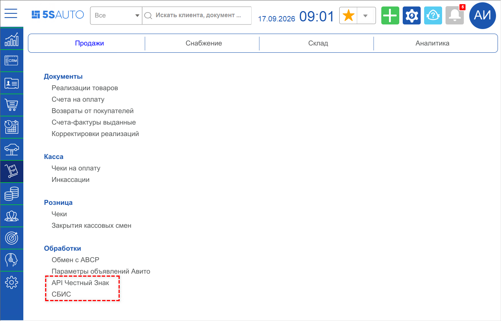

# Как добавить обработку другим пользователям

<table><tr><td><b>Создано:</b> 17.09.2026</td></tr></table>

> *Комментарий: совет нужно проверить у специалистов техподдержки — причины и порядок действий.*

## Проблема

Обработка для работы с внешним сервисом (например, «API Честный Знак» или «СБИС») есть на рабочем столе только у одного пользователя. Нужно, чтобы она была доступна и другим сотрудникам или всем пользователям подразделения.

## Причина

- Обработка не добавлена в настройку рабочего стола, которая назначена этим пользователям. Обработки для интеграций не устанавливаются на каждый компьютер отдельно: они вызываются из меню рабочего стола, а состав меню задается в справочнике «Настройки рабочего стола» и привязывается к пользователю.
- Пользователю не назначен рабочий стол, поэтому настроенное меню у него не отображается.

## Решение

Если интеграция (например, с Честным знаком или СБИС) уже настроена, обработку нужно только вывести в меню рабочего стола нужным пользователям:

1. Добавьте обработку в раздел и пункт меню нужной настройки рабочего стола. Как это сделать, описано в статье «Настройка рабочего стола» → «[Настройки разделов и пунктов рабочего стола](../../../../articles/5S%20AUTO/Администрирование%20и%20настройка%20системы/Настройка%20рабочего%20стола/nastroyka-rabochego-stola.md#настройки-разделов-и-пунктов-рабочего-стола)», там же есть видео.
2. Привяжите настроенный рабочий стол к пользователю — см. в той же статье раздел «[Привязка интерфейса к пользователю](../../../../articles/5S%20AUTO/Администрирование%20и%20настройка%20системы/Настройка%20рабочего%20стола/nastroyka-rabochego-stola.md#привязка-интерфейса-к-пользователю)». Одну настройку рабочего стола можно назначить нескольким пользователям, например всем сотрудникам подразделения.
3. Если после настройки рабочего стола обработка у пользователя не появилась, проверьте, указан ли у этого пользователя рабочий стол в карточке пользователя. После указания рабочего стола пользователю нужно перезайти в программу и проверить меню.

## Материалы для изучения

- «[Настройка рабочего стола](../../../../articles/5S%20AUTO/Администрирование%20и%20настройка%20системы/Настройка%20рабочего%20стола/nastroyka-rabochego-stola.md)» — справочник «Настройки рабочего стола», разделы и пункты меню, привязка рабочего стола к пользователю, видео.
- «[Пользователи](../../../../articles/5S%20AUTO/Пользователи%20и%20права/Пользователи/polzovateli.md)» — карточка пользователя.

## Похожие вопросы

- Как добавить обработку другим пользователям
- Требуется добавить обработку СБИС и Честный знак на компьютеры сотрудникам
- Как добавить обработку пользователю
- Обработка есть только у одного пользователя, нужно установить другим сотрудникам
- Как вывести обработку в меню рабочего стола
- У сотрудника на рабочем столе нет обработки

## Теги

обработка, рабочий стол, настройки рабочего стола, меню рабочего стола, пользователи, Честный знак, СБИС, интеграция
