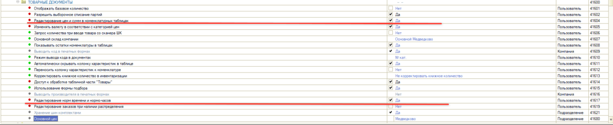
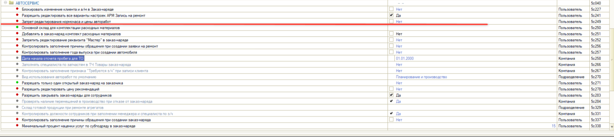

# Как запретить менять цену и сумму авторабот в заказ-наряде

<table><tr><td><b>Создано:</b> 21.09.2026</td></tr></table>

> *Комментарий: скриншоты черновые, взяты из тикета #RFC-63762 — переснять.*

## Вопрос

Мастер-приемщик может изменить цену или сумму строки с автоработой в заказ-наряде, в том числе у работ с фиксированной ценой, заданной документом «Установка цен». Как запретить редактирование цены и суммы авторабот?

## Ответ

Редактирование цены и суммы в табличных частях документов регулируется правами в «Правах и настройках» (*Администрирование → Сервис → Пользователи и права → Установка прав и настроек*). Право задается на шаблон прав должности или на конкретного пользователя. В зависимости от того, что именно нужно закрыть, используется одно из двух прав.

**1. Запретить редактирование и цены, и суммы – во всех номенклатурных таблицах**

В группе *«Документы → Общие параметры документов → Товарные документы»* установите право *«Редактирование цен и сумм в номенклатурных таблицах»* (код 41604) в значение «Нет». Пользователь не сможет изменять цену и сумму строк ни в работах, ни в товарах – во всех документах, где есть табличная часть с номенклатурой.

Там же можно закрыть и редактирование нормы времени: право *«Редактирование норм времени и нормо-часов»* (код 41617) в значении «Нет» запрещает менять количество нормочасов в строке работы.

**2. Запретить редактирование только цены авторабот**

В группе *«Автосервис»* установите право *«Запрет редактирования нормочаса и цены авторабот»* (код 5c249) в значение «Да». Право действует только на автоработы: их цену и стоимость нормочаса пользователь изменить не сможет, при этом норма времени и сумма строки остаются доступными для редактирования. Цены товаров это право не затрагивает.

*Примечание:* Если нужно, чтобы сотрудник не мог изменить именно *сумму* строки (например, продать работу с фиксированной ценой и зафиксированной нормой времени дешевле), второго права недостаточно – оно не закрывает столбец «Сумма». В этом случае установите право «Редактирование цен и сумм в номенклатурных таблицах» (41604) в значение «Нет».

После изменения прав сотруднику нужно перезайти в программу.

## См. также

- «[Как запретить сотрудникам редактировать отдельные автоработы](../Как%20запретить%20сотрудникам%20редактировать%20отдельные%20автоработы/kak-zapretit-sotrudnikam-redaktirovat-otdelnye-avtoraboty.md)»
- «[Почему при изменении суммы автоработы пересчитывается количество нормочасов](../../Автосервис/Почему%20при%20изменении%20суммы%20автоработы%20пересчитывается%20количество%20нормочасов/pochemu-pri-izmenenii-summy-avtoraboty-pereschityvaetsya-kolichestvo-normochasov.md)»
- «[Как настроить учет выработки исполнителей по нормочасам для работ с фиксированной стоимостью](../../Практики/Как%20настроить%20учет%20выработки%20исполнителей%20по%20нормочасам%20для%20работ%20с%20фиксированной%20стоимостью/uchet-vyrabotki-ispolniteley-po-normochasam-dlya-rabot-s-fiksirovannoy-stoimostyu.md)»

## Материалы для изучения

- «[Установка прав и настроек пользователя](../../../../articles/5S%20AUTO/Пользователи%20и%20права/Установка%20прав%20и%20настроек%20пользователя/ustanovka-prav-i-nastroek-polzovatelya.md)» – шаблоны прав, поиск прав, групповая установка.
- «[Настройка скидок](../../../../articles/5S%20AUTO/Ценообразование/Настройка%20скидок/nastroyka-skidok.md#основные-права-влияющие-на-применение-цен-и-скидок)» – таблица основных прав, влияющих на применение цен и скидок, в том числе право 41604.
- «[Заказ-наряды](../../../../articles/5S%20AUTO/Автосервис/Работа%20с%20Заказ-нарядами/Заказ-наряды/zakaz-naryady.md#1-вкладка-работы)» – вкладка «Работы» заказ-наряда.

## Похожие вопросы

- Как запретить менять цену и сумму авторабот в заказ-наряде
- Почему мастер-приемщик на зафиксированных работах может менять сумму стоимости строки, как исправить
- Как запретить редактирование цены работ в заказ-наряде
- Какое право запрещает изменять сумму строки в заказ-наряде
- Мастер-приемщик продает работу с фиксированной ценой дешевле, как запретить
- Как запретить редактировать нормочасы в заказ-наряде

## Теги

автоработы, заказ-наряд, права и настройки, цена, сумма, нормочас, норма времени, мастер-приемщик, фиксированная цена
