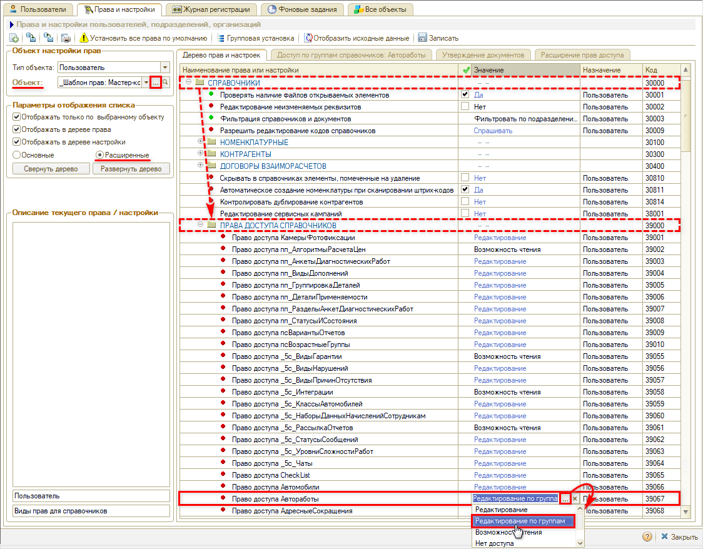
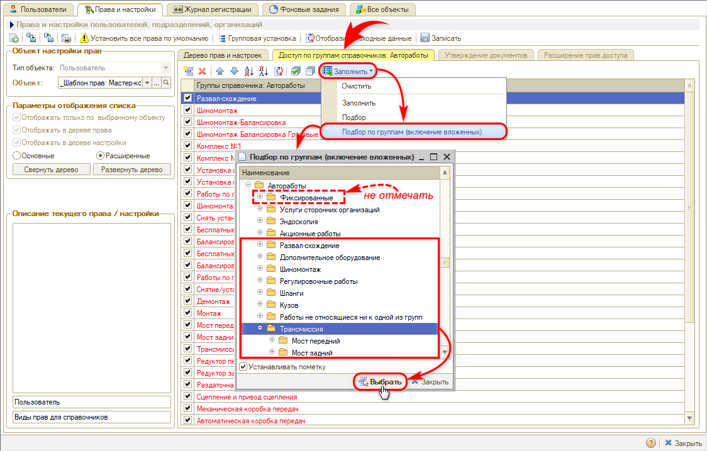

# Как запретить сотрудникам редактировать отдельные автоработы

<table><tr><td><b>Создано:</b> 21.09.2026</td></tr></table>

> *Комментарий: уточнить у техподдержки, как при значении «Редактирование по группам» создаются новые автоработы: клиент в тикете сообщил, что у мастера-приемщика при такой настройке пропадает возможность создавать работы.*

## Вопрос

Как запретить мастерам-приемщикам и другим сотрудникам редактировать наименования и характеристики отдельных авторабот, которые задал администратор, но оставить им возможность работать с остальными автоработами?

## Ответ

Доступ к справочнику «Автоработы» задается правом *«Право доступа Автоработы»* в группе прав *«Права доступа справочников»*. Кроме значений «Редактирование», «Возможность чтения» и «Нет доступа» у этого права есть значение *«Редактирование по группам»*: сотрудник может изменять только автоработы из тех групп справочника, которые для него указаны, а остальные автоработы видит и подбирает в документы, но изменить не может.

Порядок настройки:

1. Вынесите автоработы, которые нельзя редактировать, в отдельную группу справочника «Автоработы» (например, «Фиксированные»). Как создать группу и переместить в нее элементы, см. в статье «[Автоработы](../../../../articles/5S%20AUTO/Автосервис/Автоработы/avtoraboty.md#работа-со-справочником)».
2. Откройте «Права и настройки» (как перейти к ним, см. в статье «[Установка прав и настроек пользователя](../../../../articles/5S%20AUTO/Пользователи%20и%20права/Установка%20прав%20и%20настроек%20пользователя/ustanovka-prav-i-nastroek-polzovatelya.md#переход-к-установке-прав-и-настроек)») и выберите объект настройки: шаблон прав должности или конкретного пользователя.
3. На вкладке «Дерево прав и настроек» включите отображение расширенных прав (переключатель «Расширенные» – см. «[Основные и расширенные права](../../../../articles/5S%20AUTO/Пользователи%20и%20права/Установка%20прав%20и%20настроек%20пользователя/ustanovka-prav-i-nastroek-polzovatelya.md#основные-и-расширенные-права)»). В группе «Права доступа справочников» (она расположена после группы «Справочники») найдите право «Право доступа Автоработы» и установите значение «Редактирование по группам»:

   

4. Перейдите на вкладку «Доступ по группам справочников: Автоработы» и нажмите «Заполнить» → «Подбор по группам (включение вложенных)». В открывшемся окне отметьте группы, автоработы из которых сотруднику разрешено редактировать (флажок «Устанавливать пометку» должен быть включен), – вложенные группы попадут в список вместе с родительскими. Группу с защищенными автоработами (в примере – «Фиксированные») не отмечайте. Нажмите «Выбрать» – отмеченные группы появятся в списке на вкладке:

   

5. Нажмите «Записать». Чтобы настройка вступила в силу, сотруднику нужно перезайти в программу.

*Примечание:* Если ограничение нужно сразу для нескольких должностей, используйте групповую установку права – см. в статье «Установка прав и настроек пользователя» раздел «[Групповая установка прав](../../../../articles/5S%20AUTO/Пользователи%20и%20права/Установка%20прав%20и%20настроек%20пользователя/ustanovka-prav-i-nastroek-polzovatelya.md#групповая-установка-прав)».

## См. также

- «[Как запретить менять цену и сумму авторабот в заказ-наряде](../Как%20запретить%20менять%20цену%20и%20сумму%20авторабот%20в%20заказ-наряде/kak-zapretit-menyat-cenu-i-summu-avtorabot-v-zakaz-naryade.md)»
- «[Как ограничить сотрудникам редактирование закрытых документов](../../Практики/Как%20ограничить%20сотрудникам%20редактирование%20закрытых%20документов/kak-ogranichit-redaktirovanie-dokumentov.md)»

## Материалы для изучения

- «[Установка прав и настроек пользователя](../../../../articles/5S%20AUTO/Пользователи%20и%20права/Установка%20прав%20и%20настроек%20пользователя/ustanovka-prav-i-nastroek-polzovatelya.md)» – шаблоны прав, переход к правам, «[Ограничение доступа к справочникам и документам](../../../../articles/5S%20AUTO/Пользователи%20и%20права/Установка%20прав%20и%20настроек%20пользователя/ustanovka-prav-i-nastroek-polzovatelya.md#ограничение-доступа-к-справочникам-и-документам)».
- «[Автоработы](../../../../articles/5S%20AUTO/Автосервис/Автоработы/avtoraboty.md)» – справочник «Автоработы», группы, карточка автоработы.

## Похожие вопросы

- Как запретить сотрудникам редактировать отдельные автоработы
- Как заблокировать возможность редактирования наименований и характеристик созданных авторабот для мастера-приемщика и другого персонала
- Как закрыть доступ на изменение автоработы, чтобы ее не могли переименовать
- Как ограничить редактирование справочника «Автоработы» по группам
- Мастер-приемщик меняет названия работ в справочнике, как это запретить

## Теги

автоработы, права и настройки, право доступа, редактирование по группам, справочник, мастер-приемщик
