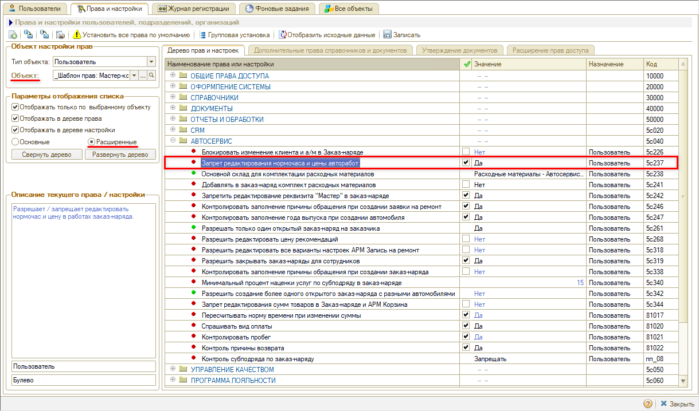
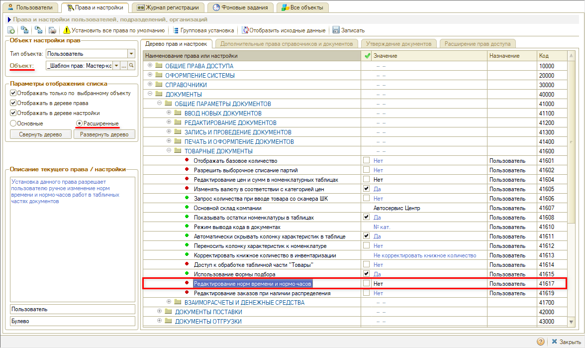
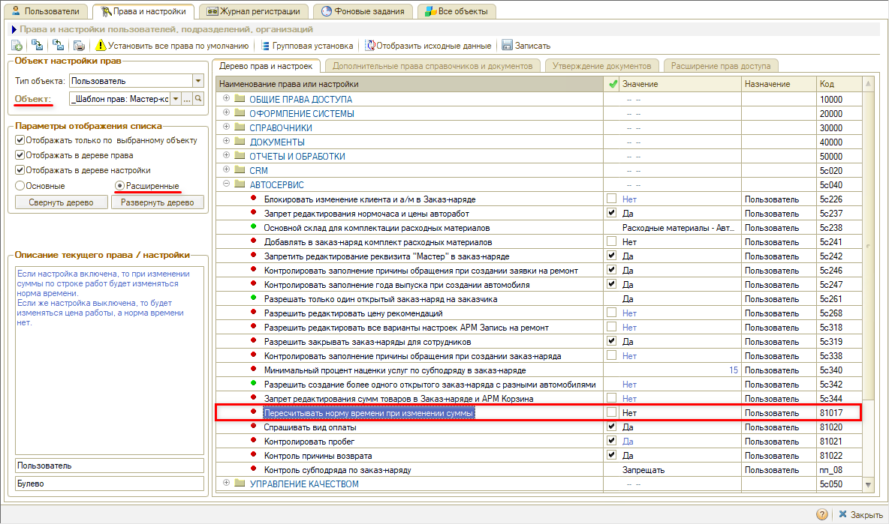

# Как ограничить редактирование цены, суммы и нормы времени авторабот в заказ-наряде

<table><tr><td><b>Создано:</b> 21.09.2026</td></tr></table>

> *Комментарий: черновик.*

## Вопрос

Мастер-приемщик может изменить цену, сумму или норму времени строки с автоработой в заказ-наряде, в том числе у работ с фиксированной ценой, заданной документом «Установка цен», а при изменении суммы у работы меняется количество нормочасов. Какими правами ограничить редактирование строк авторабот и настроить, что пересчитывается при изменении суммы?

## Ответ

Редактирование строк авторабот в заказ-наряде регулируется тремя правами в «Правах и настройках» (как перейти к ним, см. в статье «[Установка прав и настроек пользователя](../../../../articles/5S%20AUTO/Пользователи%20и%20права/Установка%20прав%20и%20настроек%20пользователя/ustanovka-prav-i-nastroek-polzovatelya.md#переход-к-установке-прав-и-настроек)»). Права задаются на шаблон прав должности или на конкретного пользователя и находятся в расширенном списке – включите переключатель «Расширенные» (см. «[Основные и расширенные права](../../../../articles/5S%20AUTO/Пользователи%20и%20права/Установка%20прав%20и%20настроек%20пользователя/ustanovka-prav-i-nastroek-polzovatelya.md#основные-и-расширенные-права)»).

Права «[Запрет редактирования нормочаса и цены авторабот](#1-запрет-редактирования-нормочаса-и-цены-авторабот)» и «[Редактирование норм времени и нормо-часов](#2-редактирование-норм-времени-и-нормо-часов)» закрывают столбцы строки от ручного редактирования, право «[Пересчитывать норму времени при изменении суммы](#3-пересчитывать-норму-времени-при-изменении-суммы)» определяет, что пересчитывается при изменении суммы. Столбец «Сумма» этими правами не закрывается.

### 1. «Запрет редактирования нормочаса и цены авторабот»

Право находится в группе «Автосервис». В значении «Да» закрывает для ручного редактирования столбцы «Нормочас» и «Цена» в строках авторабот. Столбцы «Сумма» и «Норма времени» остаются доступными. На пересчет при изменении суммы право не влияет – см. «[Пересчитывать норму времени при изменении суммы](#3-пересчитывать-норму-времени-при-изменении-суммы)».

### 2. «Редактирование норм времени и нормо-часов»

Право находится в группе «Документы → Общие параметры документов → Товарные документы». В значении «Нет» закрывает для ручного редактирования столбцы «Норма времени» и «Нормочас» в строках работ. Сумму пользователь по-прежнему может изменить, а что при этом пересчитается, определяет право «[Пересчитывать норму времени при изменении суммы](#3-пересчитывать-норму-времени-при-изменении-суммы)»: при его значении «Да» норма времени у работ без фиксированной цены изменится в результате пересчета, хотя вручную изменить ее нельзя.

### 3. «Пересчитывать норму времени при изменении суммы»

Право находится в группе «Автосервис». Определяет, что пересчитывается при ручном изменении суммы строки, независимо от прав «[Запрет редактирования нормочаса и цены авторабот](#1-запрет-редактирования-нормочаса-и-цены-авторабот)» и «[Редактирование норм времени и нормо-часов](#2-редактирование-норм-времени-и-нормо-часов)»:

- «Да» – у работ без фиксированной цены меняется норма времени: сумму уменьшили – уменьшилось и количество нормочасов, в том числе в выработке исполнителя; у работ с фиксированной ценой пересчитывается цена;
- «Нет» – у всех работ пересчитывается цена, норма времени не меняется.

Итого:

- чтобы сотрудник не мог вручную менять цену и стоимость нормочаса авторабот – «[Запрет редактирования нормочаса и цены авторабот](#1-запрет-редактирования-нормочаса-и-цены-авторабот)» в значении «Да»;
- чтобы не мог вручную менять норму времени – «[Редактирование норм времени и нормо-часов](#2-редактирование-норм-времени-и-нормо-часов)» в значении «Нет»;
- чтобы при изменении суммы не менялась норма времени (и выработка исполнителя), а пересчитывалась цена – «[Пересчитывать норму времени при изменении суммы](#3-пересчитывать-норму-времени-при-изменении-суммы)» в значении «Нет».

> *Комментарий: право «Редактирование цен и сумм в номенклатурных таблицах» (группа «Документы → Общие параметры документов → Товарные документы») в значении «Нет» закрывает цены и суммы сразу и товаров, и авторабот во всех документах – в совете не рекомендуется и не упоминается. Запретить редактирование столбца «Сумма» только для авторабот сочетанием трех описанных прав нельзя (проверено 21.09.2026): они закрывают «Нормочас», «Цену» и «Норму времени», а сумма остается доступной при любых значениях. Отдельного права на запрет суммы («Сумма» и «Всего» у работ с фиксированной ценой, как просил клиент в тикете #RFC-63762) в программе нет – это пожелание на разработку.*

После изменения прав сотруднику нужно перезайти в программу.

## См. также

- «[Как запретить сотрудникам редактировать отдельные автоработы](../Как%20запретить%20сотрудникам%20редактировать%20отдельные%20автоработы/kak-zapretit-sotrudnikam-redaktirovat-otdelnye-avtoraboty.md)»
- «[Как настроить учет выработки исполнителей по нормочасам для работ с фиксированной стоимостью](../../Практики/Как%20настроить%20учет%20выработки%20исполнителей%20по%20нормочасам%20для%20работ%20с%20фиксированной%20стоимостью/uchet-vyrabotki-ispolniteley-po-normochasam-dlya-rabot-s-fiksirovannoy-stoimostyu.md)»

## Материалы для изучения

- «[Установка прав и настроек пользователя](../../../../articles/5S%20AUTO/Пользователи%20и%20права/Установка%20прав%20и%20настроек%20пользователя/ustanovka-prav-i-nastroek-polzovatelya.md)» – шаблоны прав, поиск прав, групповая установка.
- «[Автоработы](../../../../articles/5S%20AUTO/Автосервис/Автоработы/avtoraboty.md#нормочасы)» – нормы времени и справочник «Нормочасы».
- «[Заказ-наряды](../../../../articles/5S%20AUTO/Автосервис/Работа%20с%20Заказ-нарядами/Заказ-наряды/zakaz-naryady.md#1-вкладка-работы)» – вкладка «Работы» заказ-наряда.

## Похожие вопросы

- Как ограничить редактирование цены, суммы и нормы времени авторабот в заказ-наряде
- Почему мастер-приемщик на зафиксированных работах может менять сумму стоимости строки, как исправить
- Как запретить редактирование цены работ в заказ-наряде
- Мастер-приемщик продает работу с фиксированной ценой дешевле, как запретить
- Как запретить редактировать нормочасы и норму времени в заказ-наряде
- Почему при изменении суммы автоработы пересчитывается количество нормочасов
- При корректировке суммы работы в меньшую сторону уменьшается количество нормочасов
- Как сделать, чтобы при изменении суммы менялась цена, а не норма времени
- Почему в выработке исполнителя меньше нормочасов, чем выполнено

## Теги

автоработы, заказ-наряд, права и настройки, цена, сумма, нормочас, норма времени, выработка исполнителей, мастер-приемщик, фиксированная цена
