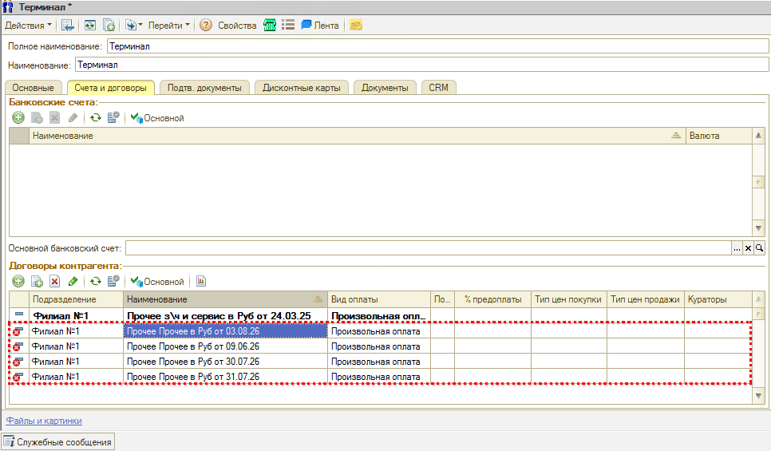
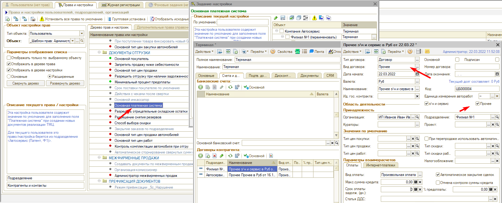

# При закрытии кассовой смены создаются новые договоры или не находится нужный

## Проблема

При закрытии кассовой смены формируется документ **«Изъятие из кассы (Инкассация)»**, и на этом шаге происходит одно из двух — в зависимости от того, включено ли автоматическое создание договоров:

- **автосоздание включено** — по контрагенту каждый день создается новый договор, их накапливается по одному на смену;
- **автосоздание выключено** — программа сообщает, что нужный договор не найден, и документ не создается.

## Причина

У контрагента нет договора с видом **«Прочее»** и признаком **«Прочее»** — по той организации и тому подразделению, по которым закрывается смена. Именно такой договор программа подставляет в инкассацию, и, не находя его, либо создает новый, либо выдает сообщение.

## Решение

**1. Проверьте договор контрагента.**

У контрагента должен быть договор со следующими реквизитами:

- **«Вид договора»** — **«Прочее»**;
- в блоке **«Область деятельности»** установлена галочка **«Прочее»**;
- **«Организация»** и **«Подразделение»** — те, по которым закрывается кассовая смена.

Если автосоздание договоров настроено, программа создаст нужный договор сама — **удалять его не нужно**. Если не настроено, договор создается вручную.

**2. Проверьте права и настройки.**

Договор нужен для того контрагента, который указан в правах. Проверьте три настройки — по той же организации и тому же подразделению, по которым закрывается смена:

- **«Основной инкассатор»**;
- **«Инкассатор в документах внесения / изъятия»**;
- **«Основная платежная система»** — именно здесь чаще всего и обнаруживается, что у указанного контрагента нужного договора нет.

После того как договор с видом и признаком «Прочее» появится у всех перечисленных контрагентов, смена закрывается штатно и новые договоры больше не плодятся.

---

**Теги:** касса, кассовая смена, закрытие смены, инкассация, изъятие из кассы, договор контрагента, вид договора Прочее, автосоздание договоров, основной инкассатор, основная платежная система
