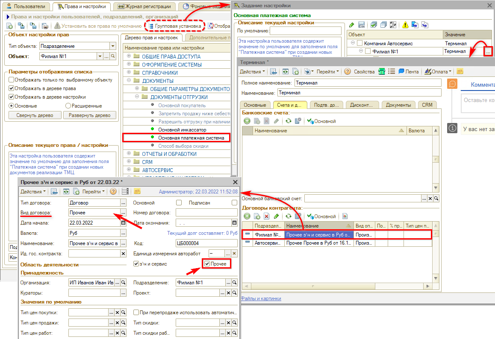

# При закрытии кассовой смены создаются новые договоры

## Проблема

При [закрытии кассовой смены](https://www.5systems.ru/help/obrabotka-zakrytie-kassovoy-smeny) формируется документ **«Изъятие из кассы (Инкассация)»**, и на этом шаге создается новый договор по контрагенту. Каждый день создается новый договор, их накапливается по одному на смену.

*Примечание:* пользователь каждый раз помечает их на удаление.

В случае если [автоматическое создание договоров](https://www.5systems.ru/help/avtomaticheskoe-sozdanie-dogovora-s-kontragentom) не включено, то новый договор не создается, но программа выдает предупреждение, что нужный договор не найден.

## Причина

У контрагента нет договора с видом **«Прочее»** и признаком **«Прочее»** — по той организации и тому подразделению, по которым закрывается смена. Именно такой договор программа подставляет в инкассацию, и, не находя его, создает новый (либо выдает предупреждение).

## Решение

**1. Проверьте договор контрагента.**

У контрагента должен быть договор со следующими реквизитами:

- **«Вид договора»** — **«Прочее»**;
- установлена галочка **«Прочее»**;
- **«Организация»** и **«Подразделение»** — те, по которым закрывается кассовая смена.

Если автосоздание договоров настроено, программа создаст нужный договор сама — **удалять его не нужно**. Если не настроено, договор с указанными реквизитами следует создать вручную.

**2. Проверьте права и настройки.**

Договор нужен для того контрагента, который указан в [правах](https://www.5systems.ru/help/ustanovka-prav-i-nastroek-polzovatelya). Проверьте три настройки — по той же организации и тому же подразделению, по которым закрывается смена:

- **«Основной инкассатор»**;
- **«Инкассатор в документах внесения / изъятия»**;
- **«Основная платежная система»** — именно здесь чаще всего и обнаруживается, что у указанного контрагента нужного договора нет.

После того как договор с видом и признаком «Прочее» появится у всех перечисленных контрагентов, смена закрывается штатно и новые договоры больше не плодятся.

## Материалы для изучения

- «[Обработка «Закрытие кассовой смены»](https://www.5systems.ru/help/obrabotka-zakrytie-kassovoy-smeny)» — как проходит закрытие смены и какие документы при этом формируются.
- «[Автоматическое создание договора с контрагентом](https://www.5systems.ru/help/avtomaticheskoe-sozdanie-dogovora-s-kontragentom)» — настройка автосоздания договоров.
- «[Установка прав и настроек пользователя](https://www.5systems.ru/help/ustanovka-prav-i-nastroek-polzovatelya)» — где смотреть и менять права и настройки.

## Похожие вопросы

- При закрытии кассовой смены создаются новые договоры
- Каждый день появляется новый договор по контрагенту
- При инкассации пишет, что договор не найден
- Какой договор нужен для закрытия кассовой смены
- Можно ли удалять договоры, созданные автоматически

## Теги

касса, кассовая смена, закрытие смены, инкассация, изъятие из кассы, договор контрагента, вид договора Прочее, автосоздание договоров, основной инкассатор, основная платежная система
