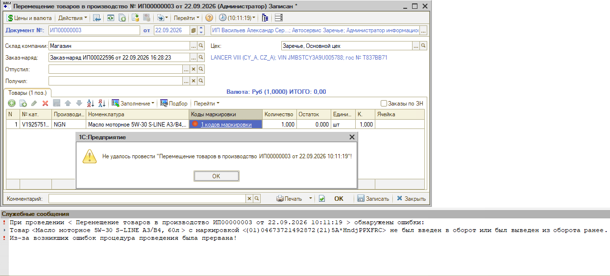
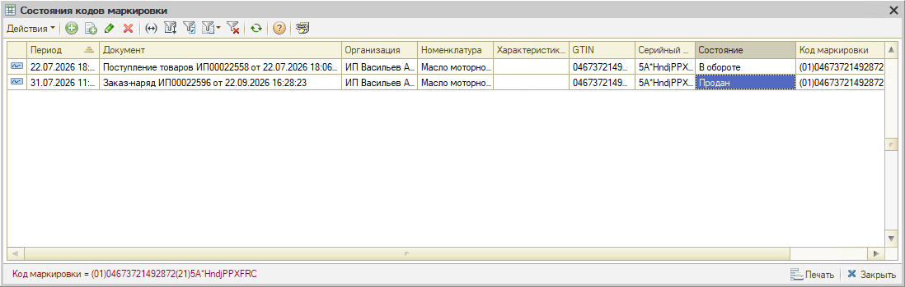
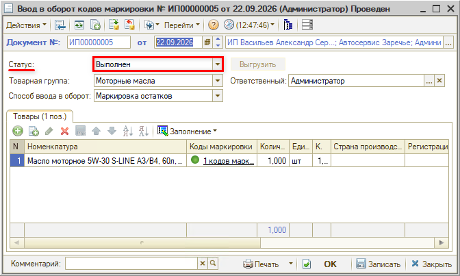

# Не проводится документ с маркированным товаром

<table><tr><td><b>Создано:</b> 22.09.2026</td></tr></table>

## Проблема

Не проводится документ с маркированным товаром – «Перемещение товаров в производство» или «Реализация товаров». Программа выдает сообщение «Не удалось провести …», а в служебных сообщениях пишет, что товар с маркировкой не был введен в оборот или был выведен из оборота ранее:

> При проведении < Перемещение товаров в производство … > обнаружены ошибки:  
> Товар <…> с маркировкой <(01)…(21)…> не был введен в оборот или был выведен из оборота ранее.  
> Из-за возникших ошибок процедура проведения была прервана!

## Причина

- Код маркировки не был введен в оборот в программе: при приемке товара его не отсканировали в документе «Поступление товаров», поэтому по данным учета товар в обороте не числится.
- Код маркировки уже был выведен из оборота другим документом – например, товар продан или списан ранее.
- Товар продается частями (масло из бочки, антифриз из канистры), а частичное выбытие для номенклатуры не настроено – при продаже первой части код был выведен из оборота полностью.

## Решение

1. Проверьте состояние кода маркировки. В строке товара нажмите на ссылку в колонке «Коды маркировки» и в открывшейся таблице выберите «Перейти → История состояний» – откроется регистр «Состояния кодов маркировки», где видно, каким документом код был введен в оборот и каким выведен (подробнее см. в статье «[Маркировка товаров → Действия с кодами маркировки](../../../../articles/5S%20AUTO/Маркировка/Маркировка%20товаров/markirovka-tovarov.md#действия-с-кодами-маркировки)»). В примере код введен в оборот поступлением товаров, а затем выведен заказ-нарядом – состояние «Продан»:

   

2. Если код не был введен в оборот, создайте документ «Ввод в оборот кодов маркировки», отсканируйте в нем код и установите документу статус «Выполнен» – только в этом статусе документ делает движения и код считается введенным в оборот в программе. Затем проведите исходный документ повторно:

   

   *Примечание:* Если в «Честном знаке» код и так числится в обороте (товар получен от поставщика), выгружать документ в «Честный знак» не нужно – он только приводит учет в программе в соответствие с ГИС МТ. Варианты корректировки для разных сочетаний состояний см. в статье «[Инвентаризация кодов маркировки → Корректировка расхождений](../../../../articles/5S%20AUTO/Маркировка/Инвентаризация%20кодов%20маркировки/inventarizaciya-kodov-markirovki.md#6-корректировка-расхождений)».

3. Если код был выведен из оборота в программе, скорее всего, он числится выведенным и в «Честном знаке». Сначала обратитесь в техподдержку «Честного знака» для корректировки статуса кода, затем оформите в программе документ «Ввод в оборот кодов маркировки» и после этого исправьте документы – в зависимости от ответа техподдержки «Честного знака». Если товар нужно продать срочно, замените его в документе на аналогичный товар без проблем с маркировкой.

4. Если товар продается частями и при продаже первой части код был полностью выведен из оборота, верните код в оборот (см. п. 3), настройте для номенклатуры частичное выбытие – см. статью «[Частичное выбытие маркированного товара → Настройки](../../../../articles/5S%20AUTO/Маркировка/Частичное%20выбытие%20маркированного%20товара/chastichnoe-vybytie-markirovannogo-tovara.md#настройки)» – и далее продавайте товар частями.

## См. также

- «[Заказ-наряд с маркированным товаром не переводится в статус «Выполнен»](../Заказ-наряд%20с%20маркированным%20товаром%20не%20переводится%20в%20статус%20«Выполнен»/zakaz-naryad-s-markirovkoy-ne-perevoditsya-v-vypolnen.md)»

## Материалы для изучения

- «[Маркировка товаров](../../../../articles/5S%20AUTO/Маркировка/Маркировка%20товаров/markirovka-tovarov.md)» – действия с кодами маркировки, регистр «Состояния кодов маркировки», «[Состояния кодов маркировки в реестре документов](../../../../articles/5S%20AUTO/Маркировка/Маркировка%20товаров/markirovka-tovarov.md#состояния-кодов-маркировки-в-реестре-документов)».
- «[Операции с кодами маркировки](../../../../articles/5S%20AUTO/Маркировка/Операции%20с%20кодами%20маркировки/operacii-s-kodami-markirovki.md#2-сканирование-кодов-маркировки-в-документе)» – сканирование кодов маркировки при приемке товара.
- «[Инвентаризация кодов маркировки](../../../../articles/5S%20AUTO/Маркировка/Инвентаризация%20кодов%20маркировки/inventarizaciya-kodov-markirovki.md)» – сверка состояний кодов с «Честным знаком» и корректирующие документы.
- «[Вывод кодов маркировки из оборота](../../../../articles/5S%20AUTO/Маркировка/Вывод%20кодов%20маркировки%20из%20оборота/vyvod-kodov-markirovki-iz-oborota.md)» – варианты выбытия кодов из оборота.
- «[Частичное выбытие маркированного товара](../../../../articles/5S%20AUTO/Маркировка/Частичное%20выбытие%20маркированного%20товара/chastichnoe-vybytie-markirovannogo-tovara.md)» – продажа товара частями и настройка номенклатуры.

## Похожие вопросы

- Не проводится документ с маркированным товаром
- При перемещении в заказ-наряде масла и антифриза не проводится документ
- Товар с маркировкой не был введен в оборот или был выведен из оборота ранее
- Коды маркировки были введены при оприходовании, но при списании документ с ними не проводится
- Проблема с кодами маркировки при списании масла и антифриза
- Не удалось провести перемещение товаров в производство – ошибка по коду маркировки
- Не проводится реализация товаров с кодом маркировки
- Ошибка при проведении перемещения с маркированным товаром
- Ошибка при проведении документа с маркированным товаром

## Теги

маркировка, коды маркировки, ввод в оборот, вывод из оборота, состояния кодов маркировки, Честный знак, частичное выбытие, перемещение товаров в производство, реализация товаров, проведение документа
